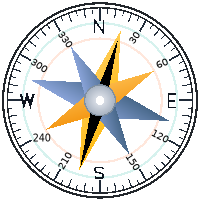

# מבנה Header המקורי - העתקה מדויקת
**project_domain:** TIKTRACK

מהקובץ המקורי `Home.html` ו-`header-styles.css`:

## מבנה HTML:
```html
<div id="unified-header">
  <div class="header-content">
    <div class="header-top">
      <div class="header-container">
        <div class="header-nav">
          <nav class="main-nav">
            <ul class="tiktrack-nav-list">
              <li class="tiktrack-nav-item">
                <a href="/" class="tiktrack-nav-link">
                  
                </a>
              </li>
              <li class="tiktrack-nav-item dropdown">
                <a href="#" class="tiktrack-nav-link tiktrack-dropdown-toggle">
                  <span class="nav-text">תכנון</span>
                  <span class="tiktrack-dropdown-arrow">▼</span>
                </a>
                <ul class="tiktrack-dropdown-menu">
                  <li><a class="tiktrack-dropdown-item" href="#">פריט</a></li>
                </ul>
              </li>
              <!-- ... עוד dropdowns ... -->
              <li class="tiktrack-nav-item">
                <a href="#" class="tiktrack-nav-link">
                  <span class="nav-text" style="color: #ff0000; font-size: 1.2rem;">🧹</span>
                </a>
              </li>
              <!-- Utils: 🧹, ⚡, 🔍 -->
            </ul>
          </nav>
        </div>
        
        <div class="logo-section">
          <a href="/" class="logo">
            
            <span class="logo-text">פשוט לנהל תיק</span>
          </a>
        </div>
      </div>
    </div>
    
    <div class="header-filters" id="headerFilters">
      <div class="filters-container">
        <div class="filter-group status-filter">
          <div class="filter-dropdown">
            <button class="filter-toggle status-filter-toggle">
              <span class="selected-value selected-status-text">כל סטטוס</span>
              <span class="dropdown-arrow">▼</span>
            </button>
            <div class="filter-menu">
              <div class="status-filter-item" data-value="הכול">הכול</div>
              <!-- ... עוד פריטים ... -->
            </div>
          </div>
        </div>
        <!-- ... עוד filters ... -->
        <div class="filter-user-section">
          <a href="/user_profile" class="user-profile-link">
            <div class="user-avatar-badge">
              <span>RT</span>
            </div>
          </a>
          <button class="auth-toggle-btn">
            
          </button>
        </div>
      </div>
    </div>
    
    <div class="filter-toggle-section filter-toggle-main">
      <button class="header-filter-toggle-btn" id="headerFilterToggleBtnMain">
        <span class="header-filter-arrow">▲</span>
      </button>
    </div>
  </div>
</div>
```

## קלאסים חשובים:
- `#unified-header` - Container ראשי
- `.header-content` - Wrapper פנימי
- `.header-top` - שורה עליונה (70px min-height)
- `.header-container` - Container פנימי (max-width: 1400px)
- `.header-nav` - אזור ניווט
- `.tiktrack-nav-list` - רשימת תפריטים
- `.tiktrack-nav-item` - פריט תפריט
- `.tiktrack-nav-link` - קישור תפריט
- `.tiktrack-dropdown-menu` - תפריט נפתח
- `.logo-section` - אזור לוגו
- `.header-filters` - אזור פילטרים (60px)
- `.filters-container` - Container פילטרים
- `.filter-toggle-section.filter-toggle-main` - כפתור toggle

## CSS Variables מהמקור:
- `--apple-bg-elevated: #ffffff`
- `--apple-border-light: #e5e5e5`
- `--apple-shadow-light: 0 2px 8px rgba(0, 0, 0, 0.05)`
- `--container-xl: 1400px`
- `--spacing-md: 16px`

## צבעים מהמקור:
- Brand: `#26baac`
- Brand Hover: `#1e9a8a`
- Brand Active: `#0f766e`
- Dropdown Item: `#29a6a8`
- Dropdown Item Hover: `#ff9e04`
- Border: `#e5e5e5`
- Text: `#1d1d1f`
- Filter Hover: `#ff9500`
