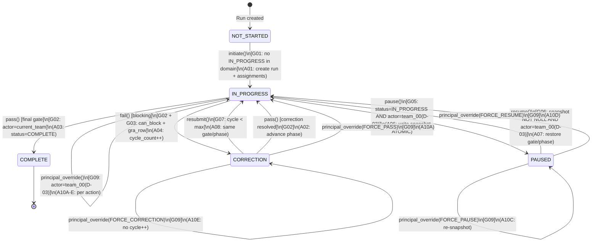

## 1. States (per Run)

| State | עברית | הגדרה | terminal? |
|---|---|---|---|
| `NOT_STARTED` | לא התחיל | Run נוצר, טרם הופעל | לא |
| `IN_PROGRESS` | בתהליך | ביצוע פעיל בgate/phase נוכחי | לא |
| `CORRECTION` | בתיקון | Gate נדחה (blocking) — הצוות מתקן את פלטו | לא |
| `PAUSED` | מושהה | ביצוע קפוא — snapshot ניתוב נשמר; ניתן לחידוש | לא |
| `COMPLETE` | הושלם | כל ה-gates עברו; Run סגור | **כן** |

**הערה:** `ABORTED` נדחה ל-v3.1. ב-v3.0: terminal state יחיד = `COMPLETE`.
**domain constraint:** מקסימום **אחד** `IN_PROGRESS` לאותו `domain_id` בכל רגע נתון. מספר `PAUSED` מותרים.

---

## 2. Transition Table

| # | From | Event | Actor | Guard | To | Action | Event Emitted |
|---|---|---|---|---|---|---|---|
| T01 | `NOT_STARTED` | `initiate(wp_id, domain_id, variant)` | `pipeline_engine` | (G01) אין `IN_PROGRESS` לdomain; wp_id קיים ב-registry; domain_id ידוע | `IN_PROGRESS` | (A01) יצירת Run; resolve Assignment ב-GATE_0; עדכון pipeline_state.json | `RUN_INITIATED` |
| T02 | `IN_PROGRESS` | `pass()` | `current_team` (via Assignment) | (G02) actor = resolved `team_id`; phase אינה final | `IN_PROGRESS` | (A02) קידום ל-phase/gate הבא; עדכון `current_gate_id`, `current_phase_id`; עדכון pipeline_state.json | `PHASE_PASSED` |
| T03 | `IN_PROGRESS` | `pass()` **[final gate]** | `current_team` | (G02) + phase = final | `COMPLETE` | (A03) `status=COMPLETE`, `completed_at=now()`; ניקוי `paused_routing_snapshot_json=NULL`; עדכון pipeline_state.json | `RUN_COMPLETED` |
| T04 | `IN_PROGRESS` | `fail(reason)` **[blocking]** | `current_team` | (G02) + (G03) `role.can_block_gate=1` AND `gate_role_authorities` row קיים ל-(gate, phase, domain, role) | `CORRECTION` | (A04) `correction_cycle_count += 1`; שמירת `correction_reason`; עדכון pipeline_state.json | `GATE_FAILED_BLOCKING` |
| T05 | `IN_PROGRESS` | `fail(reason)` **[non-blocking]** | `current_team` | (G02) + NOT (G03) — אין gate_role_authorities row | `IN_PROGRESS` | (A05) log WARN בלבד; ללא שינוי state; עדכון pipeline_state.json | `GATE_FAILED_ADVISORY` |
| T06 | `IN_PROGRESS` | `approve()` **[HITL gate]** | `team_00` | (G04) `current_gate.is_human_gate=1` AND `:actor='team_00'` | `IN_PROGRESS` | (A02) קידום ל-phase/gate הבא; עדכון pipeline_state.json | `GATE_APPROVED` |
| T07 | `IN_PROGRESS` | `pause()` | `team_00` | **(G05) `run.status='IN_PROGRESS'` AND `:actor='team_00'`** | `PAUSED` | (A06) כתיבת `paused_routing_snapshot_json` **באותה טרנזקציה**; `paused_at=now()`; עדכון pipeline_state.json | `RUN_PAUSED` |
| T08 | `PAUSED` | `resume()` | `team_00` | **(G06) `paused_routing_snapshot_json IS NOT NULL` AND `:actor='team_00'`** | `IN_PROGRESS` | (A07) שחזור `current_gate_id` + `current_phase_id` ממצב קפוא (ללא שינוי); `paused_at=NULL`; routing מ-snapshot אלא אם קיים `TEAM_ASSIGNMENT_CHANGED` event; עדכון pipeline_state.json | `RUN_RESUMED` |
| T09 | `CORRECTION` | `resubmit()` | `current_team` | (G07) `correction_cycle_count < max_cycles` (מ-Policy) | `IN_PROGRESS` | (A08) מחזור לאותו gate/phase; עדכון pipeline_state.json | `CORRECTION_RESUBMITTED` |
| T10 | `CORRECTION` | `resubmit()` **[max cycles]** | `current_team` | (G08) `correction_cycle_count >= max_cycles` | `CORRECTION` | (A09) BLOCK — דרוש Principal intervention; emit ESCALATION | `CORRECTION_ESCALATED` |
| T11 | `CORRECTION` | `pass()` | `current_team` | **(G02)** | `IN_PROGRESS` | (A02) קידום phase; `correction_cycle_count` נשמר (לא מאופס — audit trail) | `CORRECTION_RESOLVED` |
| T12 | ANY non-terminal | `principal_override(action, reason)` | `team_00` | (G09) `:actor='team_00'`; action ∈ {FORCE_PASS, FORCE_FAIL, FORCE_PAUSE, FORCE_RESUME, FORCE_CORRECTION} | לפי action | **(A10A–A10E) per action type — ראה §4** | `PRINCIPAL_OVERRIDE` |

---

## 3. Guards — הגדרות מפורטות

### 3.1 D-03 Actor Resolution Precondition *(F-04 fix)*

**חל על כל guard הכולל `:actor='team_00'` (G04, G05, G06, G09).**

`:actor='team_00'` מייצג resolution לשורת DB ב־`teams`:
```sql
SELECT id FROM teams WHERE id = 'team_00'
```
Pipeline engine חייב לאמת קיום שורה זו ב־boot. כל FK המייצג אקטור Principal — `events.actor_team_id` או `assignments.assigned_by` — חייב להצביע ל־`teams.id = 'team_00'` (D-03).
**Reference:** `PRINCIPAL_AND_TEAM_00_MODEL_v1.0.0.md` §D-03.

### 3.2 Guards Table

| Guard | תנאי מדויק |
|---|---|
| **G01** | `NOT EXISTS (SELECT 1 FROM runs WHERE domain_id=:domain AND status='IN_PROGRESS')` AND `wp_id ∈ registry` AND `domain_id ∈ domains` |
| **G02** | `Assignment WHERE wp_id=:wp AND role_id=routing_rule.role_id AND status='ACTIVE' → team_id = :actor_team_id` |
| **G03** | `pipeline_roles.can_block_gate=1` AND `EXISTS (SELECT 1 FROM gate_role_authorities WHERE gate_id=:gate AND (phase_id=:phase OR phase_id IS NULL) AND (domain_id=:domain OR domain_id IS NULL) AND role_id=:role AND may_block_verdict=1)` |
| **G04** | `gates.is_human_gate=1 WHERE id=:current_gate_id` AND `:actor = 'team_00'` *(D-03 §3.1)* |
| **G05** | `runs.status = 'IN_PROGRESS' WHERE id=:run_id` AND `:actor = 'team_00'` *(D-03 §3.1)* |
| **G06** | `runs.paused_routing_snapshot_json IS NOT NULL WHERE id=:run_id` AND `:actor = 'team_00'` *(D-03 §3.1)* |
| **G07** | `runs.correction_cycle_count < (SELECT (policy_value_json::jsonb->>'max')::integer FROM policies WHERE policy_key = 'max_correction_cycles' AND scope_type = 'GLOBAL' ORDER BY priority DESC LIMIT 1)` |
| **G08** | `runs.correction_cycle_count >= (SELECT (policy_value_json::jsonb->>'max')::integer FROM policies WHERE policy_key = 'max_correction_cycles' AND scope_type = 'GLOBAL' ORDER BY priority DESC LIMIT 1)` |
| **G09** | `:actor = 'team_00'` *(D-03 §3.1)* AND `action ∈ {FORCE_PASS, FORCE_FAIL, FORCE_PAUSE, FORCE_RESUME, FORCE_CORRECTION}` |

---

## 4. Actions — הגדרות מפורטות

### 4.1 Actions A01–A09

| Action | מה נכתב ל-DB |
|---|---|
| **A01** | `INSERT INTO runs (..., status='IN_PROGRESS', current_gate_id=first_gate, current_phase_id=first_phase, correction_cycle_count=0, paused_routing_snapshot_json=NULL)`; `INSERT INTO assignments (...)` per routing resolution; `UPDATE pipeline_state.json` |
| **A02** | `UPDATE runs SET current_gate_id=next_gate, current_phase_id=next_phase WHERE id=:run_id`; `UPDATE pipeline_state.json` |
| **A03** | `UPDATE runs SET status='COMPLETE', completed_at=now(), paused_routing_snapshot_json=NULL WHERE id=:run_id`; `UPDATE pipeline_state.json` |
| **A04** | `UPDATE runs SET status='CORRECTION', correction_cycle_count=correction_cycle_count+1 WHERE id=:run_id`; persist `correction_reason` ב-Event payload |
| **A05** | `INSERT INTO events (event_type='GATE_FAILED_ADVISORY', ...)` בלבד — ללא שינוי ב-runs |
| **A06** | `UPDATE runs SET status='PAUSED', paused_at=now(), paused_routing_snapshot_json=:snapshot WHERE id=:run_id` — **אותה טרנזקציה** עם יצירת Event |
| **A07** | `UPDATE runs SET status='IN_PROGRESS', paused_at=NULL WHERE id=:run_id`; routing resolution: use `paused_routing_snapshot_json` אלא אם `EXISTS (SELECT 1 FROM events WHERE run_id=:run_id AND event_type='TEAM_ASSIGNMENT_CHANGED' AND occurred_at > :paused_at)` — במקרה זה: re-resolve via current Assignment |
| **A08** | `UPDATE runs SET status='IN_PROGRESS' WHERE id=:run_id`; שמירת `correction_cycle_count` (לא איפוס); חזרה לאותו gate/phase |
| **A09** | `INSERT INTO events (event_type='CORRECTION_ESCALATED', payload={cycle: N, max: M})`; ללא שינוי status — BLOCK עד Principal |

### 4.2 A10A–A10E — Principal Override Sub-Actions *(F-02 fix)*

כל A10* חייב לסיים ב: `INSERT INTO events (..., event_type='PRINCIPAL_OVERRIDE', actor_team_id=(SELECT id FROM teams WHERE id='team_00'), actor_type='human', payload_json={action, from_state, reason, timestamp}, occurred_at=now(), ...)` — שמות עמודות לפי Entity Dictionary §Event + DDL Stage 4.

| Sub-Action | FORCE_* | DB Writes | Target State |
|---|---|---|---|
| **A10A** | `FORCE_PASS` | **אם phase אינה final:** `UPDATE runs SET status='IN_PROGRESS', current_gate_id=next_gate, current_phase_id=next_phase WHERE id=:run_id`<br>**אם phase final:** `UPDATE runs SET status='COMPLETE', completed_at=now(), paused_routing_snapshot_json=NULL WHERE id=:run_id` | `IN_PROGRESS` או `COMPLETE` |
| **A10B** | `FORCE_FAIL` | `UPDATE runs SET status='CORRECTION', correction_cycle_count=correction_cycle_count+1 WHERE id=:run_id`; persist `force_fail_reason` ב-Event payload | `CORRECTION` |
| **A10C** | `FORCE_PAUSE` | `UPDATE runs SET status='PAUSED', paused_at=now(), paused_routing_snapshot_json=:snapshot WHERE id=:run_id` — **אותה טרנזקציה** (זהה ל-A06) | `PAUSED` |
| **A10D** | `FORCE_RESUME` | `UPDATE runs SET status='IN_PROGRESS', paused_at=NULL WHERE id=:run_id`; routing per snapshot אלא אם `TEAM_ASSIGNMENT_CHANGED` event קיים (זהה ל-A07) | `IN_PROGRESS` |
| **A10E** | `FORCE_CORRECTION` | `UPDATE runs SET status='CORRECTION' WHERE id=:run_id`; `correction_cycle_count` **לא מוגדל** (override ידני, לא כשלון טבעי) | `CORRECTION` |

**הבדל A10B לעומת A10E:** A10B = FORCE_FAIL ← Principal כשל gate ← `cycle_count += 1`. A10E = FORCE_CORRECTION ← Principal מעביר state ללא fail event ← cycle_count נשמר.

---

## 5. Routing Resolution ב-paused_routing_snapshot_json

**פורמט snapshot (נגזר מEntity Dictionary §Run):**

```json
{
  "captured_at": "2026-03-26T12:00:00Z",
  "gate_id": "GATE_3",
  "phase_id": "3.2",
  "assignments": {
    "role_id_implementer": {
      "assignment_id": "01JASN...",
      "team_id": "team_20"
    },
    "role_id_reviewer": {
      "assignment_id": "01JASN...",
      "team_id": "team_90"
    }
  }
}
```

**כלל resume:** `paused_routing_snapshot_json.assignments[role_id]` → `team_id` — אלא אם `TEAM_ASSIGNMENT_CHANGED` event קיים עם `occurred_at > paused_at`. במקרה זה: re-resolve מ-current Assignment table.

---

## 6. Iron Rules (נעולים — אין TBD)

1. **Pipeline engine = orchestrator.** אף agent (כולל team_10) לא מבצע state transitions ישירות. כל מעבר = pipeline engine בלבד.
2. **team_10 scope ב-v3 = GATE_3 Work Plan author בלבד.** team_10 לא מעדכן `runs`, `pipeline_state.json`, או כל state אחר.
3. **PAUSED snapshot חובה באותה טרנזקציה.** `paused_routing_snapshot_json` חייב להיכתב ב-ATOMIC transaction עם `status='PAUSED'`. אם הכתיבה נכשלת — הmutation מבוטל.
4. **Resume = שחזור מדויק.** PAUSED → IN_PROGRESS חוזר לאותו `current_gate_id` + `current_phase_id`. ללא איפוס gate/phase.
5. **HITL gates = team_00 בלבד.** `approve()` transition חוקי אך ורק כאשר `:actor='team_00'` מאומת מול DB row (D-03).
6. **BLOCKER = dual check.** `fail()` blocking חוקי אך ורק כאשר `can_block_gate=1` AND שורת `gate_role_authorities` קיימת. חסר אחד → advisory בלבד (T05).
7. **Assignment frozen during PAUSED.** שינוי Assignment כאשר `run.status='PAUSED'` — אסור ב-pipeline engine. דורש `TEAM_ASSIGNMENT_CHANGED` event ידני מ-team_00 + עדכון ידני ב-DB.
8. **max 1 IN_PROGRESS per domain.** Guard G01 חייב להיבדק לפני כל `initiate()`. domain constraint — לא global.
9. **correction_cycle_count לא מאופס.** Counter נשמר לכל אורך חיי ה-Run — audit trail. לא מאופס בין correction cycles. A10E (FORCE_CORRECTION) לא מגדיל את ה-counter.
10. **pipeline_state.json עודכן בכל transition.** כל action מסתיים ב-write ל-`pipeline_state.json` — אין lag בין DB ל-state file.

---

## 7. Edge Cases

| EC | תרחיש | Guard שנבדק | תוצאה מצופה |
|---|---|---|---|
| EC-01 | `pass()` פעמיים על אותו gate/phase | G02 — actor validation | השנייה: WARN + idempotent check. אם phase כבר advanced — error code `PHASE_ALREADY_ADVANCED`. |
| EC-02 | `pause()` כאשר Run כבר PAUSED | G05 — `status=IN_PROGRESS AND :actor='team_00'` | Guard fails → error code `INVALID_STATE_TRANSITION`. ללא שינוי. |
| EC-03 | `resume()` כאשר `paused_routing_snapshot_json IS NULL` | G06 — `snapshot IS NOT NULL AND :actor='team_00'` | Guard fails → error code `SNAPSHOT_MISSING`. דרוש Principal intervention (A10D עם snapshot ידני). |
| EC-04 | שני domains: domain_A=PAUSED, domain_B מנסה `initiate()` | G01 — domain isolation | G01 בודק per-domain בלבד. domain_B יכול להתחיל — PAUSED אינו IN_PROGRESS. ✅ |
| EC-05 | Assignment משתנה בזמן PAUSED בלי Principal event | Guard G06 + A07 routing check | `resume()` משתמש ב-snapshot (מתעלם מהשינוי). Assignment החדש לא בתוקף עד Principal event. |
| EC-06 | `fail()` ע"י role ללא `gate_role_authorities` row | G03 fails → T05 path | Non-blocking: GATE_FAILED_ADVISORY בלבד. Run נשאר IN_PROGRESS. לא עובר ל-CORRECTION. |
| EC-07 | CORRECTION מגיע ל-max_cycles | G08 | T10: `CORRECTION_ESCALATED` event. Run נשאר CORRECTION. **דרוש Principal intervention** — pipeline_engine לא מתקדם. |
| EC-08 | HITL gate — team_00 לא מגיב | — (אין timeout ב-v3.0) | Run נשאר IN_PROGRESS עד approve(). **Timeout policy = Stage 6 (Prompt Architecture / Policy entity).** EC מתועד לStage 6. |
| EC-09 | `initiate()` כאשר יש IN_PROGRESS באותו domain | G01 | Guard fails → error code `DOMAIN_ALREADY_ACTIVE`. מחזיר: run_id הפעיל + current state. |
| EC-10 | `resume()` אחרי TEAM_ASSIGNMENT_CHANGED בזמן PAUSE | A07 — event timestamp check | routing re-resolves מ-current Assignment (מתעלם מsnapshot). Event חובה: `RUN_RESUMED_WITH_NEW_ASSIGNMENT`. |
| EC-11 | `principal_override(FORCE_PASS)` בזמן CORRECTION | G09 → A10A | T12: pass forced, event `PRINCIPAL_OVERRIDE` עם reason. `correction_cycle_count` נשמר. |
| EC-12 | `initiate()` עם wp_id לא קיים ב-registry | G01 — wp_id validation | Guard fails → error code `UNKNOWN_WP`. ללא יצירת Run. |

---

## 8. Mermaid State Diagram



---

## 9. Event Types — מינימום ל-Event Log

| event_type | מי מפיק | Trigger |
|---|---|---|
| `RUN_INITIATED` | pipeline_engine | T01 |
| `PHASE_PASSED` | pipeline_engine | T02 |
| `RUN_COMPLETED` | pipeline_engine | T03 |
| `GATE_FAILED_BLOCKING` | pipeline_engine | T04 |
| `GATE_FAILED_ADVISORY` | pipeline_engine | T05 |
| `GATE_APPROVED` | pipeline_engine | T06 |
| `RUN_PAUSED` | pipeline_engine | T07 |
| `RUN_RESUMED` | pipeline_engine | T08 |
| `RUN_RESUMED_WITH_NEW_ASSIGNMENT` | pipeline_engine | T08 + EC-10 |
| `CORRECTION_RESUBMITTED` | pipeline_engine | T09 |
| `CORRECTION_ESCALATED` | pipeline_engine | T10 |
| `CORRECTION_RESOLVED` | pipeline_engine | T11 |
| `PRINCIPAL_OVERRIDE` | pipeline_engine (actor=team_00) | T12 — כולל payload: {action, from_state, reason} |
| `TEAM_ASSIGNMENT_CHANGED` | team_00 (manual) | EC-05/EC-10 |

---

## 10. Open Questions — לשלבים הבאים

| OQ | נושא | שלב רלוונטי |
|---|---|---|
| OQ-01 | `max_correction_cycles` — ערך ברירת מחדל ב-Policy seed data | Stage 4 (DDL seed) |
| OQ-02 | HITL gate timeout — האם Policy entity מגדיר SLA? מה קורה בחריגה? | Stage 6 (Prompt Architecture / Policy) |
| OQ-03 | `principal_override(FORCE_ABORT)` — v3.1 ABORTED state מחייב הגדרת T13 | v3.1 (מחוץ לtop) |
| OQ-04 | פורמט מדויק של `paused_routing_snapshot_json` — JSON schema | Stage 3 (Use Cases — UC-ResumeRun) |
| OQ-05 | האם `GATE_FAILED_ADVISORY` (T05) מופיע ב-dashboard? UI contract | Stage 8 (UI Contract) |

---

## 11. הפניה ל-Stage 3 (Use Cases)

Stage 2 זה מגדיר את ה-**what** (מה קורה). Stage 3 יגדיר את ה-**how** (מה המשתמש רואה, מה הAPI מקבל, מה מוחזר).
Use Cases קריטיים לStage 3 שנגזרים ישירות מSpec זה:
- `UC-InitiateRun` — T01
- `UC-AdvanceGate` — T02/T03
- `UC-FailGate` — T04/T05
- `UC-HumanApprove` — T06
- `UC-PauseRun` — T07
- `UC-ResumeRun` — T08 + OQ-04
- `UC-CorrectionResubmit` — T09/T10/T11
- `UC-PrincipalOverride` — T12 (A10A–A10E)

---

**log_entry | TEAM_100 | STATE_MACHINE_SPEC | v1.0.1 | SUBMITTED_FOR_REVIEW | 2026-03-26**  
**log_entry | TEAM_100 | STATE_MACHINE_SPEC | v1.0.2 | TEAM190_DDL_CROSS_SSOT_REMEDIATION | 2026-03-26**
