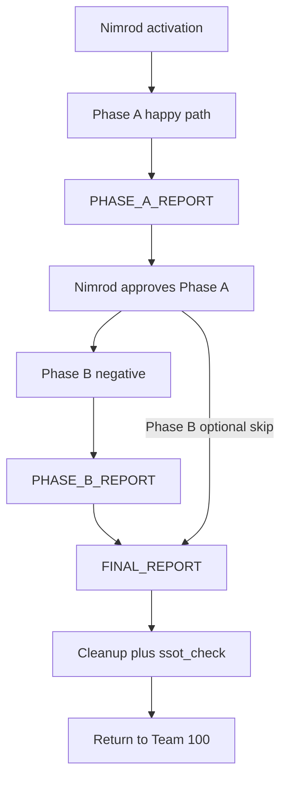

## 1 — מטרת התוכנית והתוצר המרכזי

**מטרה:** סטרס-טסט מלא של ה-pipeline (ללא סוכנים אמיתיים, ללא HITL) כדי לגלות **לפני** Canary Round 2 חוסמים, תקלות UX ותהליכיות.

**התוצר החשוב ביותר:**  
[`TEAM_101_CANARY_SIMULATION_FINAL_REPORT_v1.0.0.md`](TEAM_101_CANARY_SIMULATION_FINAL_REPORT_v1.0.0.md) (סעיף 5 במנדט) — חייב לאפשר **ניתוח מערכתי** ו**הבנת כשלים** עם **רפרנסים מלאים** (קובץ, שורה, פקודה, צילום מסך, מזהה סטייה).

### פרוטוקול רפרנסים (חובה בכל דוחות הביניים והמסכם)

| סוג ראיה | מה לתעד |
|----------|---------|
| **פקודה** | שורת מלאה: `./pipeline_run.sh --domain tiktrack --wp …` |
| **קוד / סקריפט** | `path:line` או בלוק ציטוט קצר |
| **קבצי state** | נתיב מלא + hash או `last_updated` אחרי כל צעד (אם רלוונטי) |
| **פרומפטים שנוצרו** | נתיב ל-`*.md` תחת `_COMMUNICATION/agents_os/prompts/` (או לפי דומיין) |
| **ארטיפקטי mock** | נתיב מלא + גרסה בכותרת |
| **דשבורד** | שם קובץ צילום: `sim_A_GATE_3_YYYYMMDD_HHMM.png` או `TEAM_101_SIMULATION_EVIDENCE/` |
| **סטייה** | `DEV-SIM-{NNN}` עם קישור לשורה בלוג הסימולציה |
| **כלי אימות** | `ssot_check`, `pytest` — פקודה מלאה + exit code |

מומלץ ליצור תיקיית ריכוז:  
`_COMMUNICATION/team_101/TEAM_101_SIMULATION_EVIDENCE_S003_P013_WP002/` (או מזהה WP סופי) — לכל השלבים.

---

## 2 — יעדי מסמכים (Deliverables) — מסלול מלא

| סדר | מסמך | מתי |
|-----|--------|-----|
| 1 | לוג סימולציה חי (אופציונלי אך מומלץ): `TEAM_101_SIMULATION_RUN_LOG_v1.0.0.md` | יתעדכן בזמן אמת |
| 2 | `TEAM_101_SIMULATION_PHASE_A_REPORT_v1.0.0.md` | סיום Phase A |
| 3 | `TEAM_101_SIMULATION_PHASE_B_REPORT_v1.0.0.md` | רק אם Phase B אושרה |
| 4 | `TEAM_101_CANARY_SIMULATION_FINAL_REPORT_v1.0.0.md` | סיום כל המסלול + ניקוי (לפני החזרה ל-Team 100) |
| 5 | ניקוי + ארכיון | סעיף 6 במנדט |

---

## 3 — Phase A — Happy Path (סדר מימוש מומלץ)

### 3.1 — רישום dummy WP (ללא פגיעה בתוכניות ACTIVE)

| פעולה | פרטים |
|--------|--------|
| מזהה WP | **ברירת מחדל במנדט:** `S003-P013-WP002` — לוודא שאין התנגשות ב-`PHOENIX_WORK_PACKAGE_REGISTRY` / WSM; אם תפוס — **WP הבא הפנוי** + עדכון מסמכי סימולציה. |
| דומיין | `tiktrack` |
| Program registry | רישום `SIMULATION` — **לא** לשנות סטטוס של תוכנית ACTIVE אמיתית (לפי מבנה הטבלה הקיים ב-`PHOENIX_PROGRAM_REGISTRY_v1.0.0.md`). |

**שאלה להבהרה מנימרוד:** האם לרשום רק שורת SIMULATION תחת אותו program או רק תיעוד ב-`_COMMUNICATION` בלי לגעת ב-registry קנוני? (המנדט מנחה registry — נדרש אישור אם יש מדיניות Team 170 אחרת.)

### 3.2 — אתחול state (מנדט)

- להריץ את בלוק ה-`PipelineState` מהמנדט (או מקביל מעודכן ל-API הנוכחי של `PipelineState`).
- לאמת: `pipeline_state_tiktrack.json` מצביע על WP dummy + `GATE_0` (או מצב התחלתי הנדרש לפי `GATE_SEQUENCE`).

### 3.3 — מעבר שערים (לולאה)

לכל מעבר:

1. **Precision** — לפי Iron Rule KB-84 (`--wp`, `--gate`, `--phase` כנדרש).
2. `--generate-prompt` או `./pipeline_run.sh` עם ארגומנטים כפי שממנדט Step 3.
3. לשמור **רפרנס** לקובץ prompt שנוצר.
4. ליצור **mock artifact** לפי הטבלה במנדט (§3 Step 4).
5. **Dashboard:** צילום/סנאפשוט + רשימת בדיקה (מנדט Step 5).
6. `pass` / `phase2` / … — לפי מכונת המצבים האמיתית.
7. רישום סטייה `DEV-SIM-NNN` מיד כשמופיעה.

### 3.4 — יישור טבלת ארטיפקטים מול pipeline עדכני (FIX-101)

המנדט מציין קבצים לפי שערים (למשל GATE_2 Phase 2.2 → G3_PLAN).  
לאחר FIX-101, **GATE_2** משתמש ב-`GATE_2_mandates.md` ושלבים 2.1–2.3.  
**פעולה:** לפני יצירת mocks, לבצע **מיפוי אחד** (טבלה) בין שלבי המנדט לבין `current_phase` + `GATE_MANDATE_FILES_BASE` + `pipeline_run.sh phase*` — ולתעד אותה בראש Phase A report.

### 3.5 — נקודות חיכוך ידועות

| נושא | טיפול בתוכנית |
|------|----------------|
| **GATE_4 Phase 4.3** (HRC, Nimrod) | במנדט: JSON + אישור ידני. בסימולציה: להגדיר האם **mock** של HRC + פקודת `approve` מספיקות, או לדרוש צעדים ספציפיים (לשאול נימרוד). |
| **צילומי מסך** | אם אין `preview_screenshot` — **Playwright / browser snapshot / צילום ידני** עם שם קובץ מתועד. |
| **SSOT** | אחרי כל `pass` משמעותי, לוודא שאין drift (כמו בדוחות QA קודמים), או לתעד `PIPELINE_RELAXED_KB84` רק אם חובה CI (לפי §4 Iron Rule). |

---

## 4 — Phase B — Negative Path (רק אחרי אישור Phase A)

| תרחיש | מקור במנדט | מוצר |
|--------|------------|------|
| B1 | GATE_3 fail + remediation | דוח + רפרנסים |
| B2 | GATE_5 doc block | דוח + רפרנסים |
| B3 | GATE_4 HRC מעורב | דוח + רפרנסים |
| B4 | KB-84 wrong WP | דוח + רפרנסים |

**תנאי:** עדכון `TEAM_101_SIMULATION_PHASE_B_REPORT_v1.0.0.md` במבנה זהה ל-Phase A + השוואה צפוי/בפועל.

---

## 5 — דוח מסכם (מבנה מחייב לפי מנדט §5)

| סעיף | תוכן |
|------|------|
| §1 Executive Summary | READY / NOT READY, ספירת סטיות, חוסמים, הערכת מאמץ |
| §2 Gate-by-Gate Scorecard | ציונים 1–5 + נושאים קריטיים |
| §3 UX/UI Assessment | CTA, טאבים, badges, בהירות מפעיל |
| §4 Fix Recommendations | Must / Should / Nice |
| §5 Readiness Verdict | ניסוח חד-משמעי לפני Canary Round 2 |

**כל סעיף** חייב לכלול **הפניות לקובצי ראיה** (Phase A/B, לוג, צילומים).

---

## 6 — ניקוי (מנדט §6)

רשימת בדיקה:

- [ ] איפוס `pipeline_state_tiktrack.json` למצב נקי (ללא dummy WP)
- [ ] סימון registry / SIMULATION_COMPLETE לפי הנוהל
- [ ] ארכיון mocks ל-`_COMMUNICATION/_SIMULATION_ARCHIVE/S003-P013-WP002/` (או `WP_ID` הסופי)
- [ ] `python3 -m agents_os_v2.tools.ssot_check --domain tiktrack` → **exit 0**
- [ ] רישום פקודה + תוצאה בדוח הסופי

---

## 7 — החזרה ל-Team 100

לפי מנדט §7: נתיבי שלושת הדוחות + אישור `ssot_check` אחרי ניקוי.

---

## 8 — שאלות להבהרה (מומלץ לפני START)

1. **הפעלה:** האם קיבלתם אות "GO" רשמי מנימרוד (ערוץ / תאריך)?  
2. **WP ID:** לאשר `S003-P013-WP002` או שימוש ב-WP אחר פנוי?  
3. **Registry:** האם מותר לערוך `PHOENIX_PROGRAM_REGISTRY` / `PHOENIX_WORK_PACKAGE_REGISTRY` בקובץ קנוני, או רק רישום מקביל תחת `_COMMUNICATION`?  
4. **GATE_4.3 / HRC:** היכן נמצאת סימולציה מקובלת (mock JSON path, אישור דמה)?  
5. **Phase B:** האם כל ארבעת התרחישים (B1–B4) חובה בבת אחת או לפי סדר מאושר?

---

## 9 — סיכום לוח זמנים

---

**log_entry | TEAM_101 | CANARY_SIMULATION | WORK_PLAN_v1.0.0 | 2026-03-23**
