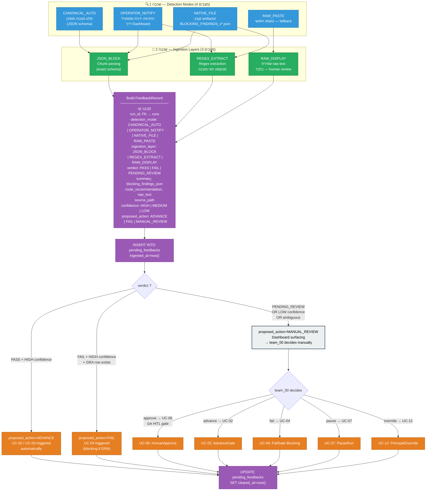

## 1. תרשים מסלול חיים מלא של Run

```mermaid
flowchart TD
    classDef state     fill:#4A90D9,stroke:#2c5f8a,color:#fff,font-weight:bold
    classDef decision  fill:#F5A623,stroke:#c47a00,color:#000
    classDef action    fill:#7ED321,stroke:#4a8f00,color:#000
    classDef error     fill:#D0021B,stroke:#8b0012,color:#fff
    classDef event     fill:#9B59B6,stroke:#6c3483,color:#fff
    classDef human     fill:#E8F4FD,stroke:#2471A3,color:#000,stroke-width:2px
    classDef system    fill:#F0FFF0,stroke:#27AE60,color:#000

    %% ─────────────────────────────────────────────
    %% BLOCK 1 — INITIALIZATION
    %% ─────────────────────────────────────────────
    START(["▶ UC-01: InitiateRun"]):::system

    START --> G01{"G01: Pre-conditions\n─────────────────\n① domain אין IN_PROGRESS\n② work_package_id קיים\n③ domain.is_active=1"}:::decision

    G01 -->|"❌ domain פעיל"| E_DOMAIN[["DOMAIN_ALREADY_ACTIVE\n409 — מחזיר run_id פעיל"]]:::error
    G01 -->|"❌ wp לא קיים"| E_UNK_WP[["UNKNOWN_WP\n400"]]:::error
    G01 -->|"❌ domain לא פעיל"| E_INACTIVE[["DOMAIN_INACTIVE\n400"]]:::error
    G01 -->|"✅ עבר"| ROUTING_INIT

    %% ─────────────────────────────────────────────
    %% BLOCK 2 — ROUTING RESOLUTION
    %% ─────────────────────────────────────────────
    subgraph ROUTING_INIT["🔀 Routing Resolution — 2 שלבים"]
        direction LR
        RA["Stage A — Sentinel\n(DEPRECATED, L1 cutover)\nresolve_from_state_key\nIS NOT NULL + context match"]:::system
        RB1["Stage B.1 — Rule Resolution\nrouting_rules → role_id\n(specificity: exact → domain+phase\n→ domain → variant → default)"]:::system
        RB2["Stage B.2 — Team Resolution\nassignments WHERE\nwork_package_id + role_id + ACTIVE"]:::system
        RA -->|"✅ sentinel match\n(bypass B)"| R_DONE["✅ team_id resolved"]
        RA -->|"no sentinel"| RB1
        RB1 -->|"❌ no rule"| E_ROUTING
        RB1 -->|"✅ role_id"| RB2
        RB2 -->|"❌ no assignment"| E_ROUTING
        RB2 -->|"✅ team_id"| R_DONE
    end

    E_ROUTING[["ROUTING_UNRESOLVED\n500 → escalate team_00"]]:::error

    R_DONE --> A01["A01: INSERT runs\nstatus=IN_PROGRESS\ncurrent_gate=GATE_0\ncorrection_cycle_count=0\npaused_routing_snapshot=NULL"]:::action

    A01 --> E_INITIATED(["⚡ RUN_INITIATED\nsequence_no=1"]):::event
    E_INITIATED --> GATE_LOOP

    %% ─────────────────────────────────────────────
    %% BLOCK 3 — GATE EXECUTION LOOP
    %% ─────────────────────────────────────────────
    subgraph GATE_LOOP["🔄 EXECUTION LOOP — Run כ-IN_PROGRESS"]
        direction TB

        CURRENT_GATE["📍 current_gate_id + current_phase_id\nActor: resolved via routing_rules → assignments"]:::state

        CURRENT_GATE --> IS_HITL{"gates.is_human_gate = 1 ?"}:::decision

        %% ── HITL PATH ──
        IS_HITL -->|"כן (GATE_4 תמיד;\nGATE_2 — PENDING_REVIEW)"|  HITL_BLOCK

        subgraph HITL_BLOCK["👤 HITL Gate — Human-in-the-Loop"]
            direction TB
            HITL_WAIT["Dashboard מציג שאלה/ממתין\nלהחלטת team_00"]:::human
            HITL_WAIT --> HITL_ACT{"team_00 בוחר פעולה"}:::decision
            HITL_ACT -->|"approve()\nG04: is_human_gate=1\nAND actor=team_00 [D-03]"| HITL_PASS["A02: advance gate\n→ PHASE_PASSED אם לא final\n→ COMPLETE אם final"]:::action
            HITL_ACT -->|"pause() [G05]"| PAUSE_TRIGGER(["ראה: PAUSE/RESUME Flow"])
            HITL_ACT -->|"principal_override() [G09]"| OVERRIDE_TRIGGER(["ראה: Principal Override"])
            HITL_ACT -->|"❌ actor ≠ team_00"| E_INSUF_HITL[["INSUFFICIENT_AUTHORITY\n403"]]:::error
        end

        %% ── AGENT PATH ──
        IS_HITL -->|"לא — gate סוכן"| AGENT_EXEC

        subgraph AGENT_EXEC["🤖 Agent Gate"]
            direction TB
            AGENT_WORK["Assigned team מבצע\n(phase נוכחית)"]:::system
            AGENT_WORK --> VERDICT{"verdict ?"}:::decision

            VERDICT -->|"pass()\nphase לא final\n[G02]"| PASS_NON_FINAL["A02: advance phase\ncurrent_gate/phase עדכני"]:::action
            VERDICT -->|"pass()\nFINAL phase\n[G02]"| PASS_FINAL["A03: status=COMPLETE\ncompleted_at=now()\nsnapshot=NULL"]:::action

            VERDICT -->|"fail()\n[G02+G03]\ncan_block=1\nGRA row קיים"| BLOCKING_FAIL["A04: status=CORRECTION\ncycle_count++"]:::action
            VERDICT -->|"fail()\nNO GRA row\n[G02, NOT G03]"| ADVISORY_FAIL["A05: advisory log בלבד\nstatus נשאר IN_PROGRESS"]:::action

            VERDICT -->|"❌ actor לא נוכחי"| E_WRONG_ACTOR[["WRONG_ACTOR\n403"]]:::error
        end

        PASS_NON_FINAL --> E_PHASE_PASSED(["⚡ PHASE_PASSED"]):::event
        HITL_PASS --> E_GATE_APPROVED(["⚡ GATE_APPROVED"]):::event
        ADVISORY_FAIL --> E_ADVISORY(["⚡ GATE_FAILED_ADVISORY"]):::event

        E_PHASE_PASSED --> CURRENT_GATE
        E_GATE_APPROVED --> CURRENT_GATE
        E_ADVISORY --> CURRENT_GATE
    end

    BLOCKING_FAIL --> E_FAIL_BLOCK(["⚡ GATE_FAILED_BLOCKING"]):::event
    E_FAIL_BLOCK --> CORRECTION_CYCLE

    %% ─────────────────────────────────────────────
    %% BLOCK 4 — CORRECTION CYCLE
    %% ─────────────────────────────────────────────
    subgraph CORRECTION_CYCLE["🔁 CORRECTION CYCLE — status=CORRECTION"]
        direction TB
        CORR_STATE["Run: status = CORRECTION\ncurrent_gate/phase נשמרים (ללא שינוי)"]:::state
        CORR_STATE --> CORR_ACTION{"פעולה נדרשת"}:::decision

        CORR_ACTION -->|"current_team: resubmit()"| G07{"G07: cycle_count\n< max_correction_cycles\n(מ-Policy table)"}:::decision
        CORR_ACTION -->|"reviewer: pass() [G02]\nT11"| CORR_RESOLVE["A02: advance phase\n(cycle_count נשמר)"]:::action
        CORR_ACTION -->|"team_00: principal_override()"| OVERRIDE_TRIGGER2(["ראה: Principal Override"])

        G07 -->|"✅ cycle < max\nUC-09"| RESUBMIT["A08: status=IN_PROGRESS\nחזרה לאותו gate/phase\ncycle_count נשמר"]:::action
        G07 -->|"❌ cycle >= max\nUC-10"| ESCALATE["A09: BLOCK\nstatus נשאר CORRECTION\n(דרוש Principal)"]:::action

        RESUBMIT --> E_RESUBMIT(["⚡ CORRECTION_RESUBMITTED"]):::event
        ESCALATE --> E_ESCALATED(["⚡ CORRECTION_ESCALATED\n❗ דרוש Principal intervention"]):::event
        CORR_RESOLVE --> E_CORR_RESOLVED(["⚡ CORRECTION_RESOLVED"]):::event

        E_RESUBMIT --> CORR_BACK_TO_GATE(["→ חזרה ל-GATE_LOOP\nאותו gate/phase"])
        E_CORR_RESOLVED --> CORR_BACK_TO_GATE
        E_ESCALATED --> CORR_BLOCKED["🔴 Run חסום\nממתין ל-team_00"]:::human
    end

    %% ─────────────────────────────────────────────
    %% BLOCK 5 — PAUSE / RESUME
    %% ─────────────────────────────────────────────
    subgraph PAUSE_RESUME["⏸ PAUSE / RESUME — UC-07 / UC-08"]
        direction LR

        subgraph PAUSE_FLOW["UC-07: PauseRun"]
            direction TB
            P_G05{"G05: status=IN_PROGRESS\nAND actor=team_00 [D-03]"}:::decision
            P_G05 -->|"❌"| E_P_INSUF[["INSUFFICIENT_AUTHORITY\n403\nאו INVALID_STATE_TRANSITION 409"]]:::error
            P_G05 -->|"✅"| P_SNAPSHOT["Compute snapshot JSON\n{captured_at, gate_id,\nphase_id, assignments{}}"]:::action
            P_SNAPSHOT --> P_ATOMIC["A06: ATOMIC TX\nstatus=PAUSED\npaused_at=now()\npaused_routing_snapshot=snapshot"]:::action
            P_ATOMIC -->|"TX fails → rollback"| P_FAIL_ROLLBACK[["SNAPSHOT_WRITE_FAILED\n500 — Run נשאר IN_PROGRESS"]]:::error
            P_ATOMIC -->|"TX OK"| E_PAUSED(["⚡ RUN_PAUSED"]):::event
        end

        subgraph RESUME_FLOW["UC-08: ResumeRun"]
            direction TB
            R_G06{"G06: snapshot IS NOT NULL\nAND actor=team_00 [D-03]"}:::decision
            R_G06 -->|"❌ snapshot NULL"| E_R_SNAP[["SNAPSHOT_MISSING 409\nדרוש FORCE_RESUME + snapshot ידני"]]:::error
            R_G06 -->|"❌ actor ≠ team_00"| E_R_AUTH[["INSUFFICIENT_AUTHORITY\n403"]]:::error
            R_G06 -->|"✅"| R_ASSIGN_CHECK{"TEAM_ASSIGNMENT_CHANGED\nevent אחרי paused_at ?"}:::decision
            R_ASSIGN_CHECK -->|"לא — Branch A\nשימוש ב-snapshot"| R_A["A07: status=IN_PROGRESS\ngate/phase מ-snapshot\npaused_at=NULL"]:::action
            R_ASSIGN_CHECK -->|"כן — Branch B\nre-resolve assignment"| R_B["A07: status=IN_PROGRESS\nrouting מ-assignments table\npaused_at=NULL"]:::action
            R_A --> E_RESUMED(["⚡ RUN_RESUMED"]):::event
            R_B --> E_RESUMED_NEW(["⚡ RUN_RESUMED_WITH_NEW_ASSIGNMENT"]):::event
        end

        E_RESUMED --> BACK_TO_LOOP_R(["→ GATE_LOOP\n(אותו gate/phase)"])
        E_RESUMED_NEW --> BACK_TO_LOOP_R
    end

    %% ─────────────────────────────────────────────
    %% BLOCK 6 — PRINCIPAL OVERRIDE
    %% ─────────────────────────────────────────────
    subgraph PRINCIPAL_OVERRIDE["👑 UC-12: PrincipalOverride — team_00 בלבד"]
        direction TB
        OV_G09{"G09: actor=team_00 [D-03]\naction ∈ {FORCE_PASS, FORCE_FAIL,\nFORCE_PAUSE, FORCE_RESUME,\nFORCE_CORRECTION}\nAND status ≠ COMPLETE"}:::decision

        OV_G09 -->|"❌ לא team_00"| E_OV_AUTH[["INSUFFICIENT_AUTHORITY\n403"]]:::error
        OV_G09 -->|"❌ status=COMPLETE"| E_OV_TERM[["TERMINAL_STATE\n409"]]:::error
        OV_G09 -->|"❌ reason חסר"| E_OV_REASON[["MISSING_REASON\n400"]]:::error

        OV_G09 -->|"FORCE_PASS\nnon-final"| OVA["A10A: advance gate/phase\nstatus=IN_PROGRESS"]:::action
        OV_G09 -->|"FORCE_PASS\nfinal phase"| OVA_F["A10A: status=COMPLETE\ncompleted_at=now()"]:::action
        OV_G09 -->|"FORCE_FAIL"| OVB["A10B: status=CORRECTION\ncycle_count++ (blocking)"]:::action
        OV_G09 -->|"FORCE_PAUSE"| OVC["A10C: ATOMIC TX\nstatus=PAUSED+snapshot"]:::action
        OV_G09 -->|"FORCE_RESUME"| OVD["A10D: status=IN_PROGRESS\nrouting מ-snapshot"]:::action
        OV_G09 -->|"FORCE_CORRECTION"| OVE["A10E: status=CORRECTION\ncycle_count ❌ לא מוגדל"]:::action

        OVA --> E_OVERRIDE(["⚡ PRINCIPAL_OVERRIDE\n{action, from_state, reason}"]):::event
        OVA_F --> E_OVERRIDE
        OVB --> E_OVERRIDE
        OVC --> E_OVERRIDE
        OVD --> E_OVERRIDE
        OVE --> E_OVERRIDE
    end

    %% ─────────────────────────────────────────────
    %% BLOCK 7 — COMPLETION
    %% ─────────────────────────────────────────────
    PASS_FINAL --> E_COMPLETED(["⚡ RUN_COMPLETED"]):::event
    OVA_F --> E_COMPLETED
    E_COMPLETED --> COMPLETE(["✅ Run: COMPLETE\nDomain slot released"]):::state
    COMPLETE --> END_STATE(["🏁 Pipeline End"]):::system
```

---

## 2. תרשים FIP — Feedback Ingestion Pipeline (Stage 8B)

תרשים נפרד לתהליך קליטת פידבקים.



---

## 3. תרשים Gate Sequence — AOS v3 BUILD

מראה את רצף השערים הספציפי לבניית AOS v3 עם אחריות כל צוות.

```mermaid
flowchart LR
    classDef gate_pass  fill:#27AE60,stroke:#1a6e3c,color:#fff,font-weight:bold
    classDef gate_open  fill:#F39C12,stroke:#a06800,color:#000
    classDef gate_hitl  fill:#2471A3,stroke:#1a4f72,color:#fff
    classDef team_impl  fill:#ECF0F1,stroke:#7F8C8D,color:#000
    classDef team_qa    fill:#FDEBD0,stroke:#D35400,color:#000
    classDef team_rev   fill:#E8F8F5,stroke:#1E8449,color:#000

    G0(["GATE_0\n✅ PASS"]):::gate_pass
    G1(["GATE_1\n✅ PASS"]):::gate_pass
    G2(["GATE_2\n✅ PASS\n⚠ Conditional HITL"]):::gate_pass
    G3(["GATE_3\n⏳ הבא"]):::gate_open
    G4(["GATE_4\n🔒 HITL תמידי"]):::gate_hitl
    G5(["GATE_5\n🏁 Cleanup"]):::gate_open

    G0 --> G1 --> G2 --> G3 --> G4 --> G5

    subgraph G0_TEAMS["GATE_0 — Infrastructure"]
        T61_0["team_61\nDB migrations\nenv setup"]:::team_impl
        T11_0["team_11\nGateway approval"]:::team_rev
    end

    subgraph G1_TEAMS["GATE_1 — Core API"]
        T21_1["team_21\nstate machine\nbasic UCs"]:::team_impl
        T51_1["team_51\npytest QA"]:::team_qa
        T100_1["team_100\narch seed review"]:::team_rev
    end

    subgraph G2_TEAMS["GATE_2 — Architecture Review\n⚠ PENDING_REVIEW → team_00 manual"]
        T21_2["team_21\nfull use cases\nauthority model"]:::team_impl
        T51_2["team_51\n43 tests PASS"]:::team_qa
        T100_2["team_100\narchitectural verdict"]:::team_rev
    end

    subgraph G3_TEAMS["GATE_3 — FIP + SSE + Routing"]
        T21_3["team_21\nFIP, SSE stream\nadvanced routing"]:::team_impl
        T51_3["team_51\nTC-15..TC-18"]:::team_qa
        T190_3["team_190\nconstitutional validation"]:::team_rev
    end

    subgraph G4_TEAMS["GATE_4 — UX Sign-off\n🔒 team_00 approves ALWAYS"]
        T31_4["team_31\nUI mockups + interactions"]:::team_impl
        T51_4["team_51\nE2E TC-19..TC-26"]:::team_qa
        T00_4["team_00\nNimrod UX approval"]:::gate_hitl
    end

    subgraph G5_TEAMS["GATE_5 — Cleanup & Closure"]
        T51_5["team_51\nall TCs 01..26"]:::team_qa
        T61_5["team_61\ncleanup report"]:::team_impl
        T00_5["team_00\nfinal BUILD COMPLETE"]:::gate_hitl
    end

    G0 --- G0_TEAMS
    G1 --- G1_TEAMS
    G2 --- G2_TEAMS
    G3 --- G3_TEAMS
    G4 --- G4_TEAMS
    G5 --- G5_TEAMS
```



---

## 4. Error Code Registry — תרשים קודי שגיאה

```mermaid
flowchart TD
    classDef err403 fill:#E74C3C,stroke:#922B21,color:#fff
    classDef err400 fill:#E67E22,stroke:#935116,color:#fff
    classDef err409 fill:#F39C12,stroke:#9A6B00,color:#000
    classDef err500 fill:#8E44AD,stroke:#5B2C6F,color:#fff

    ERRORS["🚨 Error Codes — AOS v3"]

    subgraph AUTH["403 — Authorization"]
        direction TB
        E_INSUF["INSUFFICIENT_AUTHORITY\nactor לא מורשה לפעולה"]:::err403
        E_WRONG["WRONG_ACTOR\nלא הצוות הנוכחי"]:::err403
        E_NOT_HITL["NOT_HITL_GATE\ngate לא is_human_gate"]:::err403
    end

    subgraph INVALID["400 — Bad Request"]
        direction TB
        E_UNK_WP["UNKNOWN_WP\nwp_id לא קיים"]:::err400
        E_D_INACTIVE["DOMAIN_INACTIVE\ndomain.is_active=0"]:::err400
        E_MISS_REASON["MISSING_REASON\nreason שדה ריק"]:::err400
        E_INV_ACT["INVALID_ACTION\naction לא ב-enum"]:::err400
        E_SNAP_REQ["SNAPSHOT_REQUIRED\nFORCE_PAUSE ללא snapshot"]:::err400
        E_MISS_NOTES["MISSING_NOTES\nresubmission_notes ריק"]:::err400
    end

    subgraph CONFLICT["409 — Conflict / State"]
        direction TB
        E_DOM_ACTIVE["DOMAIN_ALREADY_ACTIVE\nIN_PROGRESS קיים"]:::err409
        E_INV_STATE["INVALID_STATE\nstatus שגוי לפעולה"]:::err409
        E_INV_TRANS["INVALID_STATE_TRANSITION\nמעבר לא חוקי"]:::err409
        E_ADV["PHASE_ALREADY_ADVANCED\nEC-01 — idempotent"]:::err409
        E_NOT_FINAL["NOT_FINAL_PHASE\nphase אינה final"]:::err409
        E_SNAP_MISS["SNAPSHOT_MISSING\nEC-03 — PAUSED ללא snapshot"]:::err409
        E_MAX_CYC["MAX_CYCLES_REACHED\nG08 — UC-09 → UC-10"]:::err409
        E_TERM["TERMINAL_STATE\noverride על COMPLETE"]:::err409
        E_CYC_NOT["CYCLES_NOT_EXHAUSTED\nG08 fails — ← UC-09"]:::err409
        E_SNAP_VAL["SNAPSHOT_VALIDATION_FAILED\nJSON Schema failed"]:::err409
        E_UNEXP["UNEXPECTED_BLOCKING\nG03 pass — ← UC-04"]:::err409
    end

    subgraph SERVER["500 — Server / System"]
        direction TB
        E_ROUTING["ROUTING_UNRESOLVED\nאין rule/assignment"]:::err500
        E_PHASE_SEQ["PHASE_SEQUENCE_ERROR\nnext phase לא נמצא"]:::err500
        E_SNAP_WRITE["SNAPSHOT_WRITE_FAILED\nAtomic TX failed"]:::err500
        E_RES_FAIL["ROUTING_RESOLUTION_FAILED\nBranch B re-resolve failed"]:::err500
    end

    ERRORS --> AUTH
    ERRORS --> INVALID
    ERRORS --> CONFLICT
    ERRORS --> SERVER
```



---

## מקורות SSOT

| ספק | גרסה | תוכן |
|-----|------|------|
| State Machine Spec | v1.0.2 | כל ה-transitions T01–T12, Guards G01–G09, Actions A01–A10E |
| Use Case Catalog | v1.0.4 | UC-01 עד UC-14, קודי שגיאה, Postconditions |
| Routing Spec | v1.0.1 | 2-stage resolver, Sentinel (DEPRECATED), SQL canonical |
| UI Spec Amendment (8B) | v1.1.1 §13 | FIP: 4 detection modes × 3 ingestion layers, pending_feedbacks DDL |
| Authority Model | v1.0.0 | 3-tier pyramid, GATE_4 HITL permanent, GATE_2 conditional |
| Stage Map Working | v1.0.0 | Gate sequence: GATE_0–GATE_5, team assignments |

---

**log_entry | TEAM_111 | AOS_V3_PIPELINE_FLOW_DIAGRAM | v1.0.0 | PUBLISHED | 2026-03-28**
