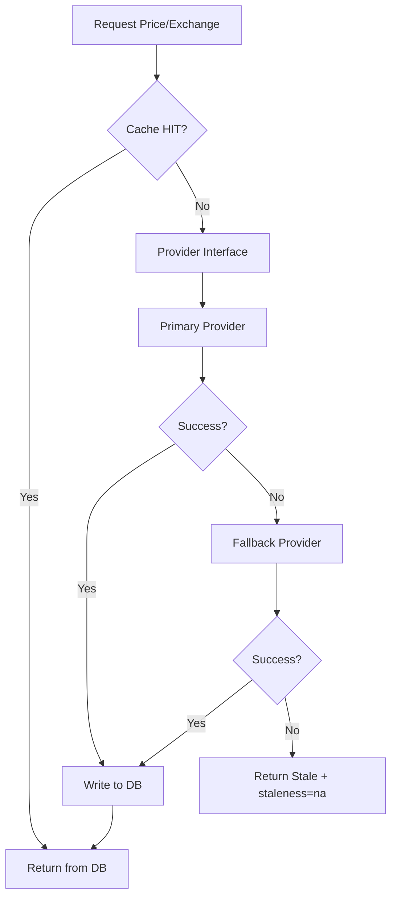

# External Market Data SSOT — טיוטה להעלאה (Stage-1)

**id:** `TEAM_20_EXTERNAL_MARKET_DATA_SSOT_DRAFT`  
**מקור:** ADR-022, ARCH-STRAT-002  
**תאריך:** 2026-01-31  
**יעד:** `documentation/01-ARCHITECTURE/MARKET_DATA_PIPE_SPEC.md` + תיקיית `api/integrations/market_data/`

---

## 1. מסמך טכני — Executive Summary

Backend אחראי על:
- **Provider Interface (Agnostic)** — החלפת ספק ללא שינוי קוד מנוע
- **Cache-First** — אין קריאה חיצונית לפני בדיקת Cache
- **Provider Guardrails** — Yahoo (User-Agent Rotation), Alpha (RateLimit 5/min)
- **Intraday Prices** — מחירים תוך־יומיים ל־Active tickers (Stage-1)
- **Data Freshness** — שדות `last_updated` / `as_of` להצגה ב־UI

---

## 2. שרטוט זרימה — Cache → Provider → DB

```
┌─────────────────────────────────────────────────────────────────────────┐
│                     REQUEST (e.g. GET price for ticker X)                 │
└─────────────────────────────────────────────────────────────────────────┘
                                        │
                                        ▼
┌─────────────────────────────────────────────────────────────────────────┐
│  STEP 1: CACHE CHECK (mandatory — ADR-022)                               │
│  ┌──────────────────────────────────────────────────────────────────┐   │
│  │  SELECT * FROM market_data.ticker_prices                           │   │
│  │  WHERE ticker_id=X AND price_timestamp > (now() - staleness_thresh)│   │
│  └──────────────────────────────────────────────────────────────────┘   │
│  Return if HIT (no external call).                                       │
└─────────────────────────────────────────────────────────────────────────┘
                                        │ MISS
                                        ▼
┌─────────────────────────────────────────────────────────────────────────┐
│  STEP 2: PROVIDER (Agnostic Interface)                                  │
│  ┌─────────────┐    ┌─────────────┐    ┌─────────────────────────────┐  │
│  │ Primary     │───▶│ Fallback    │───▶│ Raise / Return cached stale │  │
│  │ (FX: Alpha) │    │ (FX: Yahoo) │    │ (Never block UI)             │  │
│  │ (Prices:Y)  │    │ (Prices:A)  │    │                              │  │
│  └─────────────┘    └─────────────┘    └─────────────────────────────┘  │
│  Guardrails: Yahoo=User-Agent Rotation | Alpha=RateLimitQueue 12.5s     │
└─────────────────────────────────────────────────────────────────────────┘
                                        │
                                        ▼
┌─────────────────────────────────────────────────────────────────────────┐
│  STEP 3: WRITE TO DB (Cache)                                             │
│  INSERT/UPDATE market_data.ticker_prices | market_data.exchange_rates    │
│  SET last_updated=now(), as_of=price_timestamp                           │
└─────────────────────────────────────────────────────────────────────────┘
                                        │
                                        ▼
┌─────────────────────────────────────────────────────────────────────────┐
│  STEP 4: RETURN TO CALLER (with staleness: ok|warning|na)                │
└─────────────────────────────────────────────────────────────────────────┘
```

**Fallback Logic:**
- Primary fails → try Fallback
- Fallback fails → return stale from cache (if any) + `staleness=na`, **Never block UI**

**Mermaid (להטמעה ב‑Markdown):**


---

## 3. Provider Interface (Agnostic) — Python

```python
# api/integrations/market_data/provider_interface.py (proposed)
from abc import ABC, abstractmethod
from dataclasses import dataclass
from decimal import Decimal
from datetime import datetime
from typing import Optional, List

@dataclass
class PriceResult:
    symbol: str
    price: Decimal
    open_price: Optional[Decimal]
    high_price: Optional[Decimal]
    low_price: Optional[Decimal]
    close_price: Optional[Decimal]
    as_of: datetime
    provider: str

@dataclass
class ExchangeRateResult:
    from_currency: str
    to_currency: str
    rate: Decimal
    as_of: datetime
    provider: str

class MarketDataProvider(ABC):
    """Agnostic interface — swap provider without changing engine."""

    @abstractmethod
    async def get_ticker_price(self, symbol: str) -> Optional[PriceResult]:
        pass

    @abstractmethod
    async def get_exchange_rate(self, from_ccy: str, to_ccy: str) -> Optional[ExchangeRateResult]:
        pass

class YahooProvider(MarketDataProvider):
    """User-Agent Rotation required."""
    pass

class AlphaVantageProvider(MarketDataProvider):
    """RateLimitQueue: 12.5s (5 calls/min)."""
    pass
```

---

## 4. Provider Guardrails

| ספק | Guardrail | ערך |
|-----|-----------|-----|
| **Yahoo** | User-Agent Rotation | חובה — רוטציה בין User-Agent strings למניעת block |
| **Alpha Vantage** | RateLimitQueue | 12.5s בין קריאות (5 calls/min) |

---

## 5. Cadence / Precision Policy

| Domain | Primary | Fallback | Cadence | Precision |
|--------|---------|----------|---------|-----------|
| **FX** | Alpha | Yahoo | EOD + Intraday (Active) | NUMERIC(20,8) |
| **Ticker Prices** | Yahoo | Alpha | Intraday (Active) | NUMERIC(20,8) |

**Ticker Status (System Settings):** Active tickers → Intraday; Inactive → EOD בלבד.

---

## 6. Intraday Prices — Stage-1

- **דרישה:** מחירים תוך־יומיים ל־Active tickers
- **מימוש:** Cache refresh on-demand או cron כל 15 דקות ל־Active list
- **שדה:** `price_timestamp` (טבלת ticker_prices) = `as_of` להצגה

---

## 7. Data Freshness — שדות נדרשים

| טבלה | שדה | תיאור |
|------|-----|--------|
| ticker_prices | `price_timestamp` | זמן המחיר (as_of) |
| ticker_prices | `fetched_at` | מתי נמשך מה-API |
| ticker_prices | `is_stale` | boolean — stale לפי Policy |
| exchange_rates | `last_sync_time` | מתי סנכרון אחרון |

**מנגנון הצגה ב-UI:** `as_of` = price_timestamp / last_sync_time; `staleness` ב-API response.

---

## 8. סעיפי SSOT מוצעים ל-MARKET_DATA_PIPE_SPEC.md

### 8.1 Providers (להחליף Frankfurter)

```markdown
## Providers (ADR-022, ARCH-STRAT-002)

| Domain | Primary | Fallback |
|--------|--------|----------|
| FX | Alpha Vantage | Yahoo Finance |
| Ticker Prices | Yahoo Finance | Alpha Vantage |

**אין Frankfurter.** Guardrails: Yahoo=User-Agent Rotation; Alpha=RateLimitQueue 12.5s.
```

### 8.2 Cache-First Logic

```markdown
## Cache-First (Mandatory)

1. בדיקת Cache (DB) לפני כל קריאה חיצונית
2. HIT → return מיד
3. MISS → Provider (Primary → Fallback)
4. Failure → return stale + staleness=na; Never block UI
```

### 8.3 Intraday + Data Freshness

```markdown
## Intraday (Stage-1)

- Active tickers: מחירים תוך־יומיים
- שדות: price_timestamp (as_of), fetched_at, is_stale
```

---

## 9. רשימת שדות/קונפיגורציה נדרשים

| פריט | ערך |
|------|-----|
| `STALENESS_WARNING_MINUTES` | 15 |
| `STALENESS_NA_HOURS` | 24 |
| `ALPHA_RATE_LIMIT_SECONDS` | 12.5 |
| `YAHOO_USER_AGENTS` | list (רוטציה) |
| `ACTIVE_TICKERS_REFRESH_MINUTES` | 15 |
| `exchange_rates.last_sync_time` | TIMESTAMPTZ |
| `ticker_prices.price_timestamp` | TIMESTAMPTZ |
| `ticker_prices.fetched_at` | TIMESTAMPTZ |
| `ticker_prices.is_stale` | BOOLEAN |

---

## 10. תוצרים להמשך

| פריט | בעלים | הערות |
|------|--------|--------|
| מימוש Provider Interface | Team 20 | api/integrations/market_data/ |
| Yahoo/Alpha clients | Team 20 | עם Guardrails |
| Cache-First service layer | Team 20 | אוורר cache לפני provider |
| Cron/Intraday job | Team 60 | רענון Active tickers |
| System Settings (Active list) | Team 30/10 | טבלת tickers + status |

---

**בקשה לאישור:** לטיפול Team 10 — קידום ל-SSOT.

**log_entry | TEAM_20 | EXTERNAL_MARKET_DATA_SSOT_DRAFT | 2026-01-31**
