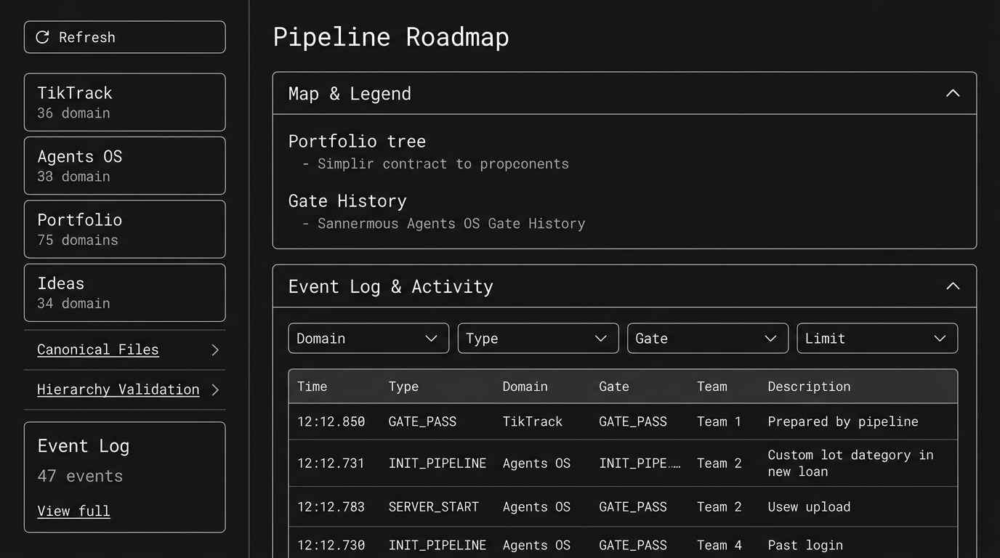

# TEAM_61 — Event Log UI Integration Mockup Proposal v1.0.0

**date:** 2026-03-16  
**Status:** PROPOSAL — awaiting approval  
**Scope:** Dashboard (תוכנית פעילה) + Roadmap (מפה)  
**References:** Event Log Phase 2 (GATE_5 PASSED), PIPELINE_DASHBOARD.html, PIPELINE_ROADMAP.html

---

## 1. Current State

### 1.1 Dashboard (PIPELINE_DASHBOARD.html) — תוכנית פעילה

```
┌─────────────────────────────────────────────────────────────────────────────────┐
│ 📊 Agents OS — Pipeline Dashboard          [TikTrack] [Agents OS]    Last: 5s   │
├─────────────────────────────────────────────────────────────────────────────────┤
│ 📊 Dashboard  │  🗺️ Roadmap  │  👥 Teams                                          │
└─────────────────────────────────────────────────────────────────────────────────┘

┌──────────────────┬──────────────────────────────────────────────────────────────┐
│ SIDEBAR          │ MAIN CONTENT                                                  │
│                  │                                                               │
│ [↺ Refresh]      │ ┌─ Feature Spec ─────────────────────────────────────────┐  │
│ [🔍 Progress]    │ │ Loading…                                                 │  │
│ ☑ Auto (5s)     │ └─────────────────────────────────────────────────────────┘  │
│ [🔵][🟢] Domain  │                                                               │
│                  │ ┌─ Current Step Banner ───────────────────────────────────┐  │
│ Pipeline Status  │ │ Gate · Owner · Next steps                               │  │
│ WP / Stage/Gate  │ └─────────────────────────────────────────────────────────┘  │
│ Gate Timeline    │                                                               │
│ Quick Commands   │ ┌─ Gate Context ──┐ ┌─ Team Mandates ──┐                    │
│                  │ │ ▼▼▼ prompt      │ │ [tabs] mandate     │                    │
│ ┌─ Event Log ──┐│ └─────────────────┘ └──────────────────┘                    │
│ │ [All▼][Gate▼]││                                                               │
│ │ [20▼]        ││ ┌─ Expected Output Files ─────────────────────────────────┐  │
│ │ ─────────────││ │ 🟢/🔴 file checklist                                     │  │
│ │ 12:34 GATE_ ││ └─────────────────────────────────────────────────────────┘  │
│ │ 12:30 INIT_ ││                                                               │
│ │ ... (compact)│                                                               │
│ └──────────────┘│                                                               │
└────────────────┴──────────────────────────────────────────────────────────────┘
```

**Event Log today:** Sidebar section under Quick Commands. Filters (Domain, Type, Limit), scrollable list ~220px. Works with `/api/log/events`.

---

### 1.2 Roadmap (PIPELINE_ROADMAP.html) — מפה

```
┌─────────────────────────────────────────────────────────────────────────────────┐
│ 🗺️ Agents OS — Roadmap & History                                    Loading…   │
├─────────────────────────────────────────────────────────────────────────────────┤
│ 📊 Dashboard  │  🗺️ Roadmap  │  👥 Teams                                          │
└─────────────────────────────────────────────────────────────────────────────────┘

┌──────────────────┬──────────────────────────────────────────────────────────────┐
│ SIDEBAR          │ MAIN                                                          │
│                  │                                                               │
│ [↺ Refresh]       │ ┌─ Accordion: Map & Legend (open) ────────────────────────┐  │
│ ☑ Auto (5s)      │ │ ┌─ Portfolio Roadmap ─┐ ┌─ Gate Sequence ─────────────┐ │  │
│                  │ │ │ S001, S002, S003     │ │ GATE_0 → GATE_1 → ...       │ │  │
│ stat-tiktrack    │ │ │ tree                 │ └─────────────────────────────┘ │  │
│ stat-agentsos    │ │ └─────────────────────┘ ┌─ Gate History ──────────────┐ │  │
│ stat-total       │ │                          │ events per program          │ │  │
│ stat-ideas       │ │                          └─────────────────────────────┘ │  │
│ Canonical Files  │ └─────────────────────────────────────────────────────────┘  │
│ Hierarchy Valid  │                                                               │
│                  │ ┌─ Accordion: Idea Pipeline (closed) ──────────────────────┐  │
│ ❌ NO Event Log  │ │ ideas list with filters                                  │  │
└──────────────────┴──────────────────────────────────────────────────────────────┘
```

**Event Log today:** Not present on Roadmap.

---

## 2. Proposed Additions

### 2.1 Dashboard — Enhancements (תוכנית פעילה)

| # | Change | Rationale |
|---|--------|-----------|
| A1 | **Mini Event Ticker** in Current Step Banner | Show last 1–2 events inline: "Last: GATE_PASS 12:34" — immediate context |
| A2 | **Expand/Collapse** Event Log sidebar section | Toggle to expand to ~400px when needed; collapse for focus |
| A3 | **Event count badge** in sidebar label | "Event Log (23)" — quick sense of activity |
| A4 | **Link to full view** | "View all →" linking to Roadmap Event Log accordion when both pages share API |

**Wireframe — A1 Mini Ticker in Banner:**
```
┌─ Current Step Banner ──────────────────────────────────────────────────────────┐
│ GATE_1 · Team 170 → Gemini · Next: Paste mandate, get LLD400                     │
│ ┌─ Recent ──────────────────────────────────────────────────────────────────┐   │
│ │ 🟢 12:34 GATE_PASS GATE_0  │  12:30 INIT_PIPELINE S002-P005-WP003         │   │
│ └──────────────────────────────────────────────────────────────────────────┘   │
└─────────────────────────────────────────────────────────────────────────────────┘
```

**Wireframe — A2 Expand/Collapse:**
```
┌─ Event Log (23) [−] ────────┐   ← click [−] to collapse to single line
│ [All▼] [Gate▼] [20▼]       │
│ ─────────────────────────  │
│ 12:34 GATE_PASS agents_os   │
│ GATE_1 team_61              │
│ Advance to GATE_1           │
│ ...                         │
│ [View in Roadmap →]         │
└────────────────────────────┘
```

---

### 2.2 Roadmap — New Event Log Section (מפה)

| # | Change | Rationale |
|---|--------|-----------|
| B1 | **Sidebar: Event Log card** | Same pattern as Canonical Files — compact card with count + "View" |
| B2 | **Accordion: Event Log** | New accordion "Event Log & Activity" — full panel with filters, timeline |
| B3 | **Gate History ↔ Event Log link** | Gate History shows static/computed; Event Log shows live. Cross-link. |

**Wireframe — B1 Sidebar Card:**
```
┌─ Event Log ────────────────┐
│ 47 events (24h)            │
│ [View full →]              │
└────────────────────────────┘
```

**Wireframe — B2 Accordion (third accordion, below Idea Pipeline):**
```
┌─ Accordion: Event Log & Activity ──────────────────────────────────────────────┐
│ [▶] Event Log & Activity                                        47 events      │
└────────────────────────────────────────────────────────────────────────────────┘

When opened:
┌─ Event Log & Activity ─────────────────────────────────────────────────────────┐
│ Domain: [All▼]  Type: [All▼]  Gate: [All▼]  Limit: [50▼]  [↺ Refresh]         │
│ ─────────────────────────────────────────────────────────────────────────────  │
│ Time     │ Type        │ Domain    │ Gate    │ Team    │ Description           │
│ 12:34:22 │ GATE_PASS   │ agents_os │ GATE_0  │ team_61 │ Advance to GATE_1      │
│ 12:30:01 │ INIT_PIPELINE│ agents_os │ GATE_0  │ team_61 │ Pipeline initialized   │
│ 12:28:00 │ SERVER_START│ global    │ —       │ team_61 │ Server started 8090    │
│ ...                                                                             │
│ Auto-refresh: 10s                                                               │
└────────────────────────────────────────────────────────────────────────────────┘
```

---

## 3. Implementation Approach

### 3.1 Shared event-log.js

- **Current:** event-log.js looks for `#event-log-panel` (Dashboard only).
- **Proposed:** Accept optional container ID — `init('event-log-panel')` or `init('event-log-roadmap')`.
- **API:** Same `GET /api/log/events`; Roadmap served from AOS → same origin.

### 3.2 Roadmap — DOM Additions

```html
<!-- Sidebar: after Hierarchy Validation -->
<div class="sidebar-section-card" id="event-log-sidebar-card">
  <div class="sidebar-section-title">Event Log <span class="badge" id="event-log-count-badge">—</span></div>
  <div id="event-log-sidebar-preview">Loading…</div>
  <a href="#" onclick="openEventLogAccordion(); return false;">View full →</a>
</div>

<!-- Main: new accordion after Idea Pipeline -->
<div class="accordion" id="acc-event-log">
  <div class="accordion-header" onclick="toggleAccordion('acc-event-log')">
    <span class="accordion-icon">📋</span>
    <span class="accordion-title">Event Log & Activity</span>
    <span class="accordion-badge" id="event-log-accordion-badge">—</span>
    <span class="accordion-chevron">▶</span>
  </div>
  <div class="accordion-body">
    <div id="event-log-roadmap-panel" data-testid="event-log-panel">
      <!-- Same filters + list as Dashboard; reuse event-log.js with container override -->
    </div>
  </div>
</div>
```

### 3.3 Dashboard — DOM Additions

```html
<!-- Current Step Banner: add optional mini ticker -->
<div id="recent-events-ticker" style="display:none">
  <span class="ticker-label">Recent:</span>
  <span id="ticker-events"></span>
</div>
```

---

## 4. Data Flow

```
                    ┌─────────────────────┐
                    │ GET /api/log/events │
                    └──────────┬──────────┘
                               │
        ┌──────────────────────┼──────────────────────┐
        ▼                      ▼                      ▼
┌───────────────┐    ┌────────────────┐    ┌────────────────────┐
│ Dashboard     │    │ Roadmap        │    │ Roadmap Sidebar     │
│ Event Log     │    │ Event Log      │    │ Event Log Card      │
│ (sidebar)     │    │ Accordion      │    │ (count + preview)   │
└───────────────┘    └────────────────┘    └────────────────────┘
```

---

## 5. CSS Additions (Draft)

```css
/* event-log-roadmap.css or in pipeline-roadmap.css */
.event-log-roadmap-panel { max-height: 400px; overflow-y: auto; }
.event-log-sidebar-preview { font-size: 11px; color: var(--text-muted); }
.ticker-label { font-size: 10px; color: var(--text-muted); }
#recent-events-ticker { margin-top: 6px; padding-top: 6px; border-top: 1px solid var(--border); }
```

---

## 6. Scope Summary

| Page      | Change                               | Effort |
|-----------|--------------------------------------|--------|
| Dashboard | Mini ticker in banner                | Small  |
| Dashboard | Expand/collapse + badge on Event Log| Small  |
| Dashboard | "View in Roadmap" link              | Trivial|
| Roadmap   | Sidebar Event Log card              | Small  |
| Roadmap   | Event Log accordion (full panel)    | Medium |
| Shared    | event-log.js multi-container support| Small  |

---

## 7. Open Questions

1. **Roadmap data source:** Roadmap today fetches `../../_COMMUNICATION/...` (static files). When served from AOS `/static/`, those paths fail. Event Log uses `/api/log/events` — works. Should Roadmap migrate to API for state too, or stay file-based when served separately?
2. **Ticker scope:** Last N events for ticker — 2? 3? Filter by current domain only?
3. **Accordion default:** Event Log accordion on Roadmap — start open or closed?

---

## 8. Visual Mockup — Roadmap + Event Log



---

**log_entry | TEAM_61 | EVENT_LOG_UI_MOCKUP_PROPOSAL | DRAFT | 2026-03-16**
