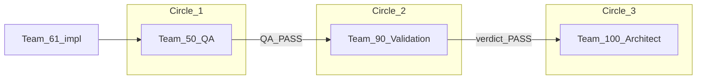

## מטרה

להפעיל **שלושה מעגלים עוקבים**, כל אחד בפרומפט קנוני נפרד, עם **PASS מלא** לפני המעבר הבא.  
**צוות 61** אחראי לתקן כל ליקוי / הערה שמופיעה במסגרת התפקיד לפני הפעלה חוזרת של אותו מעגל.

---

## מעגל 1 — QA (צוות 50)

| שדה | ערך |
|-----|-----|
| **פרומפט הפעלה** | `_COMMUNICATION/team_61/TEAM_61_TO_TEAM_50_S003_P013_WP001_CANARY_DASHBOARD_QA_PROMPT_v1.0.0.md` |
| **דוח נדרש** | `_COMMUNICATION/team_50/TEAM_50_S003_P013_WP001_*_QA_REPORT_v1.0.0.md` (או מוסכמת שמות צוות 50) |
| **קריטריון יציאה** | **QA_PASS** מלא — ללא חסימות פתוחות |
| **כשל** | Team 61 מתקן → מחזיר פרומפט / מבקש אימות חוזר עד PASS |

**הערה:** פרומפט מקביל ל-AOS-only (אופציונלי): `TEAM_61_TO_TEAM_51_S003_P013_WP001_CANARY_DASHBOARD_QA_PROMPT_v1.0.0.md` — לא מחליף את מעגל צוות 50 לפי הנוהל הזה.

---

## מעגל 2 — ולידציה חוקתית (צוות 90)

| שדה | ערך |
|-----|-----|
| **פרומפט הפעלה** | `_COMMUNICATION/team_61/TEAM_61_TO_TEAM_90_S003_P013_WP001_CANARY_DASHBOARD_REVIEW_PROMPT_v1.0.1.md` |
| **תנאי כניסה** | מעגל 1 הושלם ב-**QA_PASS** + ציטוט נתיב דוח צוות 50 |
| **פלט נדרש** | פסק דין קנוני תחת `_COMMUNICATION/team_90/` (מבנה כמנהג צוות 90) |
| **קריטריון יציאה** | **PASS** + `READY_FOR_GATE_5 = YES` (או שקיל תוכנית לפי WSM) |
| **כשל** | Team 61 מתקן / משלים ראיות → אימות חוזר |

---

## מעגל 3 — הגשה לאדריכלות (צוות 100)

| שדה | ערך |
|-----|-----|
| **פרומפט הפעלה** | `_COMMUNICATION/team_61/TEAM_61_TO_TEAM_100_S003_P013_WP001_CANARY_DASHBOARD_EVIDENCE_PROMPT_v1.0.1.md` |
| **תנאי כניסה** | מעגל 1 + מעגל 2 ב-**PASS**; Verdict Team 61 + (אופציונלי) Seal SOP-013 |
| **קריטריון יציאה** | אישור Team 100 / הנחיה להמשך canary או קידום ידע דרך Team 10 |

---

## ראיות SSOT (יישום)

| פריט | נתיב |
|------|------|
| Verdict Team 61 | `_COMMUNICATION/team_61/TEAM_61_S003_P013_CANARY_DASHBOARD_VERDICT_v1.0.0.md` |
| קוד | `agents_os/ui/js/pipeline-config.js`, `pipeline-dashboard.js`, `PIPELINE_DASHBOARD.html` |

---

## סגירה

סגירת משימה פורמלית: **SOP-013 Seal** —  
`_COMMUNICATION/team_61/TEAM_61_S003_P013_WP001_CANARY_DASHBOARD_SEAL_SOP013_v1.0.0.md` (מעודכן לשרשרת פרומפטים v1.0.1).

---

## נספח — אימות Team 51 (משלים; 2026-03-22)

| שדה | ערך |
|-----|-----|
| **תוצאה** | **QA_PASS** |
| **דוח** | `_COMMUNICATION/team_51/TEAM_51_S003_P013_WP001_GATE2_DASHBOARD_QA_REPORT_v1.0.0.md` |
| **הפניה Team 61** | `_COMMUNICATION/team_61/TEAM_61_S003_P013_WP001_TEAM51_QA_PASS_HANDOFF_v1.0.0.md` |

**לא מחליף** את מעגל **Team 50** כשער QA מאורגן עיקרי — ראה טבלת מעגל 1 לעיל.

---

**log_entry | TEAM_61 | S003_P013 | CANARY_DASHBOARD_QA_ORCHESTRATION | 2026-03-11**
