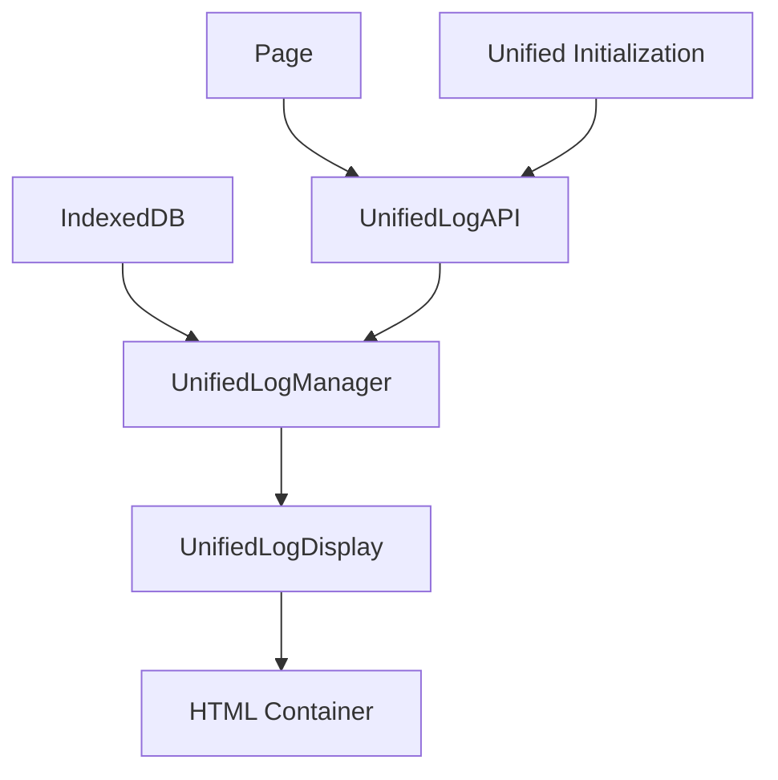

# מדריך מערכת הלוגים החדשה - TikTrack
## Unified Log System Guide

### 📋 תוכן עניינים

- [מבוא](#מבוא)
- [ארכיטקטורה](#ארכיטקטורה)
- [התקנה ושימוש בסיסי](#התקנה-ושימוש-בסיסי)
- [API Reference](#api-reference)
- [דוגמאות קוד](#דוגמאות-קוד)
- [עיצוב והתאמה](#עיצוב-והתאמה)
- [אינטגרציה עם מערכת האיתחול](#אינטגרציה-עם-מערכת-האיתחול)
- [פתרון בעיות](#פתרון-בעיות)
- [FAQ](#faq)

---

## מבוא

מערכת הלוגים החדשה של TikTrack מספקת פתרון אחיד ומרכזי לתצוגת כל סוגי הלוגים במערכת. המערכת בנויה לפי עקרונות ITCSS עם תמיכה מלאה ב-RTL ועיצוב אחיד.

### 🎯 **יתרונות המערכת**

- **מקור אחד לאמת** - כל הלוגים במקום אחד
- **עיצוב אחיד** - ממשק עקבי לכל סוגי הלוגים
- **API פשוט** - שימוש קל בכל עמוד
- **ביצועים גבוהים** - טעינה מהירה וסינון מתקדם
- **ייצוא נתונים** - CSV, JSON, העתקה ללוח
- **רספונסיבי** - עובד על כל המכשירים
- **נגיש** - תמיכה מלאה בנגישות
- **מודל פרטים** - הצגת פרטים במודל מעוצב עם כפתור סגירה

### 📊 **סוגי לוג נתמכים**

| סוג לוג | תיאור | אייקון | צבע |
|---------|--------|--------|------|
| `notificationHistory` | היסטוריית התראות | 🔔 | ירוק |
| `notificationStats` | סטטיסטיקות התראות | 📊 | כחול |
| `linterHistory` | היסטוריית Linter | 🔍 | כתום |
| `systemLogs` | לוגים מערכתיים | ⚙️ | אפור |
| `errorReports` | דוחות שגיאות | ⚠️ | אדום |
| `fileMappings` | מיפוי קבצים | 📁 | סגול |
| `scanningResults` | תוצאות סריקה | 🔎 | טורקיז |
| `jsMapAnalysis` | ניתוח JS-Map | 🗺️ | ורוד |
| `duplicatesAnalysis` | ניתוח כפילויות | 📋 | צהוב |
| `chartHistory` | היסטוריית גרפים | 📈 | כחול |

---

## ארכיטקטורה

### 🏗️ **מבנה הקבצים**

```
trading-ui/
├── scripts/
│   ├── unified-log-manager.js      # מנהל הלוגים המרכזי
│   ├── unified-log-display.js      # קומפוננט התצוגה
│   └── unified-log-api.js          # API פשוט לשימוש
├── styles-new/06-components/
│   └── _unified-log-display.css    # עיצוב ITCSS
└── unified-logs-demo.html          # דף דוגמה
```

### 🔄 **זרימת הנתונים**



### 🧩 **רכיבי המערכת**

1. **UnifiedLogManager** - מנהל הנתונים והלוגיקה
2. **UnifiedLogDisplay** - קומפוננט התצוגה
3. **UnifiedLogAPI** - ממשק פשוט לשימוש
4. **CSS Components** - עיצוב ITCSS אחיד

---

## התקנה ושימוש בסיסי

### 1. **טעינת הקבצים**

```html
<!-- CSS (בסדר ITCSS) -->
<link rel="stylesheet" href="styles-new/06-components/_unified-log-display.css">

<!-- JavaScript -->
<script src="scripts/unified-log-manager.js"></script>
<script src="scripts/unified-log-display.js"></script>
<script src="scripts/unified-log-api.js"></script>
```

### 2. **שימוש בסיסי**

```html
<!-- HTML -->
<div id="my-log-container"></div>

<script>
// הצגת לוג התראות
window.showNotificationLog('my-log-container');

// הצגת לוג Linter
window.showLinterLog('my-log-container');

// הצגת מספר לוגים
window.UnifiedLogAPI.showMultipleLogs([
    { type: 'notificationHistory', container: 'notifications-log' },
    { type: 'linterHistory', container: 'linter-log' }
]);
</script>
```

### 3. **אינטגרציה עם מערכת האיתחול**

```javascript
// ב-page-initialization-configs.js
'my-page.html': {
    name: 'My Page',
    customInitializers: [
        async (pageConfig) => {
            // אתחול מערכת הלוגים
            if (window.UnifiedLogAPI) {
                await window.UnifiedLogAPI.initialize();
                await window.showNotificationLog('log-container');
            }
        }
    ]
}
```

---

## API Reference

### 🚀 **פונקציות מהירות**

#### `window.showNotificationLog(containerId, options)`
הצגת לוג התראות

```javascript
await window.showNotificationLog('container-id', {
    displayConfig: 'default',
    autoRefresh: true,
    refreshInterval: 10000
});
```

#### `window.showLinterLog(containerId, options)`
הצגת לוג Linter

```javascript
await window.showLinterLog('container-id');
```

#### `window.showSystemLogs(containerId, options)`
הצגת לוגים מערכתיים

```javascript
await window.showSystemLogs('container-id');
```

#### `window.exportLog(logType, format, options)`
ייצוא נתונים

```javascript
// ייצוא CSV
await window.exportLog('notificationHistory', 'csv');

// ייצוא JSON
await window.exportLog('notificationHistory', 'json');

// העתקה ללוח
await window.exportLog('notificationHistory', 'clipboard');
```

### 🔧 **API מתקדם**

#### `window.UnifiedLogAPI.showLog(logType, containerId, options)`

```javascript
await window.UnifiedLogAPI.showLog('notificationHistory', 'container-id', {
    displayConfig: 'full',
    autoRefresh: true,
    refreshInterval: 5000,
    filters: {
        timeRange: 'lastDay',
        type: 'error'
    },
    sortBy: 'timestamp',
    sortOrder: 'desc',
    pagination: {
        page: 1,
        itemsPerPage: 100
    }
});
```

#### `window.UnifiedLogAPI.showMultipleLogs(logConfigs, globalOptions)`

```javascript
const results = await window.UnifiedLogAPI.showMultipleLogs([
    { type: 'notificationHistory', container: 'notifications' },
    { type: 'linterHistory', container: 'linter' },
    { type: 'systemLogs', container: 'system' }
], {
    displayConfig: 'compact',
    autoRefresh: false
});
```

#### `window.UnifiedLogAPI.getLogData(logType, options)`

```javascript
const data = await window.UnifiedLogAPI.getLogData('notificationHistory', {
    filters: { timeRange: 'lastWeek' },
    sortBy: 'timestamp',
    sortOrder: 'desc'
});
```

---

## דוגמאות קוד

### 1. **דף פשוט עם לוג התראות**

```html
<!DOCTYPE html>
<html lang="he" dir="rtl">
<head>
    <meta charset="UTF-8">
    <title>דף עם לוג התראות</title>
    <link rel="stylesheet" href="styles-new/06-components/_unified-log-display.css">
</head>
<body>
    <div class="container">
        <h1>לוג התראות</h1>
        <div id="notifications-log"></div>
    </div>

    <script src="scripts/unified-log-manager.js"></script>
    <script src="scripts/unified-log-display.js"></script>
    <script src="scripts/unified-log-api.js"></script>
    
    <script>
        document.addEventListener('DOMContentLoaded', async function() {
            await window.showNotificationLog('notifications-log', {
                displayConfig: 'default',
                autoRefresh: true
            });
        });
    </script>
</body>
</html>
```

### 2. **דף עם מספר לוגים**

```html
<div class="row">
    <div class="col-md-6">
        <h3>התראות</h3>
        <div id="notifications-log"></div>
    </div>
    <div class="col-md-6">
        <h3>Linter</h3>
        <div id="linter-log"></div>
    </div>
</div>

<script>
document.addEventListener('DOMContentLoaded', async function() {
    await window.UnifiedLogAPI.showMultipleLogs([
        { type: 'notificationHistory', container: 'notifications-log' },
        { type: 'linterHistory', container: 'linter-log' }
    ], {
        displayConfig: 'compact'
    });
});
</script>
```

### 3. **לוג עם סינון מותאם**

```javascript
// יצירת לוג עם סינון מותאם
await window.UnifiedLogAPI.showLog('notificationHistory', 'container-id', {
    filters: {
        timeRange: 'lastDay',
        type: 'error',
        search: 'שגיאה'
    },
    sortBy: 'timestamp',
    sortOrder: 'desc',
    pagination: {
        page: 1,
        itemsPerPage: 25
    }
});
```

### 4. **ייצוא נתונים מתקדם**

```javascript
// ייצוא עם סינון
await window.exportLog('notificationHistory', 'csv', {
    filters: {
        timeRange: 'lastWeek',
        type: 'error'
    }
});

// קבלת נתונים ללא תצוגה
const data = await window.getLogData('notificationHistory', {
    filters: { timeRange: 'lastDay' }
});
console.log('התקבלו', data.data.length, 'רשומות');
```

---

## עיצוב והתאמה

### 🎨 **תצורות תצוגה**

#### `default` - ברירת מחדל
```javascript
{
    itemsPerPage: 50,
    showPagination: true,
    showSearch: true,
    showFilters: true,
    showExport: true,
    showRefresh: true,
    showStats: true,
    compactMode: false,
    autoRefresh: false
}
```

#### `compact` - קומפקטי
```javascript
{
    itemsPerPage: 20,
    showPagination: true,
    showSearch: false,
    showFilters: false,
    showExport: true,
    showRefresh: true,
    showStats: false,
    compactMode: true
}
```

#### `full` - מלא
```javascript
{
    itemsPerPage: 100,
    showPagination: true,
    showSearch: true,
    showFilters: true,
    showExport: true,
    showRefresh: true,
    showStats: true,
    compactMode: false,
    autoRefresh: true,
    refreshInterval: 10000
}
```

### 🎛️ **התאמת עיצוב**

```css
/* התאמת צבעים */
.unified-log-display {
    --color-primary: #007bff;
    --color-success: #28a745;
    --color-warning: #ffc107;
    --color-danger: #dc3545;
}

/* התאמת גודל */
.unified-log-display {
    --spacing-md: 1rem;
    --spacing-lg: 1.5rem;
    --font-size-base: 14px;
}
```

### 📱 **רספונסיביות**

המערכת תומכת באופן אוטומטי בכל הגדלי מסך:

- **Desktop** (>768px) - תצוגה מלאה
- **Tablet** (768px-480px) - תצוגה מותאמת
- **Mobile** (<480px) - תצוגה קומפקטית

---

## אינטגרציה עם מערכת האיתחול

### 🔄 **אינטגרציה אוטומטית**

המערכת משולבת עם מערכת האיתחול המאוחדת:

```javascript
// ב-page-initialization-configs.js
'notifications-center.html': {
    name: 'Notifications Center',
    customInitializers: [
        async (pageConfig) => {
            // אתחול אוטומטי של מערכת הלוגים
            if (window.UnifiedLogAPI) {
                await window.UnifiedLogAPI.initialize();
                
                // החלפת התצוגה הישנה במערכת החדשה
                const historyContainer = document.getElementById('notificationHistory');
                if (historyContainer) {
                    await window.showNotificationLog('notificationHistory', {
                        displayConfig: 'default',
                        autoRefresh: true
                    });
                }
            }
        }
    ]
}
```

### ⚡ **טעינה מהירה**

המערכת תומכת בטעינה מהירה:

```javascript
// טעינה בסוף תהליך האיתחול
document.addEventListener('DOMContentLoaded', async function() {
    // המתן לסיום האיתחול המאוחד
    if (window.UnifiedAppInitializer) {
        // המערכת תיטען אוטומטית
    } else {
        // אתחול ידני
        await window.UnifiedLogAPI.initialize();
    }
});
```

---

## פתרון בעיות

### ❌ **בעיות נפוצות**

#### 1. **"UnifiedLogAPI not available"**
```javascript
// בדוק שהקבצים נטענו
if (!window.UnifiedLogAPI) {
    console.error('UnifiedLogAPI not loaded');
    // ודא שהקבצים נטענו בסדר הנכון
}
```

#### 2. **"Container not found"**
```javascript
// ודא שהקונטיינר קיים
const container = document.getElementById('my-container');
if (!container) {
    console.error('Container my-container not found');
}
```

#### 3. **"IndexedDB not available"**
```javascript
// המערכת תעבוד עם localStorage כגיבוי
if (!window.UnifiedIndexedDB) {
    console.warn('IndexedDB not available, using localStorage fallback');
}
```

#### 4. **נתונים לא מוצגים**
```javascript
// בדוק שהלוג טיפוס נתמך
const availableTypes = window.getAvailableLogTypes();
console.log('Available log types:', availableTypes);

// בדוק שיש נתונים
const data = await window.getLogData('notificationHistory');
console.log('Data count:', data.data.length);
```

### 🔍 **דיבוג**

```javascript
// בדיקת סטטוס המערכת
const status = window.UnifiedLogAPI.getStatus();
console.log('API Status:', status);

// בדיקת תצוגות פעילות
const displays = window.UnifiedLogAPI.getActiveDisplays();
console.log('Active displays:', displays);

// בדיקת סוגי לוג זמינים
const logTypes = window.getAvailableLogTypes();
console.log('Available log types:', logTypes);
```

---

## FAQ

### ❓ **שאלות נפוצות**

#### Q: איך מוסיפים סוג לוג חדש?
A: ערוך את `unified-log-manager.js` והוסף את הסוג החדש ל-`initializeLogTypes()`:

```javascript
this.logTypes.set('myNewLog', {
    name: 'הלוג החדש שלי',
    icon: 'fa-star',
    color: '#ff6b6b',
    description: 'תיאור הלוג החדש',
    fields: ['field1', 'field2'],
    defaultFilters: ['timeRange'],
    sortBy: 'timestamp',
    sortOrder: 'desc'
});
```

#### Q: איך משנים את העיצוב?
A: ערוך את `_unified-log-display.css` או השתמש ב-CSS Variables:

```css
.unified-log-display {
    --color-primary: #your-color;
    --spacing-md: 1rem;
}
```

#### Q: איך מוסיפים פילטר מותאם?
A: הוסף את הפילטר ל-`initializeFilterConfigs()`:

```javascript
this.filterConfigs.set('myFilter', {
    type: 'select',
    label: 'הפילטר שלי',
    options: [
        { value: 'option1', label: 'אפשרות 1' },
        { value: 'option2', label: 'אפשרות 2' }
    ]
});
```

#### Q: איך משנים את מספר הפריטים בדף?
A: השתמש באפשרות `pagination`:

```javascript
await window.showNotificationLog('container-id', {
    pagination: { page: 1, itemsPerPage: 100 }
});
```

#### Q: איך מוסיפים ייצוא פורמט חדש?
A: הוסף את הפורמט ל-`initializeExportConfigs()`:

```javascript
this.exportConfigs.set('xml', {
    name: 'XML',
    icon: 'fa-file-code',
    description: 'ייצוא לקובץ XML',
    mimeType: 'application/xml',
    extension: 'xml'
});
```

---

## סיכום

מערכת הלוגים החדשה של TikTrack מספקת פתרון מקיף ואחיד לתצוגת כל סוגי הלוגים במערכת. המערכת בנויה לפי עקרונות ITCSS עם תמיכה מלאה ב-RTL, API פשוט לשימוש, וביצועים גבוהים.

### 🎯 **הצעדים הבאים**

1. **הטמעה** - השתמש במערכת בדפים קיימים
2. **התאמה** - התאם את העיצוב לצרכים שלך
3. **הרחבה** - הוסף סוגי לוג חדשים
4. **אופטימיזציה** - שפר ביצועים לפי הצורך

### 📞 **תמיכה**

לשאלות או בעיות:
1. בדוק את מדריך פתרון הבעיות
2. עיין בדף הדוגמה `unified-logs-demo.html`
3. בדוק את הקונסול לדיבוג

---

**Last Updated:** January 2025  
**Version:** 1.0.0  
**Author:** TikTrack Development Team
