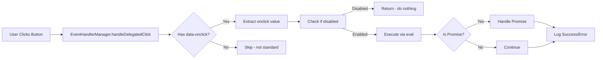

# Event Handling Standard - TikTrack
## סטנדרט אחיד לניהול אירועים במערכת

**גרסה:** 1.0.0  
**תאריך עדכון:** 2025-01-27  
**סטטוס:** תקן מחייב - מעבר מלא ל-`data-onclick`

---

## 📋 סקירה כללית

מסמך זה מגדיר את הסטנדרט האחיד לניהול כל האירועים במערכת TikTrack. הסטנדרט מחייב שימוש ב-`data-onclick` כשיטה היחידה לטיפול באירועי לחיצה על כפתורים.

### מטרת הסטנדרט

1. **אחידות מלאה** - כל הכפתורים במערכת משתמשים באותה שיטה
2. **ניהול מרכזי** - כל האירועים מטופלים דרך `EventHandlerManager`
3. **תמיכה בתוכן דינמי** - כפתורים שנוצרים בזמן ריצה עובדים אוטומטית
4. **לוגים ו-debugging** - מעקב מלא אחרי כל האירועים
5. **Error handling** - טיפול בשגיאות מקצועי
6. **אינטגרציה מלאה** - תאימות עם כל המערכות הכלליות

---

## 🎯 התקן המחייב

### ⚠️ **חובה: `data-onclick` בלבד**

**כל כפתור במערכת חייב להשתמש ב-`data-onclick` במקום `onclick` רגיל.**

```html
<!-- ✅ נכון -->
<button data-onclick="window.sortTable('positions', 0)">סימבול</button>
<button data-button-type="ADD" data-onclick="window.showModalSafe('modal', 'add')" data-text="הוסף"></button>

<!-- ❌ שגוי - לא להשתמש ב-onclick רגיל -->
<button onclick="window.sortTable('positions', 0)">סימבול</button>
```

### יוצאים מהכלל

**אין יוצאים מהכלל** - כל הכפתורים חייבים להשתמש ב-`data-onclick`.

---

## 🏗️ ארכיטקטורה

### EventHandlerManager - המנהל המרכזי

**מיקום:** `trading-ui/scripts/event-handler-manager.js`

`EventHandlerManager` הוא המנהל המרכזי של כל האירועים במערכת:

1. **Event Delegation** - listener אחד על `document` במקום listeners רבים
2. **זיהוי אוטומטי** - מזהה כל לחיצה על כפתור עם `data-onclick`
3. **ביצוע הפונקציה** - מבצע את הפונקציה דרך `eval()` (בטוח כי מבוקר)
4. **Error Handling** - לוכד שגיאות ומדווח עליהן
5. **תמיכה ב-Promise/Async** - מטפל בפונקציות אסינכרוניות

### תהליך העבודה



### קוד המימוש

```javascript
// EventHandlerManager מטפל בכל לחיצות
handleDelegatedClick(event) {
    const target = event.target;
    
    // זיהוי כפתור עם data-onclick
    const buttonWithOnclick = target.closest('button[data-onclick], a[data-onclick]');
    
    if (buttonWithOnclick) {
        // בדיקה אם הכפתור disabled
        if (buttonWithOnclick.disabled || buttonWithOnclick.hasAttribute('disabled')) {
            return;
        }
        
        const onclickValue = buttonWithOnclick.getAttribute('data-onclick');
        
        if (onclickValue && onclickValue !== 'null' && onclickValue !== '') {
            try {
                // ביצוע הפונקציה
                const result = eval(onclickValue);
                
                // טיפול ב-Promise (async functions)
                if (result && typeof result.then === 'function') {
                    result
                        .then(() => {
                            // לוג הצלחה
                        })
                        .catch(error => {
                            // לוג שגיאה
                        });
                }
            } catch (error) {
                // לוג שגיאה מפורט
            }
        }
    }
}
```

---

## 🔗 אינטגרציה עם מערכות כלליות

### 1. UnifiedTableSystem - טבלאות וסידור

#### כותרות סידור

כל כותרת סידור חייבת להשתמש ב-`data-onclick`:

```html
<!-- ✅ נכון -->
<th class="col-symbol">
    <button class="btn btn-link sortable-header" 
            data-onclick="window.sortTable('positions', 0)">
        סימבול <span class="sort-icon">↕</span>
    </button>
</th>

<!-- ❌ שגוי -->
<th class="col-symbol">
    <button class="btn btn-link sortable-header" 
            onclick="window.sortTable('positions', 0)">
        סימבול <span class="sort-icon">↕</span>
    </button>
</th>
```

#### איך זה עובד

1. המשתמש לוחץ על כותרת סידור
2. `EventHandlerManager` מזהה את ה-`data-onclick`
3. מבוצע `window.sortTable('positions', 0)`
4. `window.sortTable` מחפש את הטבלה ב-`UnifiedTableSystem`
5. אם הטבלה רשומה - `UnifiedTableSystem.sorter.sort()` מטפל
6. אחרת - fallback ל-`sortTableData` הישן

#### דוגמת קוד מלא

```javascript
// רישום טבלה ב-UnifiedTableSystem
window.UnifiedTableSystem.registry.register('positions', {
    dataGetter: () => window.positionsPortfolioState?.positionsData || [],
    updateFunction: (data) => window.updatePositionsTable(data),
    tableSelector: '#positionsTable',
    columns: window.TABLE_COLUMN_MAPPINGS?.positions || [],
    sortable: true
});

// HTML עם data-onclick
<button class="btn btn-link sortable-header" 
        data-onclick="window.sortTable('positions', 0)">
    סימבול
</button>
```

### 2. Button System - כפתורים דינמיים

#### יצירת כפתורים דרך Button System

מערכת הכפתורים (`button-system-init.js`) יוצרת אוטומטית כפתורים עם `data-onclick`:

```javascript
// Button System יוצר כפתור עם data-onclick
createButtonFromData(type, onClick, ...) {
    // ...
    let dataOnclickAttr = onClick ? ` data-onclick="${onClick}"` : '';
    return `<button ... ${dataOnclickAttr}>...</button>`;
}
```

#### דוגמה

```html
<!-- כפתור שנוצר דרך Button System -->
<button data-button-type="ADD" 
        data-entity-type="execution" 
        data-variant="full" 
        data-onclick="window.showModalSafe('modal', 'add')" 
        data-text="הוסף ביצוע">
</button>
```

**הערה:** כל כפתור שנוצר דרך `Button System` משתמש אוטומטית ב-`data-onclick`.

### 3. ModalManagerV2 - מודולים

#### כפתורי מודולים

כפתורים בתוך מודולים עובדים עם `data-onclick`:

```html
<!-- כפתור שמירה במודול -->
<button data-button-type="SAVE" 
        data-onclick="saveEntity()" 
        data-bs-dismiss="modal"
        data-text="שמור">
</button>

<!-- כפתור ביטול במודול -->
<button data-button-type="CANCEL" 
        data-onclick="window.ModalManagerV2.hideModal()" 
        data-bs-dismiss="modal"
        data-text="ביטול">
</button>
```

#### תאימות Bootstrap

`EventHandlerManager` **לא משתמש ב-`preventDefault()`** כדי לאפשר Bootstrap modals לעבוד:

```javascript
// אין preventDefault - Bootstrap יכול לטפל באירוע
// אין stopPropagation - handlers אחרים יכולים לעבוד
```

### 4. UnifiedCacheSystem - ריענון ומטמון

#### כפתורי ריענון

כפתורי ריענון משתמשים ב-`data-onclick`:

```html
<!-- כפתור ריענון -->
<button data-button-type="REFRESH" 
        data-onclick="window.UnifiedCacheManager.clear('table-data')" 
        data-text="רענן">
</button>

<!-- כפתור ניקוי מטמון -->
<button data-button-type="CLEAR" 
        data-onclick="window.UnifiedCacheManager.clearAllCache()" 
        data-text="נקה מטמון">
</button>
```

#### אינטגרציה עם Cache

כפתורי ריענון יכולים לקרוא לפונקציות של `UnifiedCacheManager`:

```javascript
// דוגמה: ריענון טבלה
window.refreshTableData = async function() {
    // ניקוי מטמון
    await window.UnifiedCacheManager.clear('table-data');
    
    // טעינה מחדש
    await loadTableData();
};
```

---

## 📝 דוגמאות שימוש

### דוגמה 1: כפתור פשוט

```html
<button data-button-type="EDIT" 
        data-onclick="editRecord(123)" 
        data-text="ערוך">
</button>
```

### דוגמה 2: כפתור עם פרמטרים מורכבים

```html
<button data-button-type="VIEW" 
        data-onclick="window.showEntityDetails('execution', 4, { mode: 'view' })" 
        data-text="צפה">
</button>
```

### דוגמה 3: כפתור בתוך טבלה דינמית

```javascript
// יצירת כפתור דינמי
const buttonHtml = `
    <button data-button-type="DELETE" 
            data-onclick="deleteRow(${rowId})" 
            data-text="מחק">
    </button>
`;
tableRow.innerHTML += buttonHtml;
// הכפתור יעבוד מיד ללא צורך ב-addEventListener!
```

### דוגמה 4: כותרת סידור בטבלה

```html
<th class="col-name">
    <button class="btn btn-link sortable-header" 
            data-onclick="window.sortTable('accounts', 0)">
        שם החשבון <span class="sort-icon">↕</span>
    </button>
</th>
```

### דוגמה 5: כפתור TOGGLE

```html
<button data-button-type="TOGGLE" 
        data-variant="small" 
        data-onclick="toggleSection('main')" 
        data-text="הצג/הסתר">
</button>
```

### דוגמה 6: כפתור עם Promise/Async

```javascript
// הפונקציה מחזירה Promise
async function loadData() {
    const data = await fetch('/api/data');
    return data.json();
}

// הכפתור
<button data-onclick="loadData().then(data => updateTable(data))">
    טען נתונים
</button>
```

---

## ✅ Best Practices

### 1. תמיד השתמש ב-`data-onclick`

```html
<!-- ✅ נכון -->
<button data-onclick="doSomething()">לחץ</button>

<!-- ❌ שגוי -->
<button onclick="doSomething()">לחץ</button>
```

### 2. בדוק שהפונקציה קיימת

```javascript
// ✅ נכון - בדיקה לפני קריאה
window.doSomething = window.doSomething || function() {
    console.warn('doSomething not implemented');
};

// ❌ שגוי - ללא בדיקה
// יכול לגרום לשגיאה אם הפונקציה לא קיימת
```

### 3. השתמש ב-`window.` לנגישות גלובלית

```html
<!-- ✅ נכון - פונקציה נגישה גלובלית -->
<button data-onclick="window.sortTable('positions', 0)">סידור</button>

<!-- ⚠️ זהירות - רק אם הפונקציה מוגדרת גלובלית -->
<button data-onclick="sortTable('positions', 0)">סידור</button>
```

### 4. עטוף פרמטרים מורכבים

```html
<!-- ✅ נכון - עטיפה נכונה -->
<button data-onclick="window.showEntityDetails('execution', 4, { mode: 'view' })">
    צפה
</button>

<!-- ❌ שגוי - עטיפה לא נכונה -->
<button data-onclick="window.showEntityDetails('execution', 4, { mode: 'view' })">
    צפה
</button>
```

### 5. השתמש במערכת הכפתורים ליצירת כפתורים

```javascript
// ✅ נכון - יצירה דרך Button System
const button = window.advancedButtonSystem.createButtonFromData(
    'ADD',
    'window.showModalSafe("modal", "add")',
    '',
    '',
    'הוסף',
    '',
    'execution'
);

// ❌ שגוי - יצירה ידנית ללא data-onclick
const button = '<button onclick="doSomething()">לחץ</button>';
```

---

## 🐛 Troubleshooting

### בעיה: כפתור לא עובד

**סיבות אפשריות:**
1. הכפתור לא נוצר עם `data-onclick`
2. הפונקציה לא קיימת ב-`window`
3. שגיאה בביצוע הפונקציה
4. הכפתור disabled

**פתרון:**
```javascript
// בדיקה מהירה בקונסולה
const button = document.querySelector('button[data-onclick]');
console.log('Button:', button);
console.log('data-onclick value:', button?.getAttribute('data-onclick'));
console.log('Function exists:', typeof window[button?.getAttribute('data-onclick')?.split('(')[0]] === 'function');
console.log('Is disabled:', button?.disabled);
```

### בעיה: Bootstrap Modal לא נסגר

**סיבה:** כפתור עם `data-onclick` בתוך modal עלול להפריע

**פתרון:** ודא שהכפתור לא מונע את האירוע (המערכת כבר לא עושה `preventDefault()`)

```html
<!-- ✅ נכון - Bootstrap יכול לטפל -->
<button data-button-type="SAVE" 
        data-onclick="saveData()" 
        data-bs-dismiss="modal"
        data-text="שמור">
</button>
```

### בעיה: כפתור פועל פעמיים

**סיבה:** אולי יש גם `onclick` רגיל וגם `data-onclick`

**פתרון:** הסר את ה-`onclick` הרגיל, השתמש רק ב-`data-onclick`

```html
<!-- ❌ שגוי - יש גם onclick וגם data-onclick -->
<button onclick="doSomething()" data-onclick="doSomething()">לחץ</button>

<!-- ✅ נכון - רק data-onclick -->
<button data-onclick="doSomething()">לחץ</button>
```

### בעיה: כפתור דינמי לא עובד

**סיבה:** כפתור שנוצר דינמית לא מזוהה

**פתרון:** כפתורים עם `data-onclick` עובדים אוטומטית גם אם נוצרו דינמית:

```javascript
// יצירת כפתור דינמי
const button = document.createElement('button');
button.setAttribute('data-onclick', 'doSomething()');
button.textContent = 'לחץ כאן';
container.appendChild(button);
// הכפתור יעבוד מיד ללא צורך ב-addEventListener!
```

---

## 📚 קישורים קשורים

- **EventHandlerManager:** `documentation/02-ARCHITECTURE/FRONTEND/EVENT_HANDLER_SYSTEM.md`
- **Button System:** `documentation/02-ARCHITECTURE/FRONTEND/button-system.md`
- **UnifiedTableSystem:** `documentation/02-ARCHITECTURE/FRONTEND/TABLE_SYSTEM_ANALYSIS.md`
- **ModalManagerV2:** `documentation/03-DEVELOPMENT/TOOLS/MODAL_MANAGER_V2_SPECIFICATION.md`
- **UnifiedCacheSystem:** `documentation/02-ARCHITECTURE/FRONTEND/CACHE_IMPLEMENTATION_GUIDE.md`
- **מדריך מעבר:** `documentation/03-DEVELOPMENT/GUIDES/MIGRATION_TO_DATA_ONCLICK.md`

---

## 🔄 סטטוס סטנדרטיזציה

### תאריך התחלה: 2025-01-27

### מטרות:
- [ ] 100% מיגרציה של כותרות סידור
- [ ] 100% מיגרציה של כפתורים רגילים
- [ ] 100% מיגרציה של כפתורי מודולים
- [ ] 100% מיגרציה של כפתורי ריענון
- [ ] הסרת כל השימושים ב-`onclick` רגיל

### סטטוס נוכחי:
- **כותרות סידור:** 0% (30+ כפתורים ב-`trading_accounts.html` לבד)
- **כפתורים רגילים:** ~23% (7/30 ב-`trading_accounts.html`)
- **כפתורי מודולים:** ~50% (משוער)
- **כפתורי ריענון:** ~30% (משוער)

---

## 📞 תמיכה

לשאלות או בעיות עם הסטנדרט:
1. בדוק את הלוגים ב-console
2. בדוק את התיעוד ב-`documentation/03-DEVELOPMENT/GUIDES/MIGRATION_TO_DATA_ONCLICK.md`
3. בדוק את הקוד ב-`trading-ui/scripts/event-handler-manager.js`

---

## 🔄 היסטוריית עדכונים

### 2025-01-27 - יצירת סטנדרט אחיד
- ✅ יצירת מסמך זה
- ✅ הגדרת `data-onclick` כתקן יחיד
- ✅ תיעוד אינטגרציה עם כל המערכות
- ✅ יצירת מדריך מעבר

