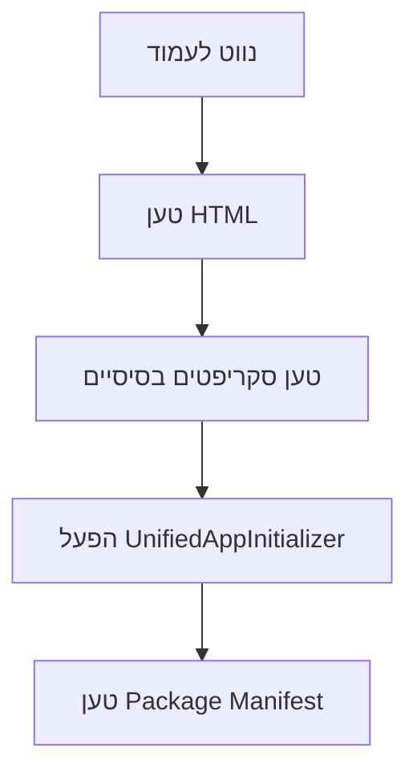
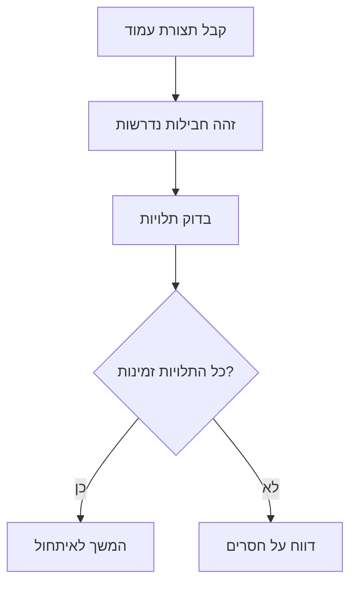
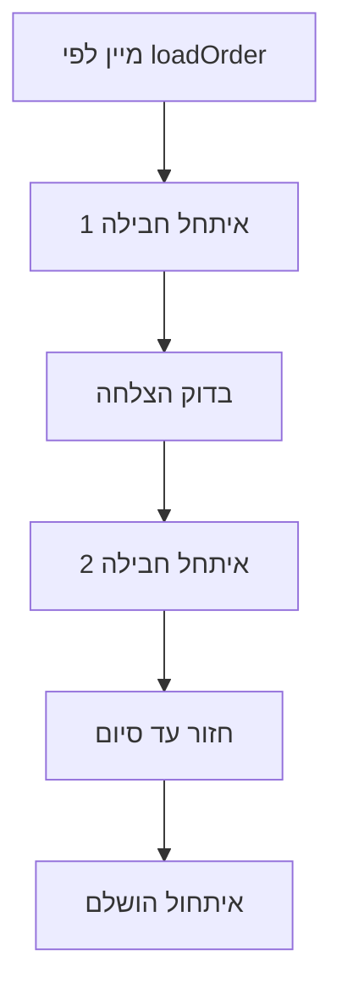
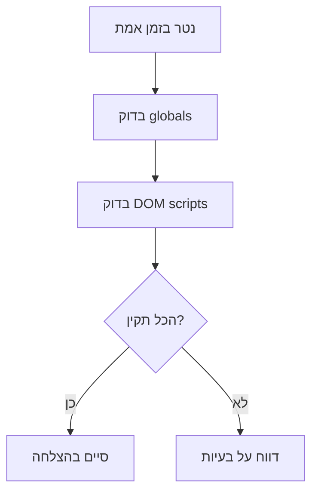

# מערכת Init/Loading - ארכיטקטורה מקיפה

**תאריך יצירה:** 1 בינואר 2026
**גרסה:** 2.0.0
**עודכן:** 1 בינואר 2026 - תיעוד מאוחד ומסודר
**סטטוס:** ✅ פעיל ומתועד
**נקודת כניסה:** `trading-ui/scripts/modules/core-systems.js`

---

## 📋 תוכן עניינים

1. [סקירה כללית](#סקירה-כללית)
2. [ארכיטקטורה כללית](#ארכיטקטורה-כללית)
3. [רכיבי הליבה](#רכיבי-הליבה)
4. [זרימת איתחול](#זרימת-איתחול)
5. [ניטור ובקרה](#ניטור-ובקרה)
6. [פתרון בעיות](#פתרון-בעיות)
7. [תיעוד נוסף](#תיעוד-נוסף)

---

## 🎯 סקירה כללית

### מטרת המערכת

מערכת Init/Loading היא המערכת האחראית על טעינה ואיתחול כל רכיבי המערכת בצורה מסודרת ובטוחה. המערכת מבטיחה שכל התלויות נטענות בסדר הנכון, כל ה-globals זמינים, וכל המערכות מאותחלות ללא שגיאות.

### היקף הכיסוי

- **טעינת סקריפטים** - ניהול סדר טעינה ותלויות
- **איתחול מערכות** - הפעלת כל רכיבי המערכת
- **ניטור** - מעקב אחר תהליך האיתחול
- **בקרת שגיאות** - טיפול בכשלים ודיווח

### עקרונות יסוד

1. **סדר קפדני** - כל חבילה נטענת לפי loadOrder מוגדר
2. **תלויות ברורות** - כל תלות מוצהרת במפורש
3. **ניטור מלא** - כל שלב מתועד ומבוקר
4. **בטיחות** - טיפול בשגיאות ללא השפעה על המערכת

### Option 1 Load-Order Discipline

מערכת Init/Loading מיישמת את משמעת Option 1 לאימות:

- **Auth Package חובה** - כל עמוד מוגן חייב לכלול auth package
- **Auth Guard Load Order** - נטען ב-23-24 (אחרי auth.js)
- **Redirect-Only Flow** - ללא modal login, הפניה ל-/login.html בלבד
- **SessionStorageLayer בלבד** - ללא localStorage auth tokens

---

## 🏗️ ארכיטקטורה כללית

### מבנה הרמות

```
┌─────────────────────────────────────┐
│         UnifiedAppInitializer       │ ← נקודת כניסה מרכזית
├─────────────────────────────────────┤
│           Package Manifest          │ ← מניפסט חבילות ותלויות
├─────────────────────────────────────┤
│         Core Systems Layer          │ ← מערכות בסיס (Logger, Cache, Auth)
├─────────────────────────────────────┤
│       Feature Systems Layer         │ ← מערכות תכונות (UI, API, Widgets)
├─────────────────────────────────────┤
│       Monitoring Layer              │ ← ניטור ובקרה
└─────────────────────────────────────┘
```

### רכיבים מרכזיים

#### 1. UnifiedAppInitializer

**תפקיד:** נקודת הכניסה המרכזית
**מיקום:** `trading-ui/scripts/modules/core-systems.js`
**אחריות:** תזמון ואיתחול כל המערכות

#### 2. Package Manifest

**תפקיד:** מקור אמת יחיד לחבילות ותלויות
**מיקום:** `trading-ui/scripts/init-system/package-manifest.js`
**אחריות:** הגדרת כל החבילות והתלויות

#### 3. Monitoring Functions

**תפקיד:** ניטור ובקרה של תהליך האיתחול
**מיקום:** `trading-ui/scripts/monitoring-functions.js`
**אחריות:** מעקב אחר טעינת סקריפטים וזמינות globals

#### 4. Core Systems

**תפקיד:** מערכות בסיס חיוניות
**מיקום:** `trading-ui/scripts/modules/`
**אחריות:** Logger, Cache, Auth, UI positioning

---

## 🔧 רכיבי הליבה

### UnifiedAppInitializer

```javascript
class UnifiedAppInitializer {
  // תכונות מרכזיות
  pageConfig: Page configuration object
  packageManifest: All packages definition
  monitoring: Monitoring functions

  // מתודות עיקריות
  initializeUnifiedApp()     // איתחול ראשי
  validateDependencies()     // בדיקת תלויות
  executeInitialization()    // ביצוע איתחול
  finalizeSetup()           // סיום והגדרות אחרונות
}
```

**זרימת עבודה:**

1. קבלת תצורת עמוד
2. טעינת מניפסט חבילות
3. בדיקת תלויות
4. איתחול לפי סדר
5. ניטור ובקרה

### Package Manifest Structure

```javascript
const PACKAGE_MANIFEST = {
  "package-id": {
    id: "package-id",
    name: "Package Display Name",
    description: "Package description",
    version: "1.0.0",
    critical: true,
    loadOrder: 1.0,
    dependencies: ["dependency-package-id"],
    loadingStrategy: "defer",
    scripts: [
      {
        file: "path/to/script.js",
        globalCheck: "window.GlobalName",
        description: "Script description",
        required: true,
        loadOrder: 1
      }
    ]
  }
};
```

### Monitoring System

```javascript
// פונקציות ניטור מרכזיות
checkScriptExecutionSuccess()    // בדיקת globals
waitForPageFullyLoaded()         // המתנה לטעינה מלאה
checkForMismatches()            // השוואת HTML ל-DOM
compareHTMLvsDOM()              // ניתוח פערים
```

---

## 🔄 זרימת איתחול

### Phase 1: הכנה



### Phase 2: בדיקת תלויות



### Phase 3: איתחול לפי סדר



### Phase 4: ניטור ובקרה



---

## 📊 ניטור ובקרה

### מדדי בריאות

#### מדדי טעינה

- **Scripts Count Match:** HTML = DOM scripts
- **Load Time:** < 3 שניות לעמוד
- **Globals Availability:** 100% required globals
- **Error Rate:** 0 שגיאות קריטיות

#### מדדי ביצועים

- **Memory Usage:** < 50MB נוסף
- **Network Requests:** מינימום בקשות
- **Cache Hit Rate:** > 90%
- **Initialization Time:** < 2 שניות

### כלי ניטור

#### אוטומטיים

```bash
# בדיקת תלויות
node scripts/audit/validate-package-dependencies.js

# בדיקת סדר טעינה
node scripts/audit/validate-all-pages-load-order.js

# ניתוח תלויות
node scripts/audit/dependency-analyzer.js
```

#### ידניים

```javascript
// בדיקת globals
checkScriptExecutionSuccess()

// בדיקת scripts count
document.querySelectorAll('script[src]').length

// בדיקת DOM ready
document.readyState
```

---

## 🔧 פתרון בעיות

### בעיית "חסרים ב-globals"

**סימפטומים:**

- ReferenceError בשימוש ב-globals
- מערכות לא מתחילות
- פונקציות לא זמינות

**פתרון:**

1. בדוק סדר טעינה ב-package-manifest.js
2. ודא שחבילה נטענת לפני השימוש
3. בדוק globalCheck בהגדרת הסקריפט

### בעיית "scripts לא נטענים"

**סימפטומים:**

- HTML count > DOM count
- מערכות חסרות
- שגיאות ב-console

**פתרון:**

1. בדוק נתיבי קבצים
2. ודא ששרת מגיש קבצים
3. בדוק CSP ומדיניות אבטחה

### בעיית "תלויות מעגליות"

**סימפטומים:**

- אתחול לא מסתיים
- שגיאות טעינה
- מערכת תקועה

**פתרון:**

1. הרץ validate-package-dependencies.js
2. הסר תלויות מעגליות
3. שנה loadOrder אם נדרש

---

## 📚 תיעוד נוסף

- [UNIFIED_INITIALIZATION_SYSTEM.md](UNIFIED_INITIALIZATION_SYSTEM.md) - מערכת איתחול מאוחדת
- [PACKAGE_MANIFEST_SOT_DEVELOPER_GUIDE.md](PACKAGE_MANIFEST_SOT_DEVELOPER_GUIDE.md) - מדריך מניפסט SOT
- [INIT_LOADING_MONITORING_SYSTEM_GUIDE.md](../../03-DEVELOPMENT/TOOLS/INIT_LOADING_MONITORING_SYSTEM_GUIDE.md) - מדריך ניטור
- [MONITORING_SYSTEMS_ARCHITECTURE_OVERVIEW.md](MONITORING_SYSTEMS_ARCHITECTURE_OVERVIEW.md) - סקירת ארכיטקטורה ניטור
- [LOAD_ORDER_VALIDATION_SYSTEM.md](LOAD_ORDER_VALIDATION_SYSTEM.md) - מערכת אימות סדר טעינה

---

**Team F - Init/Loading System Architecture**
