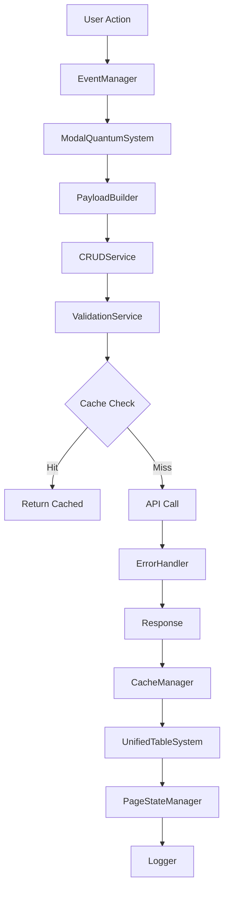
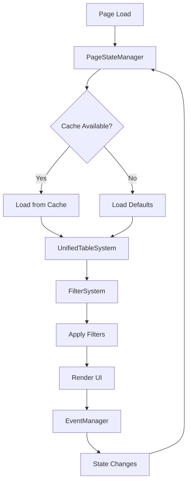
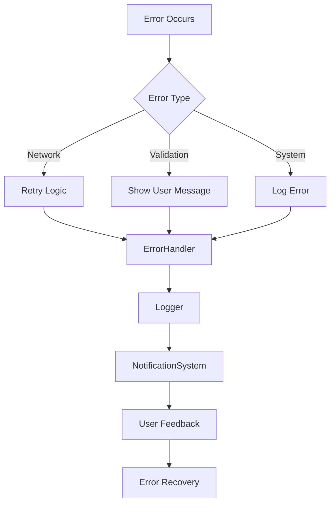

# Integration Matrix - TikTrack

## סקירה כללית

**Integration Matrix** מספק מטריצה מקיפה של אינטגרציות בין כל המערכות והרכיבים ב-TikTrack. המטריצה מאפשרת הבנה של התלויות, נקודות המגע והזרימות בין המערכות השונות.

## מבנה המטריצה

### ציר X: מערכות מקור (Source Systems)

- **UI Systems:** UnifiedTableSystem, ModalQuantumSystem, FilterSystem
- **State Management:** PageStateManager, CacheManager
- **Data Systems:** CRUDService, PayloadBuilder
- **Infrastructure:** EventManager, Logger, ErrorHandler

### ציר Y: מערכות יעד (Target Systems)

- **UI Components:** Tables, Modals, Filters
- **Data Flow:** CRUD operations, state persistence
- **User Experience:** Navigation, feedback, error handling
- **Performance:** Caching, lazy loading, optimization

### רמות אינטגרציה

- **🔴 Critical:** חובה לפעולה בסיסית
- **🟡 Important:** משפר UX משמעותית
- **🟢 Optional:** תכונות נוספות
- **⚪ None:** אין אינטגרציה

## מטריצת אינטגרציות

### UI Systems Integration

| Source → Target | Tables | Modals | Filters | Navigation | Notifications |
|----------------|--------|--------|---------|------------|---------------|
| **UnifiedTableSystem** | 🔴 Self | 🟡 Data | 🟡 Filter | 🟡 Sort/Page | 🟢 Status |
| **ModalQuantumSystem** | 🟡 CRUD | 🔴 Self | ⚪ None | 🟡 Close | 🟢 Confirm |
| **FilterSystem** | 🟡 Apply | ⚪ None | 🔴 Self | ⚪ None | 🟢 Active |
| **PageStateManager** | 🟡 Persist | 🟡 Restore | 🟡 Save | 🟡 History | ⚪ None |

### Data Systems Integration

| Source → Target | CRUD Ops | Payload | Cache | Validation | Error Handling |
|----------------|----------|---------|-------|------------|----------------|
| **CRUDService** | 🔴 Self | 🟡 Build | 🟡 Store | 🟡 Validate | 🟢 Handle |
| **PayloadBuilder** | 🟡 Format | 🔴 Self | ⚪ None | 🟡 Structure | ⚪ None |
| **CacheManager** | 🟡 Speed | ⚪ None | 🔴 Self | ⚪ None | 🟡 Fallback |
| **ValidationService** | 🟡 Check | 🟡 Sanitize | ⚪ None | 🔴 Self | 🟡 Report |

### Infrastructure Integration

| Source → Target | Events | Logging | Errors | Performance | Security |
|----------------|--------|---------|--------|-------------|----------|
| **EventManager** | 🔴 Self | 🟡 Track | 🟡 Handle | 🟡 Measure | ⚪ None |
| **Logger** | 🟡 Context | 🔴 Self | 🟡 Record | 🟡 Monitor | 🟡 Audit |
| **ErrorHandler** | 🟡 Notify | 🟡 Log | 🔴 Self | 🟡 Alert | ⚪ None |
| **PerformanceMonitor** | 🟡 Metrics | 🟡 Report | ⚪ None | 🔴 Self | ⚪ None |

## זרימות אינטגרציה מפורטות

### זרימת CRUD מלאה



### זרימת UI State



### זרימת Error Handling



## נקודות אינטגרציה קריטיות

### 1. PageStateManager ↔ UnifiedTableSystem

**חשיבות:** 🔴 Critical

**נקודות מגע:**

- State persistence across page reloads
- Table configuration storage
- Filter and sort state

**שיקולים:**

- Memory vs persistent storage
- State validation
- Performance impact

### 2. CRUDService ↔ CacheManager

**חשיבות:** 🟡 Important

**נקודות מגע:**

- Cache invalidation on CRUD operations
- Fallback to cache on network failure
- Cache warming strategies

**שיקולים:**

- Cache consistency
- TTL management
- Memory limits

### 3. EventManager ↔ כל המערכות

**חשיבות:** 🔴 Critical

**נקודות מגע:**

- Centralized event handling
- Event delegation
- Cross-system communication

**שיקולים:**

- Event naming conventions
- Listener cleanup
- Performance overhead

## בעיות אינטגרציה נפוצות

### Circular Dependencies

**תסמינים:**

- Import errors
- Initialization failures
- Memory leaks

**פתרונות:**

- Dependency injection
- Lazy loading
- Interface segregation

### State Synchronization

**תסמינים:**

- UI not updating
- Inconsistent data display
- Race conditions

**פתרונות:**

- Single source of truth
- Event-driven updates
- State validation

### Performance Bottlenecks

**תסמינים:**

- Slow page loads
- High memory usage
- UI freezing

**פתרונות:**

- Lazy initialization
- Debounced updates
- Memory cleanup

## מדדי אינטגרציה

### Coverage Metrics

- **System Integration:** % of systems with defined integrations
- **Test Coverage:** % of integration points tested
- **Performance Impact:** Baseline vs integrated performance

### Quality Metrics

- **Error Rate:** Integration-related errors
- **Recovery Rate:** Successful error recovery
- **User Impact:** Integration failures affecting users

### Maintenance Metrics

- **Change Frequency:** How often integrations need updates
- **Breaking Changes:** Integration-breaking changes
- **Documentation Freshness:** How up-to-date integration docs are

## תחזוקת אינטגרציות

### ניטור שוטף

```javascript
// Integration health monitoring
const IntegrationMonitor = {
  checkHealth() {
    return {
      eventSystem: this.checkEventSystem(),
      cacheSystem: this.checkCacheSystem(),
      stateSystem: this.checkStateSystem(),
      overallHealth: this.calculateOverallHealth()
    };
  },

  checkEventSystem() {
    // Verify event listeners are registered
    // Check for orphaned listeners
    // Validate event flow
  },

  checkCacheSystem() {
    // Verify cache consistency
    // Check memory usage
    // Validate TTL
  }
};
```

### עדכון אינטגרציות

1. **Identify Change:** Determine which systems affected
2. **Update Integration Points:** Modify affected integrations
3. **Test Integration:** Run integration tests
4. **Update Documentation:** Reflect changes in matrix
5. **Deploy Gradually:** Use feature flags if needed

### הוספת אינטגרציה חדשה

1. **Assess Need:** Determine integration requirements
2. **Design Interface:** Define integration contract
3. **Implement Integration:** Code the integration points
4. **Test Thoroughly:** Integration and end-to-end tests
5. **Document:** Update integration matrix

## תרחישי בדיקה

### Integration Test Scenarios

```javascript
describe('System Integration Tests', () => {
  it('should handle CRUD with cache', async () => {
    // Create entity
    const result = await CRUDService.create('test', testData);
    expect(result.success).toBe(true);

    // Verify cache updated
    const cached = await CacheManager.get(`test:${result.id}`);
    expect(cached).toEqual(result.data);

    // Verify UI updated
    expect(TableSystem.getRow(result.id)).toBeDefined();
  });

  it('should persist state across reload', async () => {
    // Set state
    PageStateManager.setPageState('test', { filter: 'active' });

    // Simulate reload
    await PageStateManager.loadState();

    // Verify state restored
    const state = PageStateManager.getPageState('test');
    expect(state.filter).toBe('active');
  });

  it('should handle errors gracefully', async () => {
    // Simulate network failure
    mockNetworkFailure();

    // Attempt operation
    const result = await CRUDService.create('test', testData);

    // Verify fallback to cache
    expect(result.fromCache).toBe(true);

    // Verify user notification
    expect(NotificationSystem.lastMessage.type).toBe('warning');
  });
});
```

---

**גרסה:** 1.0.0
**תאריך:** 1 בינואר 2026
**סטטוס:** ✅ פעיל ומתועד
