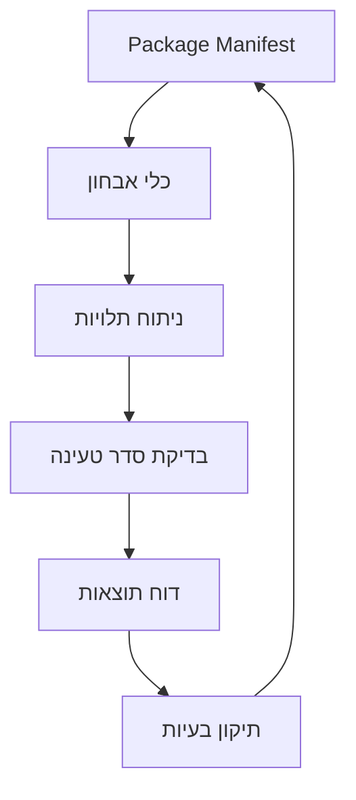

# מערכת אימות סדר טעינה - Load Order Validation System

**תאריך יצירה:** 1 בינואר 2026
**גרסה:** 1.0.0
**סטטוס:** ✅ פעיל ומתועד
**מיקום:** `scripts/audit/`

---

## 📋 תוכן עניינים

1. [סקירה כללית](#סקירה-כללית)
2. [ארכיטקטורה](#ארכיטקטורה)
3. [רשימת כלי הבדיקה](#רשימת-כלי-הבדיקה)
4. [מדריך שימוש מפורט](#מדריך-שימוש-מפורט)
5. [תרחישי שימוש נפוצים](#תרחישי-שימוש-נפוצים)
6. [פתרון בעיות](#פתרון-בעיות)
7. [תעוד נוסף](#תעוד-נוסף)

---

## 🎯 סקירה כללית

### מטרת המערכת

מערכת אימות סדר טעינה (Load Order Validation System) אחראית על בדיקה ואימות סדר טעינת הסקריפטים בכל עמודי המערכת. המערכת מבטיחה שהתלויות בין החבילות נכונות וכל העמודים נטענים בסדר הנכון.

### חשיבות סדר הטעינה

סדר טעינה שגוי יכול לגרום ל:

- **שגיאות ReferenceError** - גישה ל-globals שלא נטענו
- **כשל באתחול** - חבילות לא מצליחות להתחיל
- **בעיות ביצועים** - טעינה לא יעילה
- **חוסר יציבות** - מערכת לא צפויה

### מתי להשתמש

- **לפני עדכון מניפסט** - בדיקת שהתלויות נכונות
- **לאחר הוספת חבילה חדשה** - וידוא שהסדר נכון
- **לפני release** - בדיקה שכל העמודים תקינים
- **כשמופיעות שגיאות טעינה** - זיהוי בעיות סדר טעינה
- **לאחר שינוי תלויות** - וידוא שאין מעגלי תלויות

---

## 🏗️ ארכיטקטורה

### רכיבי הליבה

#### 1. Package Manifest

**מיקום:** `trading-ui/scripts/init-system/package-manifest.js`
**תפקיד:** מקור האמת היחיד לתצורת חבילות ותלויות

#### 2. כלי אבחון

**מיקום:** `scripts/audit/`
**תפקיד:** ביצוע בדיקות אוטומטיות ואימות

#### 3. מערכת ניטור

**מיקום:** `trading-ui/scripts/monitoring-functions.js`
**תפקיד:** מעקב בזמן אמת אחר טעינה

### זרימת עבודה



---

## 📦 רשימת כלי הבדיקה

### 1. validate-package-dependencies.js

**תפקיד:** בדיקת תלויות וסדר טעינה של חבילות
**מתי להשתמש:** לפני עדכון מניפסט, לאחר שינוי תלויות
**פלט:** דוח מפורט + קובץ Markdown

**יכולות:**

- בדיקת תלויות חסרות
- זיהוי תלויות מעגליות
- אימות סדר טעינה
- דוח מפורט עם המלצות תיקון

### 2. validate-all-pages-load-order.js

**תפקיד:** בדיקת סדר טעינה בכל עמודי המערכת
**מתי להשתמש:** לפני release, לאחר שינוי מניפסט
**פלט:** דוח מפורט + קובץ Markdown

**יכולות:**

- סריקה של כל עמודי המערכת
- השוואת HTML vs DOM scripts
- זיהוי scripts חסרים או עודפים
- דוח מרוכז עם סטטוס כל עמוד

### 3. load-order-validator.js

**תפקיד:** אימות מתקדם של סדר טעינה ותלויות
**מתי להשתמש:** באבחון בעיות מורכבות
**פלט:** ניתוח מפורט + עצות תיקון

**יכולות:**

- ניתוח עומק של תלויות
- זיהוי נקודות כשל
- הצעות אופטימיזציה
- דוחות טכניים מפורטים

### 4. dependency-analyzer.js

**תפקיד:** ניתוח מתקדם של תלויות בין חבילות
**מתי להשתמש:** בפיתוח חבילות חדשות
**פלט:** מפת תלויות + ניתוח השפעה

**יכולות:**

- מיפוי תלויות מלא
- זיהוי תלויות עקיפות
- ניתוח השפעת שינויים
- המלצות ארכיטקטוניות

### 5. browser-automated-validation.js

**תפקיד:** בדיקות אוטומטיות בדפדפן
**מתי להשתמש:** באימות סביבות ייצור
**פלט:** דוח ביצועים + שגיאות

**יכולות:**

- הרצה אוטומטית בדפדפן
- בדיקת טעינה בזמן אמת
- לכידת שגיאות JavaScript
- מדידת ביצועים

---

## 🔧 מדריך שימוש מפורט

### הרצת בדיקות בסיסיות

```bash
# בדיקת תלויות חבילות
node scripts/audit/validate-package-dependencies.js

# בדיקת סדר טעינה כללי
node scripts/audit/validate-all-pages-load-order.js

# ניתוח תלויות מתקדם
node scripts/audit/dependency-analyzer.js
```

### בדיקות ממוקדות

```bash
# בדיקה לעמוד ספציפי
node scripts/audit/validate-all-pages-load-order.js --page trading_journal

# בדיקה לחבילה ספציפית
node scripts/audit/validate-package-dependencies.js --package auth

# בדיקה עם פלט מורחב
node scripts/audit/load-order-validator.js --verbose
```

### שילוב עם CI/CD

```yaml
# .github/workflows/ci.yml
- name: Validate Load Order
  run: |
    node scripts/audit/validate-package-dependencies.js
    node scripts/audit/validate-all-pages-load-order.js

- name: Dependency Analysis
  run: node scripts/audit/dependency-analyzer.js
```

---

## 🎯 תרחישי שימוש נפוצים

### תרחיש 1: הוספת חבילה חדשה

```bash
# 1. הוסף חבילה ל-package-manifest.js
# 2. הרץ בדיקת תלויות
node scripts/audit/validate-package-dependencies.js

# 3. בדוק סדר טעינה
node scripts/audit/validate-all-pages-load-order.js

# 4. נתח השפעה
node scripts/audit/dependency-analyzer.js
```

### תרחיש 2: שגיאת טעינה בעמוד

```bash
# 1. זהה עמוד עם בעיה
node scripts/audit/validate-all-pages-load-order.js --page problematic_page

# 2. בדוק תלויות
node scripts/audit/validate-package-dependencies.js

# 3. נתח לעומק
node scripts/audit/load-order-validator.js --page problematic_page
```

### תרחיש 3: הכנת release

```bash
# 1. בדיקה מקיפה
node scripts/audit/validate-package-dependencies.js
node scripts/audit/validate-all-pages-load-order.js

# 2. בדיקת ביצועים
node scripts/audit/browser-automated-validation.js

# 3. ניתוח סופי
node scripts/audit/dependency-analyzer.js --comprehensive
```

---

## 🔧 פתרון בעיות

### בעיית "תלויות מעגליות"

**סימפטומים:**

- אתחול לא מסתיים
- שגיאות טעינה
- מערכת תקועה

**פתרון:**

```bash
# 1. זיהוי תלויות מעגליות
node scripts/audit/validate-package-dependencies.js --circular

# 2. תיקון ב-package-manifest.js
# הסר תלות מעגלית או שנה סדר טעינה

# 3. אימות תיקון
node scripts/audit/validate-package-dependencies.js
```

### בעיית "חבילה לא נטענת"

**סימפטומים:**

- שגיאות ReferenceError
- globals לא זמינים
- פונקציות חסרות

**פתרון:**

```bash
# 1. בדוק תלויות
node scripts/audit/validate-package-dependencies.js --package broken_package

# 2. בדוק סדר טעינה
node scripts/audit/load-order-validator.js --package broken_package

# 3. תקן loadOrder ב-package-manifest.js
```

### בעיית "עמוד עם scripts חסרים"

**סימפטומים:**

- HTML scripts count > DOM scripts count
- פונקציות לא עובדות
- UI לא מלא

**פתרון:**

```bash
# 1. זיהוי עמוד עם בעיה
node scripts/audit/validate-all-pages-load-order.js --failed-only

# 2. השוואת HTML vs page config
node scripts/audit/load-order-validator.js --page failed_page

# 3. תקן תצורת עמוד או הוסף scripts חסרים
```

---

## 📊 מדדי הצלחה

### מדדי איכות

- **% עמודים עם טעינה תקינה:** > 95%
- **זמן הרצת בדיקות:** < 30 שניות
- **כמות שגיאות false positive:** < 5%
- **כיסוי בדיקות:** 100% מהחבילות

### מדדי ביצועים

- **זמן טעינת עמוד ממוצע:** < 3 שניות
- **כמות scripts ללא תלויות:** > 80%
- **יעילות cache:** > 90%
- **שיעור שגיאות טעינה:** < 1%

---

## 🚀 הרחבות עתידיות

### 1. AI-Powered Analysis

- ניתוח אוטומטי של דפוסי שגיאות
- הצעות תיקון אוטומטיות
- חיזוי בעיות לפני התרחשות

### 2. Real-time Monitoring

- מעקב בזמן אמת אחר טעינה
- התראות אוטומטיות
- דוחות ביצועים חיים

### 3. Performance Optimization

- אופטימיזציה אוטומטית של סדר טעינה
- bundle splitting חכם
- lazy loading מתקדם

---

## 📚 תעוד נוסף

- [UNIFIED_INITIALIZATION_SYSTEM.md](UNIFIED_INITIALIZATION_SYSTEM.md)
- [PACKAGE_MANIFEST_SOT_DEVELOPER_GUIDE.md](PACKAGE_MANIFEST_SOT_DEVELOPER_GUIDE.md)
- [INIT_LOADING_MONITORING_SYSTEM_GUIDE.md](../../03-DEVELOPMENT/TOOLS/INIT_LOADING_MONITORING_SYSTEM_GUIDE.md)
- [MONITORING_SYSTEMS_ARCHITECTURE_OVERVIEW.md](MONITORING_SYSTEMS_ARCHITECTURE_OVERVIEW.md)

---

**Team F - Load Order Validation System**
