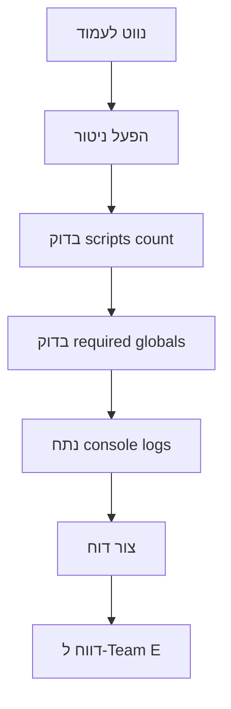
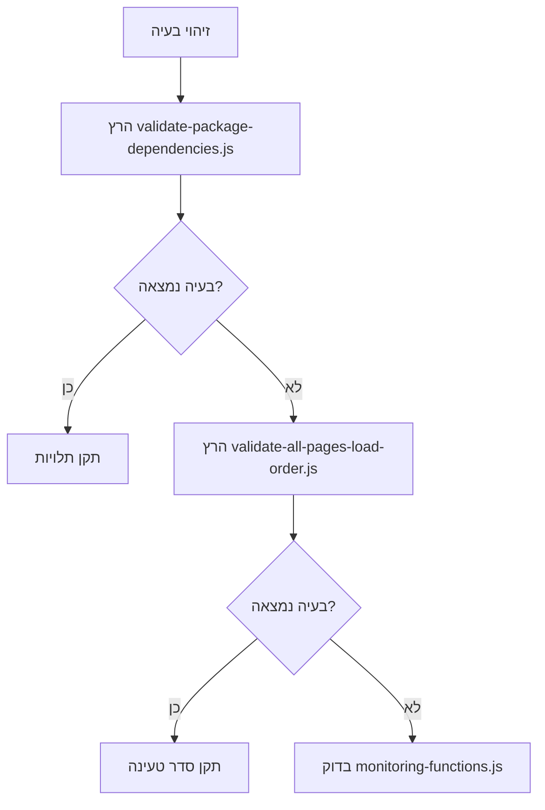
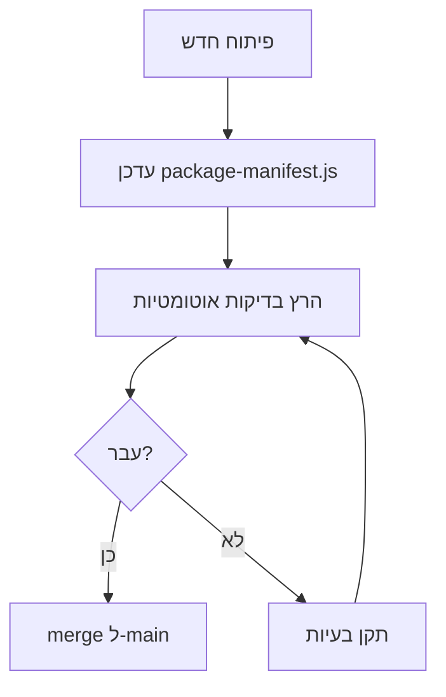

# סקירת ארכיטקטורת מערכות ניטור - TikTrack

**תאריך יצירה:** 1 בינואר 2026
**גרסה:** 1.0.0
**סטטוס:** ✅ פעיל ומתועד

---

## 📋 תוכן עניינים

1. [סקירה כללית](#סקירה-כללית)
2. [רכיבי ארכיטקטורה](#רכיבי-ארכיטקטורה)
3. [זרימת עבודה](#זרימת-עבודה)
4. [אינטגרציות](#אינטגרציות)
5. [ניטור ותחזוקה](#ניטור-ותחזוקה)

---

## 🎯 סקירה כללית

### מטרת המערכת

מערכות הניטור ב-TikTrack מספקות מעקב מקיף אחר בריאות המערכת, ביצועים, ויציבות האתחול. המערכות כוללות כלים לניטור בזמן אמת, אבחון בעיות, ואימות תקינות.

### היקף הכיסוי

- **אתחול וטעינה** - מעקב אחר תהליכי init/loading
- **ביצועים** - מדידת זמני טעינה ותגובה
- **בריאות מערכת** - בדיקת זמינות שירותים
- **שגיאות** - לכידה ודיווח על שגיאות
- **תלויות** - אימות סדר טעינה ותלויות

---

## 🏗️ רכיבי ארכיטקטורה

### 1. מערכת ניטור Init/Loading

**רכיב מרכזי:** `trading-ui/scripts/monitoring-functions.js`
**גודל:** 1,718 שורות
**אחריות:** מעקב אחר אתחול עמודים וטעינת סקריפטים

**תתי-רכיבים:**

- `checkScriptExecutionSuccess()` - בדיקת globals
- `waitForPageFullyLoaded()` - המתנה לטעינה מלאה
- `checkForMismatches()` - השוואת HTML ל-DOM
- `compareHTMLvsDOM()` - ניתוח פערים

### 2. כלי אבחון אוטומטיים

**מיקום:** `scripts/audit/`
**מטרה:** בדיקות אוטומטיות של סדר טעינה ותלויות

**כלים מרכזיים:**

- `validate-package-dependencies.js` - בדיקת תלויות
- `validate-all-pages-load-order.js` - בדיקת סדר טעינה
- `load-order-validator.js` - אימות תלויות
- `dependency-analyzer.js` - ניתוח תלויות

### 3. מערכת יומנים (Logging)

**רכיב מרכזי:** `trading-ui/scripts/logger-service.js`
**אחריות:** איסוף ודיווח על אירועי מערכת

**יכולות:**

- רמות לוג שונות (DEBUG, INFO, WARN, ERROR)
- הודעות מותאמות אישית עם context
- דיווח לשרת לביקורת

### 4. מערכת Package Manifest

**רכיב מרכזי:** `trading-ui/scripts/init-system/package-manifest.js`
**גודל:** 2,502 שורות
**אחריות:** ניהול תצורת חבילות ותלויות

**תכונות:**

- SOT (Source of Truth) לחבילות
- הגדרת תלויות וסדר טעינה
- אימות בריאות מערכת

### 5. סקריפטי ניהול ניטור

**מיקום:** `scripts/monitoring/`
**אחריות:** ניהול ניטור ברקע

**סקריפטים:**

- `start-monitoring.sh` - הפעלת ניטור
- `stop-monitoring.sh` - עצירת ניטור
- `generate-report.sh` - יצירת דוחות

---

## 🔄 זרימת עבודה

### תהליך ניטור רגיל



### תהליך אבחון בעיות



### אינטגרציה עם תהליכי פיתוח



---

## 🔗 אינטגרציות

### עם מערכת Unified Initialization

```
monitoring-functions.js ↔ core-systems.js
├── מעקב אחר טעינת חבילות
├── בדיקת תלויות בזמן ריצה
└── דיווח על כשלים באתחול
```

### עם מערכת Package Manifest

```
monitoring-functions.js ↔ package-manifest.js
├── קריאת תצורת חבילות
├── אימות תלויות
└── בדיקת זמינות globals
```

### עם מערכת יומנים

```
monitoring-functions.js ↔ logger-service.js
├── דיווח על בעיות ניטור
├── רישום אירועי אתחול
└── דיווח על שגיאות
```

### עם כלי CI/CD

```
scripts/audit/ ↔ CI/CD Pipeline
├── בדיקות אוטומטיות לפני merge
├── אימות סדר טעינה
└── בדיקת תלויות
```

---

## 📊 ניטור ותחזוקה

### מדדי בריאות

#### מדדי אתחול

- **Scripts Count Match:** HTML vs DOM scripts count
- **Globals Availability:** % זמינות required globals
- **Load Time:** זמן טעינה מלא של עמוד
- **Error Rate:** % עמודים עם שגיאות אתחול

#### מדדי ביצועים

- **Memory Usage:** צריכת זיכרון במהלך טעינה
- **Network Requests:** מספר בקשות רשת
- **Bundle Size:** גודל חבילות JavaScript
- **Cache Hit Rate:** אחוזי פגיעה ב-cache

### תהליכי תחזוקה

#### יומי

- בדיקת logs עבור שגיאות חדשות
- אימות scripts count בכל עמוד
- בדיקת זמינות globals קריטיים

#### שבועי

- הרצת כלי audit אוטומטיים
- בדיקת ביצועים
- עדכון סטטיסטיקות

#### חודשי

- סקירת דוחות ניטור
- אופטימיזציה של זמני טעינה
- עדכון thresholds

### כלי תחזוקה

```bash
# בדיקות אוטומטיות
./scripts/audit/validate-package-dependencies.js
./scripts/audit/validate-all-pages-load-order.js

# ניטור בזמן אמת
./scripts/monitoring/start-monitoring.sh
./scripts/monitoring/generate-report.sh

# ניתוח logs
grep "ERROR\|FAILED" /var/log/tiktrack/*.log
```

---

## 🔧 הרחבות עתידיות

### 1. ניטור מבוזר

- ניטור במספר סביבות (dev/staging/prod)
- איסוף מדדים מרכזי
- התראות אוטומטיות

### 2. AI-Driven Diagnostics

- ניתוח אוטומטי של דפוסי שגיאות
- הצעות תיקון אוטומטיות
- חיזוי בעיות לפני שהן קורות

### 3. Performance Monitoring

- Real-time performance tracking
- Memory leak detection
- Bundle size optimization

---

## 📚 תיעוד נוסף

- [INIT_LOADING_MONITORING_SYSTEM_GUIDE.md](../../03-DEVELOPMENT/TOOLS/INIT_LOADING_MONITORING_SYSTEM_GUIDE.md)
- [PACKAGE_MANIFEST_SOT_DEVELOPER_GUIDE.md](PACKAGE_MANIFEST_SOT_DEVELOPER_GUIDE.md)
- [UNIFIED_INITIALIZATION_SYSTEM.md](UNIFIED_INITIALIZATION_SYSTEM.md)
- [LOGGING_SYSTEM_GUIDE.md](../../03-DEVELOPMENT/TOOLS/LOGGING_SYSTEM_GUIDE.md)

---

**Team F - Monitoring Systems Architecture**
