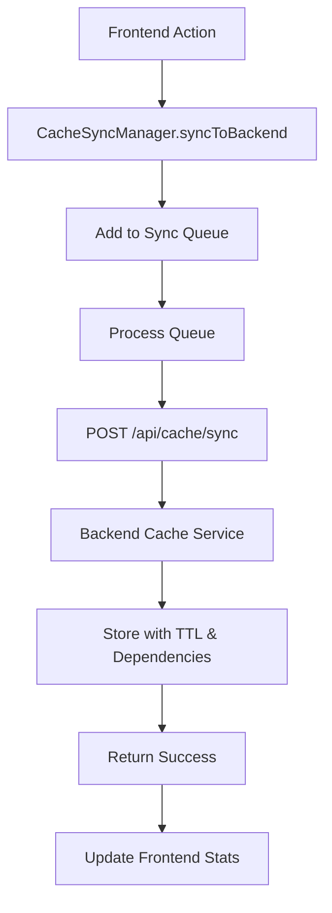
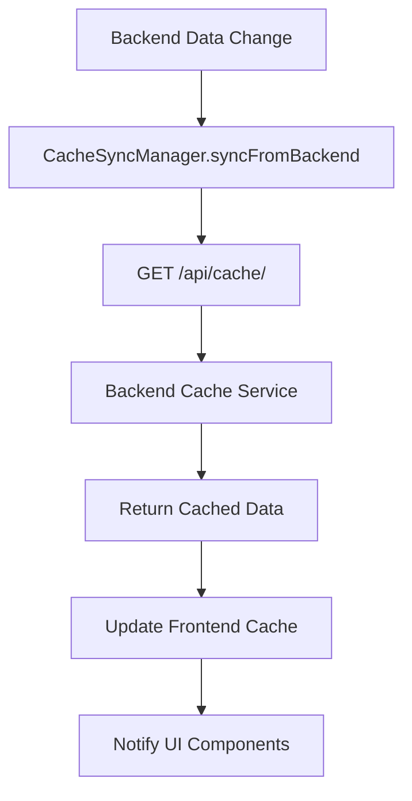
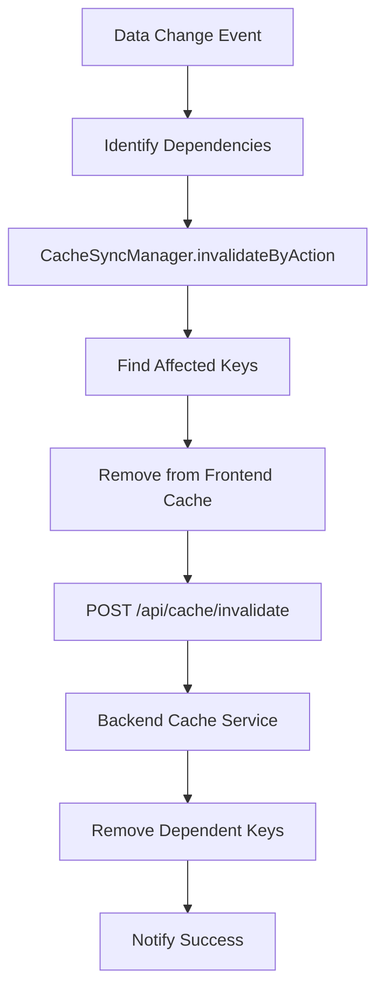

# Cache Sync Specification - TikTrack
# אפיון סינכרון מטמון

**תאריך עדכון:** 26 בינואר 2025  
**גרסה:** 1.0.0  
**סטטוס:** ✅ פעיל  
**מטרה:** אפיון מלא של מערכת סינכרון המטמון בין Frontend ו-Backend  

---

## 📋 סקירה כללית

מערכת CacheSyncManager מספקת סינכרון דו-כיווני מתקדם בין Frontend ו-Backend Cache, כולל ניהול תלות, invalidation patterns, ו-retry logic.

---

## 🏗️ Architecture Overview

### רכיבי המערכת:

#### 1. CacheSyncManager (Frontend)
- **תפקיד:** ניהול סינכרון Frontend → Backend
- **מיקום:** `trading-ui/scripts/cache-sync-manager.js`
- **תכונות:** Queue management, retry logic, dependency tracking

#### 2. Cache Sync API (Backend)
- **תפקיד:** קבלת נתונים מ-Frontend ושמירה ב-Backend Cache
- **מיקום:** `Backend/routes/api/cache_sync.py`
- **תכונות:** REST API, validation, error handling

#### 3. Advanced Cache Service (Backend)
- **תפקיד:** ניהול Backend Cache עם TTL ו-dependencies
- **מיקום:** `Backend/services/advanced_cache_service.py`
- **תכונות:** TTL management, dependency invalidation

---

## 🔄 Sync Flow Diagrams

### 1. Frontend → Backend Sync



### 2. Backend → Frontend Sync



### 3. Invalidation Flow



---

## 🔗 Dependencies Mapping

### Dependency Hierarchy:

```javascript
this.dependencies = {
    // Level 0 - Base dependencies
    'user-preferences': [],
    
    // Level 1 - Direct user preferences dependencies
    'preference-data': ['user-preferences'],
    'profile-data': ['user-preferences'],
    'accounts-data': ['user-preferences'],
    
    // Level 2 - Account-dependent data
    'trades-data': ['accounts-data'],
    'executions-data': ['accounts-data'],
    'tickers-data': ['accounts-data'],
    'alerts-data': ['accounts-data'],
    
    // Level 3 - Market data dependencies
    'market-data': ['tickers-data'],
    
    // Level 4 - Dashboard dependencies
    'dashboard-data': ['market-data', 'trades-data', 'executions-data']
};
```

### Dependency Rules:

1. **Level 0:** בסיסי, ללא תלות
2. **Level 1:** תלוי בהעדפות משתמש
3. **Level 2:** תלוי בנתוני חשבון
4. **Level 3:** תלוי בנתוני שוק
5. **Level 4:** תלוי בנתונים מורכבים

---

## 🎯 Invalidation Patterns

### Pattern Categories:

#### 1. User Actions
```javascript
'preference-updated': ['preference-data', 'user-preferences'],
'profile-switched': ['preference-data', 'profile-data', 'user-preferences'],
'profile-created': ['profile-data', 'user-preferences'],
'profile-updated': ['profile-data', 'user-preferences'],
'profile-deleted': ['profile-data', 'user-preferences']
```

#### 2. Account Actions
```javascript
'account-created': ['accounts-data', 'trades-data', 'executions-data'],
'account-updated': ['accounts-data', 'trades-data', 'executions-data'],
'account-deleted': ['accounts-data', 'trades-data', 'executions-data']
```

#### 3. Trading Actions
```javascript
'trade-created': ['trades-data', 'dashboard-data'],
'trade-updated': ['trades-data', 'dashboard-data'],
'trade-deleted': ['trades-data', 'dashboard-data'],
'execution-created': ['executions-data', 'dashboard-data'],
'execution-updated': ['executions-data', 'dashboard-data'],
'execution-deleted': ['executions-data', 'dashboard-data']
```

#### 4. Market Actions
```javascript
'ticker-updated': ['tickers-data', 'market-data'],
'alert-created': ['alerts-data'],
'alert-updated': ['alerts-data'],
'alert-deleted': ['alerts-data']
```

---

## 🔧 API Endpoints

### 1. Sync Cache Data
**Endpoint:** `POST /api/cache/sync`

**Request:**
```json
{
    "key": "preference_primaryColor_1_2",
    "data": "#26baac",
    "dependencies": ["user-preferences"],
    "ttl": 300,
    "timestamp": 1640995200000
}
```

**Response:**
```json
{
    "success": true,
    "key": "preference_primaryColor_1_2",
    "message": "Cache synced successfully",
    "data": {
        "key": "preference_primaryColor_1_2",
        "ttl": 300,
        "dependencies": ["user-preferences"],
        "timestamp": 1640995200000
    }
}
```

### 2. Get Cache Data
**Endpoint:** `GET /api/cache/<key>`

**Response:**
```json
{
    "success": true,
    "data": "#26baac",
    "key": "preference_primaryColor_1_2"
}
```

### 3. Invalidate Cache
**Endpoint:** `POST /api/cache/invalidate`

**Request:**
```json
{
    "dependencies": ["user-preferences", "preference-data"]
}
```

**Response:**
```json
{
    "success": true,
    "clearedCount": 15,
    "dependencies": ["user-preferences", "preference-data"],
    "message": "Invalidated 15 cache entries"
}
```

### 4. Cache Status
**Endpoint:** `GET /api/cache/status`

**Response:**
```json
{
    "success": true,
    "data": {
        "backend_cache_stats": {
            "total_entries": 150,
            "total_size": "2.5MB",
            "hit_rate": 0.85
        },
        "sync_endpoints": ["/sync", "/<key>", "/invalidate"],
        "status": "operational",
        "version": "1.0.0"
    }
}
```

---

## 💻 Usage Examples

### 1. Basic Sync
```javascript
// Sync preference to backend
await CacheSyncManager.syncToBackend('preference_primaryColor_1_2', '#26baac', {
    dependencies: ['user-preferences'],
    ttl: 300
});
```

### 2. Invalidation by Action
```javascript
// Invalidate cache when preference is updated
await CacheSyncManager.invalidateByAction('preference-updated');
```

### 3. Dependency-based Invalidation
```javascript
// Invalidate all user-preferences dependent data
await CacheSyncManager.invalidateByDependency('user-preferences');
```

### 4. Queue Management
```javascript
// Check sync queue status
const queueStatus = CacheSyncManager.getQueueStatus();
console.log('Queue size:', queueStatus.size);
console.log('Processing:', queueStatus.isProcessing);
```

### 5. Error Handling
```javascript
try {
    await CacheSyncManager.syncToBackend(key, data);
} catch (error) {
    console.error('Sync failed:', error);
    // Handle retry or fallback
}
```

---

## 🔍 Monitoring and Debugging

### 1. Sync Statistics
```javascript
const stats = CacheSyncManager.getSyncStatus();
console.log('Sync stats:', {
    operations: stats.operations,
    success: stats.success,
    failures: stats.failures,
    retries: stats.retries
});
```

### 2. Queue Monitoring
```javascript
const queueStatus = CacheSyncManager.getQueueStatus();
console.log('Queue status:', {
    size: queueStatus.size,
    isProcessing: queueStatus.isProcessing,
    retryAttempts: queueStatus.retryAttempts
});
```

### 3. Dependency Tracking
```javascript
const dependencies = CacheSyncManager.getDependencies('user-preferences');
console.log('Dependencies:', dependencies);
// Output: ['preference-data', 'profile-data', 'accounts-data']
```

---

## ⚡ Performance Considerations

### 1. Queue Size Limits
- **Max Queue Size:** 100 items
- **Auto-cleanup:** Items older than 5 minutes
- **Priority:** User actions > System actions

### 2. Retry Logic
- **Max Retries:** 3 attempts
- **Retry Delay:** 1 second (exponential backoff)
- **Timeout:** 10 seconds per request

### 3. Batch Operations
```javascript
// Batch multiple sync operations
await CacheSyncManager.syncBatch([
    { key: 'pref1', data: 'value1' },
    { key: 'pref2', data: 'value2' }
]);
```

---

## 🛡️ Error Handling

### 1. Network Errors
- **Retry:** 3 attempts with exponential backoff
- **Fallback:** Queue for later sync
- **Notification:** User-friendly error messages

### 2. Validation Errors
- **Response:** 400 Bad Request
- **Action:** Log error, skip invalid data
- **Recovery:** Continue with valid items

### 3. Server Errors
- **Retry:** 3 attempts
- **Fallback:** Local storage only
- **Recovery:** Retry on next user action

---

## 📊 Integration Examples

### 1. Preferences System
```javascript
// In savePreference
async function savePreference(name, value, userId, profileId) {
    // Save to backend
    const success = await PreferencesCore.savePreference(name, value, userId, profileId);
    
    if (success) {
        // Sync to backend cache
        await CacheSyncManager.syncToBackend(
            `preference_${name}_${userId}_${profileId}`,
            value,
            { dependencies: ['user-preferences'], ttl: 300 }
        );
        
        // Invalidate related cache
        await CacheSyncManager.invalidateByAction('preference-updated');
    }
}
```

### 2. Profile Switching
```javascript
// In setCurrentProfile
async function setCurrentProfile(userId, profileId) {
    // Update active profile
    await PreferencesCore.setCurrentProfile(userId, profileId);
    
    // Invalidate all preference-related cache
    await CacheSyncManager.invalidateByAction('profile-switched');
    
    // Sync new profile data
    await CacheSyncManager.syncToBackend('active-profile', profileId, {
        dependencies: ['user-preferences'],
        ttl: null // No expiration
    });
}
```

---

## 🎯 Summary

CacheSyncManager מספק:
- **סינכרון דו-כיווני** בין Frontend ו-Backend
- **ניהול תלות** חכם עם invalidation patterns
- **Retry logic** אמין עם error handling
- **Queue management** מתקדם
- **Performance monitoring** מקיף

**זכור:** תמיד השתמש ב-CacheSyncManager לפעולות סינכרון ולא ב-API ישיר!
