# דוח ניתוח אינטגרציה - TikTrack
## System Integration Analysis Report

**תאריך יצירה:** 1.11.2025  
**גרסה:** 1.0.0  
**סטטוס:** ניתוח מקיף

---

## 📋 Executive Summary

### סיכום מנהלים

- **סה"כ מערכות נסרקו:** 34
- **סה"כ תלויות:** 1765
- **תלויות מעגליות:** 3
- **בעיות אינטגרציה:** 8

⚠️ **נמצאו בעיות שדורשות טיפול!**

---

## 🕸️ Dependency Graph

גרף התלויות המלא בין כל המערכות:

```mermaid
graph TD
    AlertConditionRenderer[AlertConditionRenderer]
    CRUDResponseHandler[CRUDResponseHandler]
    DataCollectionService[DataCollectionService]
    DefaultValueSetter[DefaultValueSetter]
    FieldRendererService[FieldRendererService]
    LinkedItemsService[LinkedItemsService]
    SelectPopulatorService[SelectPopulatorService]
    StatisticsCalculator[StatisticsCalculator]
    ActionsMenuSystem[ActionsMenuSystem]
    loadTableData[loadTableData]
    UnifiedAppInitializer[UnifiedAppInitializer]
    ModalManagerV2[ModalManagerV2]
    UnifiedCacheManager[UnifiedCacheManager]
    CacheSyncManager[CacheSyncManager]
    CachePolicyManager[CachePolicyManager]
    ModalNavigationManager[ModalNavigationManager]
    EventHandlerManager[EventHandlerManager]
    NotificationSystem[NotificationSystem]
    Logger[Logger]
    HeaderSystem[HeaderSystem]
    ButtonSystem[ButtonSystem]
    ColorSchemeSystem[ColorSchemeSystem]
    InfoSummarySystem[InfoSummarySystem]
    AlertService[AlertService]
    TickerService[TickerService]
    TradePlanService[TradePlanService]
    AccountService[AccountService]
    PreferencesGroupManager[PreferencesGroupManager]
    EntityDetailsModal[EntityDetailsModal]
    EntityDetailsRenderer[EntityDetailsRenderer]
    EntityDetailsAPI[EntityDetailsAPI]
    toggleSection[toggleSection]
    PreferencesCore[PreferencesCore]
    showFieldError[showFieldError]
    CRUDResponseHandler-->UnifiedCacheManager
    LinkedItemsService-->ModalManagerV2
    SelectPopulatorService-->PreferencesCore
    SelectPopulatorService-->PreferencesSystem
    loadTableData-->CRUDResponseHandler
    loadTableData-->ModalManagerV2
    loadTableData-->toggleSection
    UnifiedAppInitializer-->UnifiedCacheManager
    UnifiedAppInitializer-->PreferencesSystem
    UnifiedAppInitializer-->Logger
    UnifiedAppInitializer-->NotificationSystem
    UnifiedAppInitializer-->ActionsMenuSystem
    UnifiedAppInitializer-->HeaderSystem
    UnifiedAppInitializer-->toggleSection
    ModalManagerV2-->PreferencesSystem
    ModalManagerV2-->SelectPopulatorService
    UnifiedCacheManager-->Logger
    UnifiedCacheManager-->CacheSyncManager
    UnifiedCacheManager-->PreferencesCore
    CacheSyncManager-->Logger
    ModalNavigationManager-->Logger
    ModalNavigationManager-->UnifiedCacheManager
    ModalNavigationManager-->ButtonSystem
    EventHandlerManager-->Logger
    EventHandlerManager-->ModalManagerV2
    EventHandlerManager-->toggleSection
    NotificationSystem-->Logger
    NotificationSystem-->UnifiedCacheManager
    Logger-->toggleSection
    HeaderSystem-->Logger
    HeaderSystem-->UnifiedCacheManager
    ButtonSystem-->Logger
    ColorSchemeSystem-->Logger
    InfoSummarySystem-->Logger
    AlertService-->Logger
    TickerService-->Logger
    PreferencesGroupManager-->PreferencesCore
    PreferencesGroupManager-->UnifiedCacheManager
    EntityDetailsModal-->Logger
    EntityDetailsRenderer-->Logger
    EntityDetailsRenderer-->FieldRendererService
    EntityDetailsRenderer-->LinkedItemsService
    EntityDetailsRenderer-->ModalManagerV2
    EntityDetailsAPI-->Logger
    EntityDetailsAPI-->UnifiedCacheManager
    toggleSection-->Logger
    toggleSection-->InfoSummarySystem
    PreferencesCore-->Logger
    PreferencesCore-->UnifiedCacheManager
```



**גרף מלא זמין ב:** `reports/integration-analysis/dependency-graph.mmd`

---

## 🚨 Critical Issues

בעיות קריטיות שדורשות טיפול מיידי:

✅ **לא נמצאו בעיות קריטיות**

### תלויות מעגליות

נמצאו 3 מעגלי תלות:

1. **Logger → Logger → toggleSection → Logger**

2. **Logger → toggleSection → Logger → InfoSummarySystem → Logger**

3. **UnifiedCacheManager → UnifiedCacheManager → PreferencesCore → UnifiedCacheManager**

---

## 📊 Integration Status Summary

### סיכום לפי סטטוס

- **Working:** 15 מערכות
- **Partial:** 9 מערכות
- **Unknown:** 10 מערכות

---

## 💡 Recommendations

### המלצות עם אופציות

להלן 4 אופציות שונות לטיפול בבעיות האינטגרציה:

### אופציה 1: Incremental Fixing (תיקון הדרגתי)

**גישה:** תיקון הדרגתי לפי עדיפויות

#### יתרונות:
- ✅ סיכון נמוך - כל שינוי קטן ונבדק
- ✅ התקדמות הדרגתית - רואים שיפור כל הזמן
- ✅ אפשרות לעצור בכל נקודה
- ✅ לא משבש את העבודה הקיימת

#### חסרונות:
- ⚠️ זמן ארוך יותר - תהליך ארוך טווח
- ⚠️ עשוי ליצור inconsistency זמני
- ⚠️ עשוי להיות קשה לעקוב אחרי ההתקדמות

#### שלבים:

1. **תיקון בעיות קריטיות** (Priority 1)
   - Broken/Missing integrations
   - Circular dependencies
   - Initialization order violations
   - **זמן משוער:** 1-2 שבועות

2. **שיפור אינטגרציות חלקיות** (Priority 2)
   - Partial integrations → Working
   - הוספת fallbacks חסרים
   - אופטימיזציה של תלויות
   - **זמן משוער:** 2-3 שבועות

3. **אופטימיזציה של אינטגרציות עובדות** (Priority 3)
   - שיפור ביצועים
   - הפחתת תלויות מיותרות
   - תיעוד משופר
   - **זמן משוער:** 1-2 שבועות

#### סה"כ זמן משוער: 4-7 שבועות

#### מתי לבחור אופציה זו:
- כאשר יש צורך בהמשך עבודה חלקה
- כאשר יש זמן לעבודה הדרגתית
- כאשר רוצים להפחית סיכונים

---

### אופציה 2: Service Layer Architecture (שכבת שירותים מאוחדת)

**גישה:** יצירת שכבת שירותים מאוחדת עם ServiceRegistry מרכזי

#### יתרונות:
- ✅ שליטה מלאה בתלויות
- ✅ קל לבדיקה - כל מערכת רשומה
- ✅ ארכיטקטורה נקייה ומסודרת
- ✅ Dependency injection מובנה
- ✅ קל לזיהוי וטיפול בבעיות

#### חסרונות:
- ⚠️ שינוי מקיף - הרבה קוד צריך להשתנות
- ⚠️ סיכון גבוה - שינוי באזורים רבים
- ⚠️ זמן פיתוח ארוך
- ⚠️ נדרש refactoring נרחב

#### שלבים:

1. **יצירת ServiceRegistry** (Week 1)
   - יצירת registry מרכזי
   - מנגנון רישום מערכות
   - מנגנון dependency injection
   - **דוגמה:**
   ```javascript
   class ServiceRegistry {
       register(name, service, dependencies = []) {
           // Register service with dependencies
       }
       get(name) {
           // Get registered service
       }
       validate() {
           // Validate all dependencies exist
       }
   }
   ```

2. **רישום כל המערכות** (Week 2-3)
   - רישום כל ה-50+ מערכות
   - מיפוי תלויות
   - יצירת dependency tree
   - **זמן משוער:** 2 שבועות

3. **החלפת קריאות ישירות** (Week 4-8)
   - החלפת `window.Service` ב-`ServiceRegistry.get('Service')`
   - עדכון כל הקבצים
   - בדיקות בכל שלב
   - **זמן משוער:** 4-5 שבועות

4. **Dependency Injection** (Week 9-10)
   - יצירת constructors עם DI
   - הסרת תלויות גלובליות
   - בדיקות סופיות
   - **זמן משוער:** 2 שבועות

#### סה"כ זמן משוער: 10-11 שבועות

#### מתי לבחור אופציה זו:
- כאשר רוצים ארכיטקטורה נקייה לטווח ארוך
- כאשר יש זמן לתכנון ויישום מקיף
- כאשר המערכת גדלה ומצריכה ניהול תלויות מקצועי

---

### אופציה 3: Integration Contracts (חוזי אינטגרציה)

**גישה:** הגדרת חוזים בין מערכות עם interfaces ותיעוד

#### יתרונות:
- ✅ תיעוד ברור - כל מערכת מתועדת
- ✅ צפי ל-breakage - רואים שינויים לפני שהם קורים
- ✅ תחזוקה קלה - ברור מה כל מערכת מצפה
- ✅ בדיקת compliance אוטומטית
- ✅ תאימות לאחור מובטחת

#### חסרונות:
- ⚠️ overhead של תיעוד - צריך לתחזק
- ⚠️ נדרש שיתוף פעולה - כל המערכות צריכות לחתום
- ⚠️ עשוי להיות overhead ב-runtime (בדיקות)

#### שלבים:

1. **הגדרת Interfaces** (Week 1-2)
   - יצירת interface לכל מערכת
   - הגדרת method signatures
   - הגדרת data contracts
   - **דוגמה:**
   ```typescript
   interface DataCollectionService {
       collectFormData(fieldMap: FieldMap): FormData;
       setFormData(fieldMap: FieldMap, values: Values): void;
       resetForm(formId: string): void;
   }
   ```

2. **יצירת Integration Contracts** (Week 3-4)
   - חוזה לכל אינטגרציה
   - תיעוד תלויות
   - גרסאות ושבירה
   - **דוגמה:**
   ```markdown
   ## Contract: DataCollectionService → FormValidation
   
   **Version:** 1.0.0
   **Depends on:** clearValidation function
   **Breaking Changes:** None
   ```

3. **בדיקת Compliance** (Week 5-6)
   - יצירת סקריפט בדיקה
   - בדיקת כל החוזים
   - דוח compliance
   - **זמן משוער:** 2 שבועות

4. **תיעוד Contracts** (Week 7)
   - תיעוד כל החוזים
   - יצירת מסמך מרכזי
   - עדכון במידה והחוזים משתנים
   - **זמן משוער:** 1 שבוע

#### סה"כ זמן משוער: 7 שבועות

#### מתי לבחור אופציה זו:
- כאשר יש צוות גדול שמשנה קוד
- כאשר רוצים להבטיח תאימות
- כאשר המערכת צריכה להיות יציבה לטווח ארוך

---

### אופציה 4: Event-Based Integration (אינטגרציה מבוססת events)

**גישה:** מעבר לארכיטקטורה מבוססת events עם EventBus מרכזי

#### יתרונות:
- ✅ Loose coupling - מערכות לא תלויות זו בזו
- ✅ Scalable - קל להוסיף מערכות חדשות
- ✅ Easy to test - כל מערכת בודדת
- ✅ Flexible - קל לשנות התנהגות
- ✅ Decoupling מלא

#### חסרונות:
- ⚠️ שינוי מקיף - כל הקריאות הישירות צריכות להשתנות
- ⚠️ Debugging קשה יותר - קשה לעקוב אחרי flow
- ⚠️ Overhead - event system מוסיף overhead
- ⚠️ קשה לזהות תלויות - הכל דרך events

#### שלבים:

1. **יצירת EventBus מרכזי** (Week 1)
   - יצירת event system
   - מנגנון publish/subscribe
   - event routing
   - **דוגמה:**
   ```javascript
   class EventBus {
       subscribe(event, handler) {
           // Subscribe to event
       }
       publish(event, data) {
           // Publish event
       }
       unsubscribe(event, handler) {
           // Unsubscribe
       }
   }
   ```

2. **החלפת קריאות ישירות ב-events** (Week 2-6)
   - זיהוי כל הקריאות הישירות
   - החלפה ב-event publishing
   - יצירת event handlers
   - **דוגמה:**
   ```javascript
   // Before:
   window.ModalManagerV2.showModal('myModal', 'add');
   
   // After:
   EventBus.publish('modal:show', { modalId: 'myModal', mode: 'add' });
   ```

3. **יצירת Event Handlers** (Week 7-9)
   - handler לכל מערכת
   - event routing logic
   - error handling
   - **זמן משוער:** 3 שבועות

4. **Decoupling מלא** (Week 10-11)
   - הסרת תלויות ישירות
   - בדיקות end-to-end
   - אופטימיזציה
   - **זמן משוער:** 2 שבועות

#### סה"כ זמן משוער: 11 שבועות

#### מתי לבחור אופציה זו:
- כאשר רוצים scalability גבוה
- כאשר יש צורך ב-loose coupling
- כאשר המערכת צריכה להיות מאוד flexible
- כאשר יש צורך ב-event-driven architecture

---

---

## 📈 Next Steps

### שלבים הבאים

1. **סקירה:** סקור את המטריצה והדוח המלא
2. **בחירה:** בחר את האופציה המתאימה לצרכים שלך
3. **תכנון:** תכנן את היישום לפי האופציה שנבחרה
4. **יישום:** התחל ביישום הדרגתי

---

## 📝 Files Reference

- **מטריצת אינטגרציה:** `documentation/02-ARCHITECTURE/FRONTEND/INTEGRATION_MATRIX.md`
- **גרף תלויות JSON:** `reports/integration-analysis/dependency-graph.json`
- **גרף תלויות Mermaid:** `reports/integration-analysis/dependency-graph.mmd`
- **גרף תלויות DOT:** `reports/integration-analysis/dependency-graph.dot`
- **תוצאות סריקה:** `reports/integration-analysis/integration-scan-results.json`

---

**עדכון אחרון:** 1.11.2025, 5:14:39

