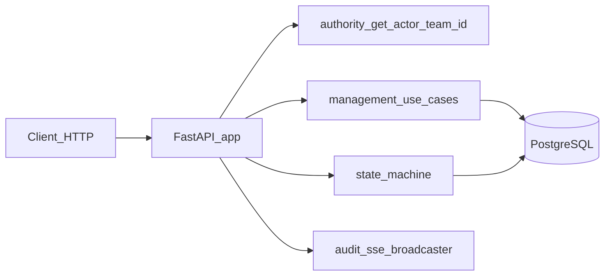

# Agents_OS v3 — Architecture overview
## documentation/docs-agents-os/02-ARCHITECTURE/AGENTS_OS_V3_ARCHITECTURE_OVERVIEW.md

**project_domain:** AGENTS_OS  
**owner:** Team 71 (AOS Documentation)  
**date:** 2026-03-29  
**status:** Active

**Traceability:** Directive 3B · Team 11 → Team 71 GATE_DOC Phase B mandate (2026-03-28)

---

## 1. Runtime entry

- **ASGI app:** `agents_os_v3.modules.management.api:create_app()` / module-level `app`.
- **Server:** `uvicorn agents_os_v3.modules.management.api:app` (see `scripts/start-aos-v3-server.sh`).
- **Routers:** Two `APIRouter` instances are mounted at **`/api`**:
  - `_api_router` — health, SSE stream.
  - `business_router` — runs, state, history, teams, work-packages, ideas, routing-rules, templates, policies.

OpenAPI UI: `/docs` and `/redoc` on the same host/port as the API.

---

## 2. Package layout (`agents_os_v3/`)

| Area | Role |
|------|------|
| `modules/definitions/` | Constants, Pydantic request/response models, event registry, queries |
| `modules/state/` | State machine, repository, domain errors |
| `modules/management/` | FastAPI app, DB connection, use cases, portfolio/read models, authority |
| `modules/audit/` | Ingestion, ledger, SSE broadcaster |
| `modules/routing/` | Resolver logic |
| `modules/prompting/` | Template cache, prompt assembly (`assemble_prompt_for_run`) |
| `modules/policy/` | Policy listing for API |
| `modules/governance/` | Artifact index, archive helpers |
| `db/` | Migration runner, local Postgres ensure helper |
| `cli/` | Pipeline CLI (`pipeline_run.py`) |
| `seed.py` | Database seed |
| `ui/` | Static HTML/JS client — served by FastAPI from **`/v3/*`** with **`GET /`** returning Pipeline HTML (same port as API; `<base href="/v3/">`); shared CSS via **`/agents_os/ui/*`**. See [AGENTS_OS_V3_NETWORK_PORTS_AND_UI_ENTRY_v1.0.0.md](AGENTS_OS_V3_NETWORK_PORTS_AND_UI_ENTRY_v1.0.0.md). |
| `governance/` | Team markdown used by prompting/governance paths |
| `FILE_INDEX.json` | Required index for every tracked path under `agents_os_v3/` |

---

## 3. Request flow (simplified)

- Mutating run operations go through **`modules.management.use_cases`** and/or **`modules.state.machine`** with psycopg2 connections from **`modules.management.db.connection`**.
- **GET `/api/runs/{run_id}`** resolves via **`state_machine.get_run`**.
- **GET `/api/runs/{run_id}/prompt`** calls **`prompting.builder.assemble_prompt_for_run`** (may raise `GovernanceNotFoundError` → HTTP 404).

---

## 4. Actor identity (BUILD stub)

- Header **`X-Actor-Team-Id`** is required on routes that declare `Depends(get_actor_team_id)` in `api.py`. Missing or blank → **400** with `MISSING_ACTOR_HEADER`.
- Implementation: `agents_os_v3.modules.management.authority.get_actor_team_id` (documented **TODO AUTH_STUB** for future API-key mapping).
- **PUT `/api/teams/{team_id}/engine`** additionally requires actor **`team_00`** (`TEAM_PRINCIPAL` in `modules.definitions.constants`); otherwise **403**.

Routes that **do not** use `get_actor_team_id` include: `GET /api/health`, `GET /api/events/stream`, `GET /api/runs/{run_id}`, list/read endpoints for runs, work-packages, ideas, routing-rules, templates, policies, and `POST /api/runs/{run_id}/feedback/clear`. For an exact list, compare route handlers in `api.py` with `Depends(get_actor_team_id)`.

---

## 5. Lifespan and SSE

`create_app()` registers an **`asynccontextmanager` lifespan**: initializes the SSE broadcaster (`init_sse`), starts **APScheduler** (currently no jobs registered — log message references GATE_0), yields, then shuts down scheduler and SSE.

**GET `/api/events/stream`** returns `text/event-stream`; if SSE is not initialized, the stream may yield a heartbeat comment indicating SSE not initialized (see handler docstring in `api.py`).

---

## 6. Related documents

- [AGENTS_OS_V3_API_REFERENCE.md](AGENTS_OS_V3_API_REFERENCE.md)
- [AGENTS_OS_V3_NETWORK_PORTS_AND_UI_ENTRY_v1.0.0.md](AGENTS_OS_V3_NETWORK_PORTS_AND_UI_ENTRY_v1.0.0.md)
- [AGENTS_OS_V3_DEVELOPER_RUNBOOK.md](../04-PROCEDURES/AGENTS_OS_V3_DEVELOPER_RUNBOOK.md)
- [AGENTS_OS_V3_OVERVIEW.md](../01-OVERVIEW/AGENTS_OS_V3_OVERVIEW.md)

---

**log_entry | TEAM_71 | AOS_V3 | GATE_DOC_PHASE_B | ARCHITECTURE | 2026-03-28**
**log_entry | TEAM_170 | AOS_V3 | CANONICAL_PROMOTION | UI_MOUNT_ROW_AND_PORTS_LINK | 2026-03-29**
