# GATE_LIFECYCLE_PRESENTATION_PANTHEON_v1.0.0

project_domain: SHARED
status: ACTIVE
version: 1.0.0
purpose: presentation_ready_flowchart

---

## Scope

Presentation-grade lifecycle diagram for GATE_0..GATE_8, including:
- gate ownership
- WSM ownership per phase
- GATE_3 sub-stages (G3.1..G3.9)
- reject loops and return paths
- architectural decision points

Canonical description:
`documentation/docs-governance/01-FOUNDATIONS/GATE_LIFECYCLE_DESCRIPTION_AND_OWNERS_v1.0.0.md`

Raw Mermaid source:
`documentation/docs-governance/01-FOUNDATIONS/GATE_LIFECYCLE_FLOWCHART_PRESENTATION_v1.0.0.mmd`

---

## Mermaid (Presentation)

```mermaid
flowchart LR

subgraph SPINE["Gate Spine (Left Root)"]
direction TB
G0["GATE_0<br/>SPEC_ARC (LOD 200)<br/>Owner: Team 190"]
G1["GATE_1<br/>SPEC_LOCK (LOD 400)<br/>Owner: Team 190"]
G2["GATE_2<br/>ARCHITECTURAL_SPEC_VALIDATION<br/>Owner: Team 190"]
G3["GATE_3<br/>IMPLEMENTATION<br/>Owner: Team 10"]
G4["GATE_4<br/>QA<br/>Owner: Team 10"]
G5["GATE_5<br/>DEV_VALIDATION<br/>Owner: Team 90"]
G6["GATE_6<br/>ARCHITECTURAL_DEV_VALIDATION<br/>Owner: Team 90"]
G7["GATE_7<br/>HUMAN_UX_APPROVAL<br/>Owner: Team 90"]
G8["GATE_8<br/>DOCUMENTATION_CLOSURE<br/>(AS_MADE_LOCK)<br/>Owner: Team 90"]
G0 -.-> G1 -.-> G2 -.-> G3 -.-> G4 -.-> G5 -.-> G6 -.-> G7 -.-> G8
end

START["Idea Intake (Nimrod)"] --> G0
REMOVED["Policy: PRE_GATE_3 removed from active model"] -.-> G3

G0 --> P0["Process: concept/scope alignment<br/>Architects + Team 190"]
P0 --> D0{"Exit criteria met?"}
D0 -- PASS --> W0["WSM update<br/>GATE_0 PASS<br/>Owner: Team 190"] --> G1
D0 -- REJECT --> L0["Refinement loop"] --> G0

G1 --> P1["Process: LOD400 lock verification"]
P1 --> D1{"Exit criteria met?"}
D1 -- PASS --> W1["WSM update<br/>GATE_1 PASS<br/>Owner: Team 190"] --> G2
D1 -- REJECT --> L1["Spec correction loop<br/>Team 170 + Team 190"] --> G1

G2 --> P2["Process: architectural SPEC submission and review"]
P2 --> D2{"Architect decision"}
D2 -- APPROVED --> W2["WSM update<br/>GATE_2 PASS<br/>Owner: Team 190"] --> G3
D2 -- REJECTED --> L2["Feedback loop<br/>Team 170 + Team 190"] --> G2

subgraph G3SEQ["GATE_3 internal sequence (Team 10)"]
direction TB
G31["G3.1 SPEC_INTAKE"]
G32["G3.2 SPEC_IMPLEMENTATION_REVIEW"]
G33["G3.3 ARCH_CLARIFICATION_LOOP"]
G34["G3.4 WORK_PACKAGE_DETAILED_BUILD"]
G35["G3.5 WORK_PACKAGE_VALIDATION_WITH_TEAM_90"]
G36["G3.6 TEAM_ACTIVATION_MANDATES (20/30/40/60)"]
G37["G3.7 IMPLEMENTATION_ORCHESTRATION"]
G38["G3.8 COMPLETION_COLLECTION_AND_PRECHECK"]
G39["G3.9 GATE3_CLOSE_AND_GATE4_QA_REQUEST"]
G31 --> G32 --> G33 --> G34 --> G35 --> G36 --> G37 --> G38 --> G39
end

G3 --> G31
G39 --> D3{"GATE_3 complete?"}
D3 -- PASS --> W3["WSM update<br/>GATE_3 PASS<br/>Owner: Team 10"] --> G4
D3 -- REJECT --> L3["Back to G3 clarification/build loop"] --> G33

G4 --> P4["Process: Team 10 hands QA package to Team 50"]
P4 --> D4{"QA PASS?"}
D4 -- PASS --> W4["WSM update<br/>GATE_4 PASS<br/>Owner: Team 10"] --> G5
D4 -- FAIL --> L4["QA remediation loop"] --> G3

G5 --> P5["Process: Team 90 dev validation"]
P5 --> D5{"Validation PASS?"}
D5 -- PASS --> W5["WSM update<br/>GATE_5 PASS<br/>Owner: Team 90"] --> G6
D5 -- FAIL --> L5["Return remediation package to Team 10"] --> G3

G6 --> P6["Process: Team 90 submits execution package<br/>to architects (via Team 100/00 governance path)"]
P6 --> D6{"Architect decision"}
D6 -- APPROVED --> W6["WSM update<br/>GATE_6 PASS/OPEN_NEXT<br/>Owner: Team 90"] --> G7
D6 -- REJECT_DOC_ONLY --> L6A["DOC_ONLY_LOOP<br/>Team 90 updates docs/reports"] --> G6
D6 -- REJECT_CODE_CHANGE --> L6B["CODE_CHANGE_REQUIRED<br/>Return full package to Team 10"] --> G3
D6 -- UNCLEAR_ROUTE --> L6C["Escalate to Team 00"] --> G6

G7 --> P7["Process: human UX approval<br/>Team 90 + Nimrod"]
P7 --> D7{"Approved?"}
D7 -- PASS --> W7["WSM update<br/>GATE_7 PASS<br/>Owner: Team 90"] --> G8
D7 -- REJECT --> L7["Team 90 route decision<br/>doc-only or code-change"] --> G6

G8 --> P8["Process: documentation closure<br/>Team 70 executes, Team 90 validates"]
P8 --> D8{"Closure PASS?"}
D8 -- PASS --> W8["WSM update<br/>GATE_8 PASS (CLOSED)<br/>Owner: Team 90"] --> END["Lifecycle Closed"]
D8 -- FAIL --> L8["Closure remediation loop"] --> G8

subgraph LEGEND["Legend"]
direction TB
LG1["Gate nodes"]
LG2["Process nodes"]
LG3{"Decision nodes"}
LG4["WSM update nodes"]
LG5["Loop / reject nodes"]
end

classDef gate190 fill:#dbeafe,stroke:#1d4ed8,color:#0f172a,stroke-width:1px;
classDef gate10 fill:#dcfce7,stroke:#15803d,color:#052e16,stroke-width:1px;
classDef gate90 fill:#ffedd5,stroke:#c2410c,color:#431407,stroke-width:1px;
classDef process fill:#f8fafc,stroke:#64748b,color:#0f172a,stroke-width:1px;
classDef decision fill:#fef9c3,stroke:#a16207,color:#422006,stroke-width:1px;
classDef wsm fill:#f3e8ff,stroke:#7e22ce,color:#3b0764,stroke-width:1px;
classDef loop fill:#fee2e2,stroke:#b91c1c,color:#450a0a,stroke-width:1px;
classDef note fill:#e2e8f0,stroke:#475569,color:#0f172a,stroke-width:1px;
classDef legend fill:#ffffff,stroke:#94a3b8,color:#0f172a,stroke-width:1px;

class G0,G1,G2 gate190;
class G3,G4,G31,G32,G33,G34,G35,G36,G37,G38,G39 gate10;
class G5,G6,G7,G8 gate90;
class P0,P1,P2,P4,P5,P6,P7,P8 process;
class D0,D1,D2,D3,D4,D5,D6,D7,D8 decision;
class W0,W1,W2,W3,W4,W5,W6,W7,W8 wsm;
class L0,L1,L2,L3,L4,L5,L6A,L6B,L6C,L7,L8 loop;
class START,END,REMOVED note;
class LG1,LG2,LG4,LG5 legend;
class LG3 decision;
```

