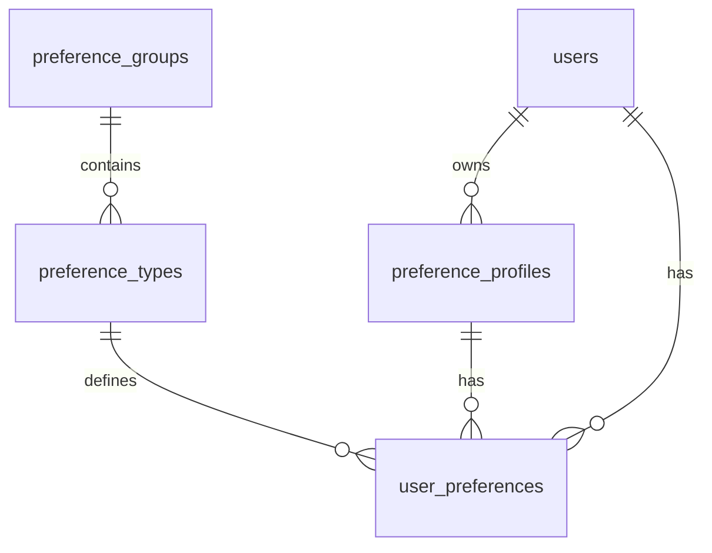

# מבנה בסיס הנתונים - מערכת העדפות
## Database Schema - Preferences System

> **גרסה 3.0** - מבנה גמיש ומתקדם

---

## 🗄️ סקירה כללית

מערכת העדפות מבוססת על 4 טבלאות עיקריות המאפשרות גמישות מקסימלית:

1. **`preference_groups`** - קבוצות העדפות
2. **`preference_types`** - סוגי העדפות  
3. **`preference_profiles`** - פרופילי משתמשים
4. **`user_preferences`** - העדפות שמורות

---

## 📋 טבלאות מפורטות

### 1. טבלת `preference_groups`

```sql
CREATE TABLE preference_groups (
    id INTEGER PRIMARY KEY AUTOINCREMENT,
    group_name VARCHAR(100) NOT NULL UNIQUE,
    description TEXT,
    created_at DATETIME DEFAULT CURRENT_TIMESTAMP,
    updated_at DATETIME DEFAULT CURRENT_TIMESTAMP
);
```

**תכלית:** קבוצות לוגיות של העדפות (כללי, צבעים, פילטרים, וכו')

**דוגמאות:**
- `general` - הגדרות כלליות
- `colors` - צבעי ממשק
- `filters` - פילטרים ברירת מחדל
- `ui` - הגדרות ממשק משתמש
- `external_data` - נתונים חיצוניים
- `notifications` - התראות

---

### 2. טבלת `preference_types`

```sql
CREATE TABLE preference_types (
    id INTEGER PRIMARY KEY AUTOINCREMENT,
    group_id INTEGER NOT NULL,
    data_type VARCHAR(20) NOT NULL,
    preference_name VARCHAR(100) NOT NULL,
    description TEXT,
    constraints TEXT,  -- JSON עם הגבלות ואימותים
    default_value TEXT,
    is_required BOOLEAN DEFAULT FALSE,
    is_active BOOLEAN DEFAULT TRUE,
    created_at DATETIME DEFAULT CURRENT_TIMESTAMP,
    updated_at DATETIME DEFAULT CURRENT_TIMESTAMP,
    FOREIGN KEY (group_id) REFERENCES preference_groups(id),
    UNIQUE(group_id, preference_name)
);
```

**תכלית:** הגדרת סוגי העדפות זמינים במערכת

**סוגי נתונים נתמכים:**
- `string` - מחרוזת
- `number` - מספר
- `boolean` - true/false
- `json` - מבנה JSON
- `color` - קוד צבע (#ffffff)
- `select` - רשימת אפשרויות

**דוגמאות:**
```sql
INSERT INTO preference_types VALUES 
(1, 1, 'string', 'timezone', 'אזור זמן של המשתמש', '{"options": ["Asia/Jerusalem", "America/New_York"]}', 'Asia/Jerusalem', TRUE, TRUE),
(2, 1, 'number', 'defaultStopLoss', 'אחוז stop loss ברירת מחדל', '{"min": 0, "max": 100}', '5.0', TRUE, TRUE),
(3, 2, 'color', 'primaryColor', 'צבע ראשי של הממשק', '{"format": "hex"}', '#007bff', FALSE, TRUE);
```

---

### 3. טבלת `preference_profiles`

```sql
CREATE TABLE preference_profiles (
    id INTEGER PRIMARY KEY AUTOINCREMENT,
    user_id INTEGER NOT NULL,
    profile_name VARCHAR(100) NOT NULL,
    is_active BOOLEAN DEFAULT TRUE,
    is_default BOOLEAN DEFAULT FALSE,
    description TEXT,
    created_by INTEGER,
    last_used_at DATETIME,
    usage_count INTEGER DEFAULT 0,
    created_at DATETIME DEFAULT CURRENT_TIMESTAMP,
    updated_at DATETIME DEFAULT CURRENT_TIMESTAMP,
    UNIQUE(user_id, profile_name)
);
```

**תכלית:** פרופילי העדפות לכל משתמש

**תכונות:**
- משתמש יכול להחזיק מספר פרופילים
- פרופיל ברירת מחדל אחד בלבד
- מעקב אחר שימוש (usage_count, last_used_at)

---

### 4. טבלת `user_preferences`

```sql
CREATE TABLE user_preferences (
    id INTEGER PRIMARY KEY AUTOINCREMENT,
    user_id INTEGER NOT NULL,
    profile_id INTEGER NOT NULL,
    preference_id INTEGER NOT NULL,
    saved_value TEXT NOT NULL,
    created_at DATETIME DEFAULT CURRENT_TIMESTAMP,
    updated_at DATETIME DEFAULT CURRENT_TIMESTAMP,
    FOREIGN KEY (profile_id) REFERENCES preference_profiles(id),
    FOREIGN KEY (preference_id) REFERENCES preference_types(id),
    UNIQUE(user_id, profile_id, preference_id)
);
```

**תכלית:** העדפות שמורות בפועל

**תכונות:**
- ערך יחיד לכל שילוב (user + profile + preference)
- עדכון otomatic של updated_at
- שמירת ערכים כ-TEXT עם validation לפי data_type

---

## 🔗 קשרים ויחסים



---

## 📊 אינדקסים מומלצים

```sql
-- אינדקסים לביצועים
CREATE INDEX idx_user_preferences_user_profile ON user_preferences(user_id, profile_id);
CREATE INDEX idx_user_preferences_preference ON user_preferences(preference_id);
CREATE INDEX idx_preference_profiles_user ON preference_profiles(user_id);
CREATE INDEX idx_preference_types_group ON preference_types(group_id);

-- אינדקסים ייחודיים
CREATE UNIQUE INDEX idx_user_preferences_unique ON user_preferences(user_id, profile_id, preference_id);
CREATE UNIQUE INDEX idx_preference_profiles_unique ON preference_profiles(user_id, profile_name);
CREATE UNIQUE INDEX idx_preference_types_unique ON preference_types(group_id, preference_name);
```

---

## 🚀 דוגמאות שאילתות

### קבלת כל ההעדפות של משתמש
```sql
SELECT 
    pt.preference_name,
    pt.data_type,
    up.saved_value,
    pg.group_name
FROM user_preferences up
JOIN preference_types pt ON up.preference_id = pt.id
JOIN preference_groups pg ON pt.group_id = pg.id
WHERE up.user_id = ? AND up.profile_id = ?
ORDER BY pg.group_name, pt.preference_name;
```

### קבלת פרופילים של משתמש
```sql
SELECT * FROM preference_profiles 
WHERE user_id = ? AND is_active = TRUE
ORDER BY is_default DESC, profile_name;
```

### חיפוש העדפות לפי קבוצה
```sql
SELECT 
    pt.preference_name,
    pt.description,
    up.saved_value
FROM preference_types pt
LEFT JOIN user_preferences up ON pt.id = up.preference_id 
    AND up.user_id = ? AND up.profile_id = ?
WHERE pt.group_id = ? AND pt.is_active = TRUE
ORDER BY pt.preference_name;
```

---

## 🔧 Migration למערכת החדשה

### שלב 1: יצירת טבלאות חדשות
```sql
-- הרץ את ה-CREATE TABLE statements למעלה
```

### שלב 2: מילוי נתונים בסיסיים
```sql
-- הוסף קבוצות
INSERT INTO preference_groups (group_name, description) VALUES
('general', 'הגדרות כלליות'),
('colors', 'צבעי ממשק'),
('filters', 'פילטרים ברירת מחדל'),
('ui', 'הגדרות ממשק משתמש'),
('external_data', 'נתונים חיצוניים'),
('notifications', 'התראות');

-- הוסף סוגי העדפות
-- (ראה דוגמאות למעלה)
```

### שלב 3: העברת נתונים קיימים
```sql
-- העבר נתונים מ-user_preferences הישן לחדש
-- (script נפרד לפי הצורך)
```

### שלב 4: מחיקת טבלאות ישנות
```sql
-- DROP TABLE user_preferences_old;
-- DROP TABLE preference_profiles_old;
```

---

## 📈 יתרונות המבנה החדש

### ✅ גמישות
- הוספת העדפות חדשות ללא שינוי קוד
- סוגי נתונים מגוונים
- קבוצות לוגיות

### ✅ ביצועים
- אינדקסים מותאמים
- שאילתות יעילות
- Cache-friendly

### ✅ תחזוקה
- מבנה ברור ומובן
- קל להוסיף תכונות
- תמיכה ב-migrations

### ✅ אבטחה
- Validation ברמת בסיס הנתונים
- Constraints ו-foreign keys
- Audit trail עם timestamps

---

*עדכון אחרון: ינואר 2025 | גרסה 3.0*
