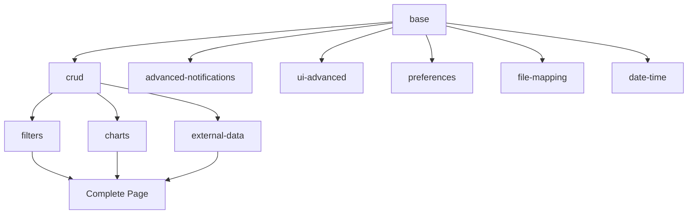

# מדריך Package Registry - מערכת אתחול חכמה
## Package Registry Guide - Smart Initialization System

**תאריך יצירה:** 19 אוקטובר 2025  
**גרסה:** 1.0.0  
**סטטוס:** ✅ פעיל  
**קובץ:** `init-package-registry.js`

---

## 📋 סקירה כללית

Package Registry הוא המאגר המרכזי של חבילות מערכות במערכת האתחול החכמה. הוא מנהל את כל החבילות, התלויות שלהן, וסדר הטעינה הנכון.

### 🎯 מטרות המערכת

1. **ניהול מרכזי** - כל החבילות במקום אחד
2. **פתרון תלויות** - טיפול אוטומטי בתלויות בין חבילות
3. **סדר טעינה** - הבטחת סדר טעינה נכון
4. **ולידציה** - בדיקת תקינות חבילות ותלויות
5. **גמישות** - הוספה קלה של חבילות חדשות

---

## 📦 חבילות זמינות

### 1. **Base Package** (חובה)
```javascript
{
  id: 'base',
  name: 'Base Package',
  description: 'חבילת בסיס חובה לכל עמוד',
  systems: [
    'unified-app-initializer',
    'notification-system',
    'ui-utils',
    'page-utils',
    'translation-utils',
    'global-favicon',
    'warning-system',
    'unified-cache-manager',
    'cache-sync-manager',
    'header-system'
  ],
  required: true,
  critical: true
}
```

**מערכות כלולות:**
- מערכת אתחול מאוחדת
- מערכת התראות
- כלי עזר לממשק משתמש
- כלי עזר לעמודים
- מערכת תרגום
- ניהול favicon
- מערכת אזהרות
- מנהל מטמון מאוחד
- מנהל סינכרון מטמון
- מערכת כותרת

### 2. **CRUD Package** (אופציונלי)
```javascript
{
  id: 'crud',
  name: 'CRUD Package',
  description: 'מערכות לניהול נתונים וטבלאות',
  systems: ['tables', 'table-mappings', 'data-utils', 'pagination-system'],
  dependencies: ['base']
}
```

**מערכות כלולות:**
- מערכת טבלאות
- מיפוי טבלאות
- כלי עזר לנתונים
- מערכת עמודים

### 3. **Filters Package** (אופציונלי)
```javascript
{
  id: 'filters',
  name: 'Filters Package',
  description: 'מערכות סינון וחיפוש',
  systems: ['header-filters', 'category-detector', 'search-utils'],
  dependencies: ['base', 'crud']
}
```

**מערכות כלולות:**
- פילטרים בכותרת
- זיהוי קטגוריות
- כלי עזר לחיפוש

### 4. **Charts Package** (אופציונלי)
```javascript
{
  id: 'charts',
  name: 'Charts Package',
  description: 'מערכות להצגת נתונים ויזואלית',
  systems: ['chart-system', 'chart-export', 'chart-utils'],
  dependencies: ['base', 'crud']
}
```

**מערכות כלולות:**
- מערכת גרפים
- ייצוא גרפים
- כלי עזר לגרפים

### 5. **Advanced Notifications** (אופציונלי)
```javascript
{
  id: 'advanced-notifications',
  name: 'Advanced Notifications',
  description: 'מערכות התראות מתקדמות',
  systems: ['notification-category-detector', 'global-notification-collector', 'active-alerts-component'],
  dependencies: ['base']
}
```

**מערכות כלולות:**
- זיהוי קטגוריות התראות
- איסוף התראות גלובלי
- רכיב התראות פעילות

### 6. **Advanced UI Package** (אופציונלי)
```javascript
{
  id: 'ui-advanced',
  name: 'Advanced UI Package',
  description: 'מערכות ממשק משתמש מתקדמות',
  systems: ['button-system', 'color-scheme-system', 'entity-details-system', 'modal-system'],
  dependencies: ['base']
}
```

**מערכות כלולות:**
- מערכת כפתורים
- מערכת צבעים
- מערכת פרטי ישות
- מערכת מודאלים

### 7. **Preferences Package** (אופציונלי)
```javascript
{
  id: 'preferences',
  name: 'Preferences Package',
  description: 'מערכות העדפות והגדרות',
  systems: ['preferences-system', 'preferences-admin'],
  dependencies: ['base']
}
```

**מערכות כלולות:**
- מערכת העדפות
- ניהול העדפות

### 8. **File Mapping Package** (אופציונלי)
```javascript
{
  id: 'file-mapping',
  name: 'File Mapping Package',
  description: 'מערכות למיפוי וניהול קבצים',
  systems: ['file-mapping-system', 'file-utils'],
  dependencies: ['base']
}
```

**מערכות כלולות:**
- מערכת מיפוי קבצים
- כלי עזר לקבצים

### 9. **External Data Package** (אופציונלי)
```javascript
{
  id: 'external-data',
  name: 'External Data Package',
  description: 'מערכות לנתונים חיצוניים',
  systems: ['external-data-system', 'external-data-dashboard'],
  dependencies: ['base', 'crud']
}
```

**מערכות כלולות:**
- מערכת נתונים חיצוניים
- דשבורד נתונים חיצוניים

### 10. **Date Time Package** (אופציונלי)
```javascript
{
  id: 'date-time',
  name: 'Date Time Package',
  description: 'מערכות לתאריכים וזמן',
  systems: ['date-utils', 'time-utils'],
  dependencies: ['base']
}
```

**מערכות כלולות:**
- כלי עזר לתאריכים
- כלי עזר לזמן

---

## 🔧 שימוש במערכת

### אתחול בסיסי
```javascript
// המערכת מאותחלת אוטומטית
console.log(window.packageRegistry.getAllPackages());
```

### קבלת חבילה ספציפית
```javascript
const basePackage = window.packageRegistry.getPackage('base');
console.log(basePackage);
```

### פתרון תלויות
```javascript
// קבלת סדר טעינה נכון
const packageIds = ['filters', 'charts'];
const resolvedOrder = window.packageRegistry.resolveDependencies(packageIds);
console.log(resolvedOrder); // ['base', 'crud', 'filters', 'charts']
```

### קבלת סקריפטים לסדר טעינה
```javascript
const scripts = window.packageRegistry.getScriptsForPackages(['filters', 'charts']);
console.log(scripts); // Array of script paths in correct order
```

### קבלת מערכות
```javascript
const systems = window.packageRegistry.getSystemsForPackages(['base', 'crud']);
console.log(systems); // Array of system names
```

### ולידציה
```javascript
const validation = window.packageRegistry.validateDependencies(['filters', 'charts']);
if (validation.errors.length > 0) {
  console.error('Validation errors:', validation.errors);
}
```

### סטטיסטיקות
```javascript
const stats = window.packageRegistry.getStatistics();
console.log(stats);
// {
//   total: 10,
//   required: 1,
//   optional: 9,
//   critical: 1,
//   totalSystems: 35,
//   totalScripts: 25,
//   loaded: 0
// }
```

---

## 📊 תלויות בין חבילות



### הסבר תלויות:
- **base** - חובה לכל עמוד
- **crud** - תלוי ב-base
- **filters** - תלוי ב-base ו-crud
- **charts** - תלוי ב-base ו-crud
- **external-data** - תלוי ב-base ו-crud
- **advanced-notifications** - תלוי ב-base בלבד
- **ui-advanced** - תלוי ב-base בלבד
- **preferences** - תלוי ב-base בלבד
- **file-mapping** - תלוי ב-base בלבד
- **date-time** - תלוי ב-base בלבד

---

## 🚀 הוספת חבילה חדשה

### 1. רישום חבילה
```javascript
window.packageRegistry.registerPackage('my-new-package', {
  name: 'My New Package',
  description: 'תיאור החבילה החדשה',
  systems: ['system1', 'system2'],
  required: false,
  critical: false,
  scripts: [
    'scripts/my-new-system.js'
  ],
  dependencies: ['base'],
  loadOrder: 11
});
```

### 2. בדיקת תקינות
```javascript
const validation = window.packageRegistry.validateDependencies(['my-new-package']);
if (validation.errors.length === 0) {
  console.log('Package registered successfully');
}
```

### 3. שימוש בחבילה
```javascript
const scripts = window.packageRegistry.getScriptsForPackages(['my-new-package']);
// scripts will include all dependencies in correct order
```

---

## ⚠️ כללים חשובים

### 1. **תלויות מעגליות**
```javascript
// ❌ אסור - תלות מעגלית
packageA.dependencies = ['packageB'];
packageB.dependencies = ['packageA'];

// ✅ נכון - תלות חד-כיוונית
packageA.dependencies = ['packageB'];
packageB.dependencies = ['base'];
```

### 2. **שמות מערכות**
- חייבים להיות ייחודיים
- ללא רווחים או תווים מיוחדים
- באנגלית בלבד

### 3. **נתיבי סקריפטים**
- יחסיים לתיקיית `scripts/`
- עם סיומת `.js`
- קיימים במערכת

### 4. **סדר טעינה**
- `loadOrder` נמוך יותר = נטען קודם
- base תמיד loadOrder = 1
- חבילות אופציונליות מ-2 ומעלה

---

## 🔍 דיבוג וניטור

### בדיקת חבילות נטענות
```javascript
// סימון חבילה כנטענת
window.packageRegistry.markPackageLoaded('base');

// בדיקה אם נטענה
const isLoaded = window.packageRegistry.isPackageLoaded('base');

// קבלת כל החבילות הנטענות
const loaded = window.packageRegistry.getLoadedPackages();
```

### ייצוא קונפיגורציה
```javascript
const config = window.packageRegistry.exportConfiguration();
console.log(JSON.stringify(config, null, 2));
```

### ניטור בזמן אמת
```javascript
// עדכון סטטיסטיקות
const stats = window.packageRegistry.getStatistics();
console.log(`Loaded packages: ${stats.loaded}/${stats.total}`);
```

---

## 📚 דוגמאות מעשיות

### עמוד פשוט (רק base)
```javascript
const packages = ['base'];
const scripts = window.packageRegistry.getScriptsForPackages(packages);
// scripts = ['scripts/unified-app-initializer.js', 'scripts/notification-system.js', ...]
```

### עמוד CRUD (base + crud)
```javascript
const packages = ['base', 'crud'];
const scripts = window.packageRegistry.getScriptsForPackages(packages);
// scripts = [base scripts..., 'scripts/tables.js', 'scripts/data-utils.js', ...]
```

### עמוד מתקדם (base + crud + filters + charts)
```javascript
const packages = ['base', 'crud', 'filters', 'charts'];
const scripts = window.packageRegistry.getScriptsForPackages(packages);
// scripts = [base scripts..., crud scripts..., filters scripts..., charts scripts...]
```

---

## 🎯 יתרונות המערכת

1. **ניהול מרכזי** - כל החבילות במקום אחד
2. **פתרון תלויות אוטומטי** - אין צורך לחשוב על סדר
3. **ולידציה מובנית** - זיהוי בעיות לפני הטעינה
4. **גמישות מקסימלית** - הוספה קלה של חבילות
5. **ביצועים אופטימליים** - טעינה רק של מה שצריך
6. **דיבוג קל** - מעקב אחר חבילות נטענות
7. **תאימות לאחור** - עובד עם המערכת הקיימת

---

## 🔗 קישורים רלוונטיים

- [מערכת אתחול מאוחדת](UNIFIED_INITIALIZATION_SYSTEM.md)
- [System Dependency Graph](SYSTEM_DEPENDENCY_GRAPH_GUIDE.md)
- [Page Templates](PAGE_TEMPLATES_GUIDE.md)
- [Smart Script Loader](SMART_SCRIPT_LOADER_GUIDE.md)

---

**תאריך עדכון אחרון:** 19 אוקטובר 2025  
**גרסה:** 1.0.0  
**סטטוס:** ✅ פעיל ומעודכן
