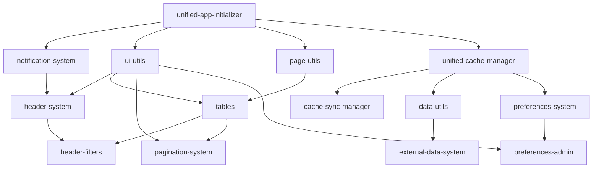

# מדריך System Dependency Graph - מערכת אתחול חכמה
## System Dependency Graph Guide - Smart Initialization System

**תאריך יצירה:** 19 אוקטובר 2025  
**גרסה:** 1.0.0  
**סטטוס:** ✅ פעיל  
**קובץ:** `init-dependency-graph.js`

---

## 📋 סקירה כללית

System Dependency Graph מנהל את התלויות בין מערכות בודדות, מבטיח סדר טעינה נכון, ומספק מנגנוני fallback במקרה של כשל.

### 🎯 מטרות המערכת

1. **ניהול תלויות** - מעקב אחר תלויות בין מערכות
2. **סדר טעינה** - הבטחת טעינה בסדר הנכון
3. **זיהוי מעגלים** - מניעת תלויות מעגליות
4. **מנגנון fallback** - טיפול בכשלים
5. **ניטור סטטוס** - מעקב אחר מערכות נטענות/נכשלות

---

## 🔗 מערכות זמינות

### מערכות בסיס (ללא תלויות)

#### 1. **unified-app-initializer**
```javascript
{
  id: 'unified-app-initializer',
  name: 'Unified App Initializer',
  description: 'מערכת אתחול מרכזית',
  dependencies: [],
  critical: true,
  fallback: null,
  loadOrder: 1
}
```

#### 2. **notification-system**
```javascript
{
  id: 'notification-system',
  name: 'Notification System',
  description: 'מערכת התראות גלובלית',
  dependencies: [],
  critical: true,
  fallback: 'console.log',
  loadOrder: 2
}
```

#### 3. **ui-utils**
```javascript
{
  id: 'ui-utils',
  name: 'UI Utils',
  description: 'כלי עזר לממשק משתמש',
  dependencies: [],
  critical: true,
  fallback: null,
  loadOrder: 3
}
```

#### 4. **unified-cache-manager**
```javascript
{
  id: 'unified-cache-manager',
  name: 'Unified Cache Manager',
  description: 'מנהל מטמון מאוחד',
  dependencies: [],
  critical: true,
  fallback: 'localStorage',
  loadOrder: 8
}
```

### מערכות עם תלויות

#### 5. **header-system**
```javascript
{
  id: 'header-system',
  name: 'Header System',
  description: 'מערכת כותרת',
  dependencies: ['notification-system', 'ui-utils'],
  critical: true,
  fallback: 'basicHeader',
  loadOrder: 10
}
```

#### 6. **tables**
```javascript
{
  id: 'tables',
  name: 'Tables System',
  description: 'מערכת טבלאות',
  dependencies: ['ui-utils', 'page-utils'],
  critical: false,
  fallback: 'basicTable',
  loadOrder: 11
}
```

#### 7. **pagination-system**
```javascript
{
  id: 'pagination-system',
  name: 'Pagination System',
  description: 'מערכת עמודים',
  dependencies: ['tables', 'ui-utils'],
  critical: false,
  fallback: 'basicPagination',
  loadOrder: 13
}
```

#### 8. **header-filters**
```javascript
{
  id: 'header-filters',
  name: 'Header Filters',
  description: 'פילטרים בכותרת',
  dependencies: ['header-system', 'tables'],
  critical: false,
  fallback: 'basicFilters',
  loadOrder: 14
}
```

---

## 🔧 שימוש במערכת

### אתחול בסיסי
```javascript
// המערכת מאותחלת אוטומטית
console.log(window.systemDependencyGraph.getAllSystems());
```

### קבלת מערכת ספציפית
```javascript
const headerSystem = window.systemDependencyGraph.getSystem('header-system');
console.log(headerSystem);
```

### פתרון תלויות
```javascript
// קבלת סדר טעינה נכון
const systemIds = ['header-filters', 'pagination-system'];
const resolvedOrder = window.systemDependencyGraph.resolveSystemDependencies(systemIds);
console.log(resolvedOrder);
// ['ui-utils', 'page-utils', 'notification-system', 'header-system', 'tables', 'header-filters', 'pagination-system']
```

### קבלת סקריפטים לסדר טעינה
```javascript
const scripts = window.systemDependencyGraph.getScriptsForSystems(['header-filters']);
console.log(scripts); // Array of script paths in correct order
```

### ולידציה
```javascript
const validation = window.systemDependencyGraph.validateSystemDependencies(['header-filters']);
if (validation.errors.length > 0) {
  console.error('Validation errors:', validation.errors);
}
if (validation.warnings.length > 0) {
  console.warn('Validation warnings:', validation.warnings);
}
```

### ניטור סטטוס
```javascript
// סימון מערכת כנטענת
window.systemDependencyGraph.markSystemLoaded('header-system');

// בדיקה אם נטענה
const isLoaded = window.systemDependencyGraph.isSystemLoaded('header-system');

// קבלת סטטוס
const status = window.systemDependencyGraph.getSystemStatus('header-system');
// 'pending', 'loaded', 'failed', 'not-found'
```

### סטטיסטיקות
```javascript
const stats = window.systemDependencyGraph.getStatistics();
console.log(stats);
// {
//   total: 28,
//   critical: 4,
//   nonCritical: 24,
//   loaded: 5,
//   failed: 0,
//   pending: 23,
//   withFallback: 20,
//   withoutFallback: 8
// }
```

---

## 📊 תלויות בין מערכות



### הסבר תלויות:
- **מערכות בסיס** - ללא תלויות (loadOrder 1-8)
- **מערכות ביניים** - תלויות במערכות בסיס (loadOrder 9-15)
- **מערכות מתקדמות** - תלויות במערכות ביניים (loadOrder 16+)

---

## 🚨 מנגנון Fallback

### מערכות קריטיות עם Fallback
```javascript
// notification-system
fallback: 'console.log' // במקרה של כשל, השתמש ב-console.log

// unified-cache-manager
fallback: 'localStorage' // במקרה של כשל, השתמש ב-localStorage

// header-system
fallback: 'basicHeader' // במקרה של כשל, הצג כותרת בסיסית
```

### מערכות קריטיות ללא Fallback
```javascript
// unified-app-initializer
fallback: null // כשל קריטי - העמוד לא יעבוד

// ui-utils
fallback: null // כשל קריטי - העמוד לא יעבוד
```

### מערכות לא קריטיות
```javascript
// tables
fallback: 'basicTable' // במקרה של כשל, הצג טבלה בסיסית

// pagination-system
fallback: 'basicPagination' // במקרה של כשל, הצג עמודים בסיסיים
```

---

## 🔍 ניטור ודיבוג

### מעקב אחר מערכות נטענות
```javascript
// סימון מערכת כנטענת
window.systemDependencyGraph.markSystemLoaded('tables');

// סימון מערכת כנכשלת
window.systemDependencyGraph.markSystemFailed('chart-system');

// קבלת כל המערכות הנטענות
const loaded = window.systemDependencyGraph.getLoadedSystems();

// קבלת כל המערכות הנכשלות
const failed = window.systemDependencyGraph.getFailedSystems();
```

### שרשרת תלויות
```javascript
// קבלת שרשרת תלויות למערכת
const chain = window.systemDependencyGraph.getDependencyChain('header-filters');
console.log(chain);
// ['ui-utils', 'page-utils', 'notification-system', 'header-system', 'tables', 'header-filters']

// קבלת מערכות שתלויות במערכת
const dependents = window.systemDependencyGraph.getDependents('ui-utils');
console.log(dependents);
// ['header-system', 'tables', 'pagination-system', 'button-system', ...]
```

### איפוס סטטוס
```javascript
// איפוס כל הסטטוסים
window.systemDependencyGraph.resetSystemStatus();
```

---

## 🚀 הוספת מערכת חדשה

### 1. רישום מערכת
```javascript
window.systemDependencyGraph.registerSystem('my-new-system', {
  name: 'My New System',
  description: 'תיאור המערכת החדשה',
  dependencies: ['ui-utils', 'data-utils'],
  critical: false,
  fallback: 'basicMyNewSystem',
  loadOrder: 29,
  scripts: ['scripts/my-new-system.js']
});
```

### 2. בדיקת תקינות
```javascript
const validation = window.systemDependencyGraph.validateSystemDependencies(['my-new-system']);
if (validation.errors.length === 0) {
  console.log('System registered successfully');
}
```

### 3. שימוש במערכת
```javascript
const scripts = window.systemDependencyGraph.getScriptsForSystems(['my-new-system']);
// scripts will include all dependencies in correct order
```

---

## ⚠️ כללים חשובים

### 1. **תלויות מעגליות**
```javascript
// ❌ אסור - תלות מעגלית
systemA.dependencies = ['systemB'];
systemB.dependencies = ['systemA'];

// ✅ נכון - תלות חד-כיוונית
systemA.dependencies = ['systemB'];
systemB.dependencies = ['base-system'];
```

### 2. **מערכות קריטיות**
- חייבות להיות עם fallback או להיות הכרחיות
- כשל בהן יכול לשבור את העמוד
- יש לטעון אותן קודם

### 3. **סדר טעינה**
- `loadOrder` נמוך יותר = נטען קודם
- מערכות בסיס: 1-8
- מערכות ביניים: 9-15
- מערכות מתקדמות: 16+

### 4. **מנגנון Fallback**
- מערכות קריטיות: חובה
- מערכות לא קריטיות: מומלץ
- Fallback יכול להיות:
  - פונקציה
  - מחרוזת
  - null (כשל קריטי)

---

## 📚 דוגמאות מעשיות

### טעינת מערכות בסיס
```javascript
const basicSystems = ['unified-app-initializer', 'notification-system', 'ui-utils'];
const scripts = window.systemDependencyGraph.getScriptsForSystems(basicSystems);
// scripts = ['scripts/unified-app-initializer.js', 'scripts/notification-system.js', 'scripts/ui-utils.js']
```

### טעינת מערכות CRUD
```javascript
const crudSystems = ['tables', 'data-utils', 'pagination-system'];
const scripts = window.systemDependencyGraph.getScriptsForSystems(crudSystems);
// scripts = [dependencies..., 'scripts/tables.js', 'scripts/data-utils.js', 'scripts/pagination-system.js']
```

### טעינת מערכות מתקדמות
```javascript
const advancedSystems = ['header-filters', 'chart-system'];
const scripts = window.systemDependencyGraph.getScriptsForSystems(advancedSystems);
// scripts = [all dependencies in correct order...]
```

---

## 🎯 יתרונות המערכת

1. **ניהול תלויות אוטומטי** - אין צורך לחשוב על סדר
2. **זיהוי בעיות מוקדם** - ולידציה לפני הטעינה
3. **מנגנון fallback** - טיפול בכשלים
4. **ניטור בזמן אמת** - מעקב אחר סטטוס
5. **דיבוג קל** - זיהוי בעיות מהיר
6. **גמישות מקסימלית** - הוספה קלה של מערכות
7. **ביצועים אופטימליים** - טעינה רק של מה שצריך

---

## 🔗 קישורים רלוונטיים

- [Package Registry](PACKAGE_REGISTRY_GUIDE.md)
- [מערכת אתחול מאוחדת](UNIFIED_INITIALIZATION_SYSTEM.md)
- [Page Templates](PAGE_TEMPLATES_GUIDE.md)
- [Smart Script Loader](SMART_SCRIPT_LOADER_GUIDE.md)

---

**תאריך עדכון אחרון:** 19 אוקטובר 2025  
**גרסה:** 1.0.0  
**סטטוס:** ✅ פעיל ומעודכן
