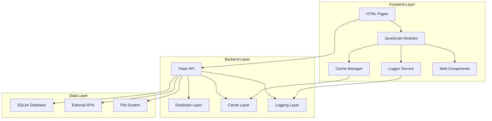
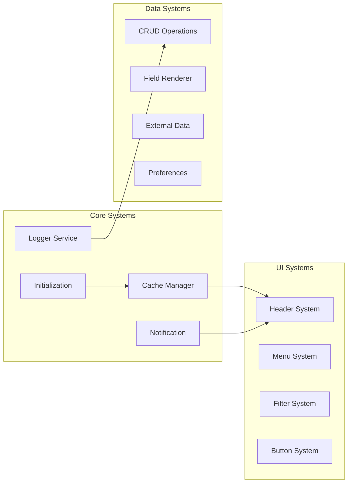
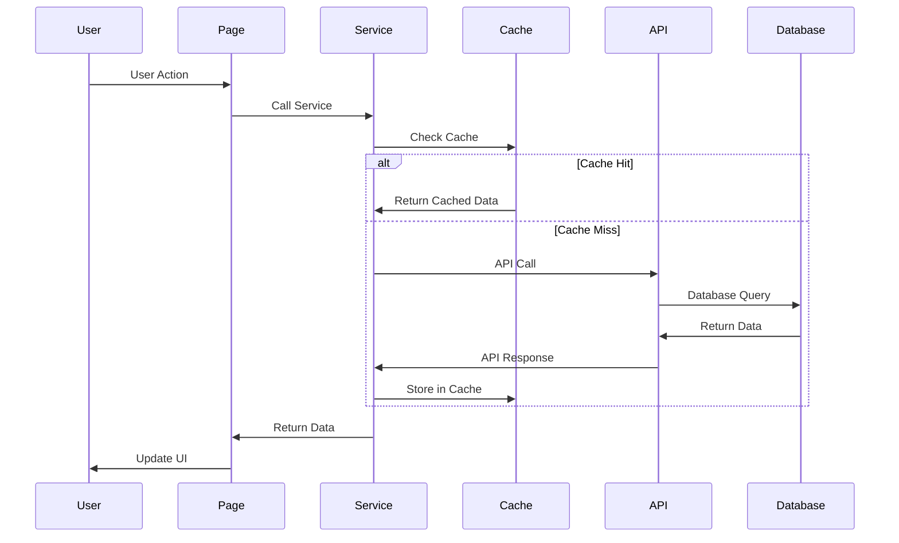
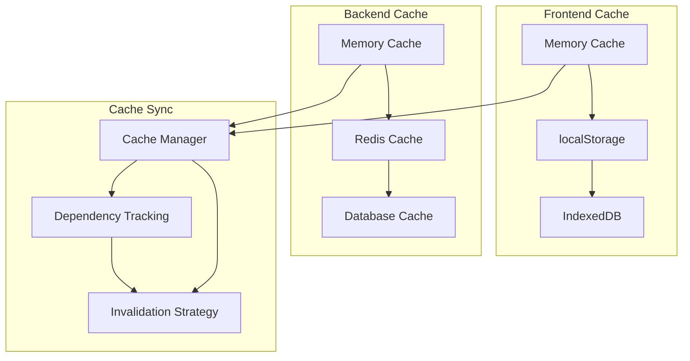
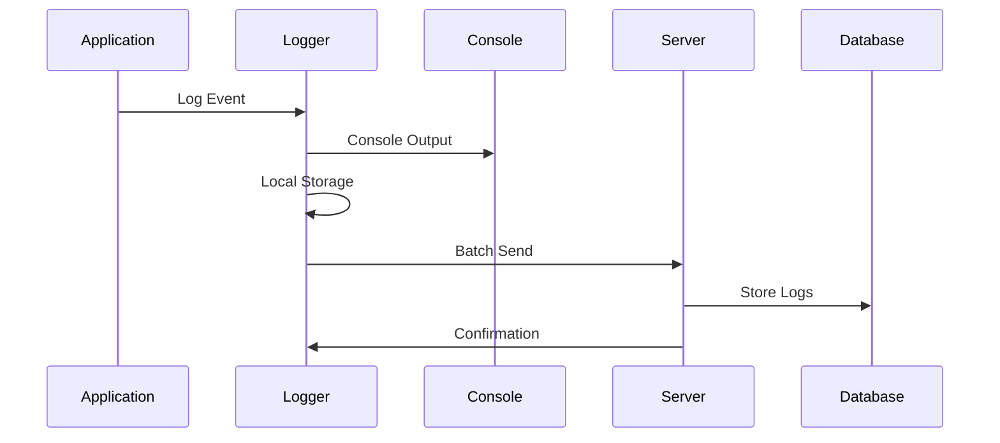
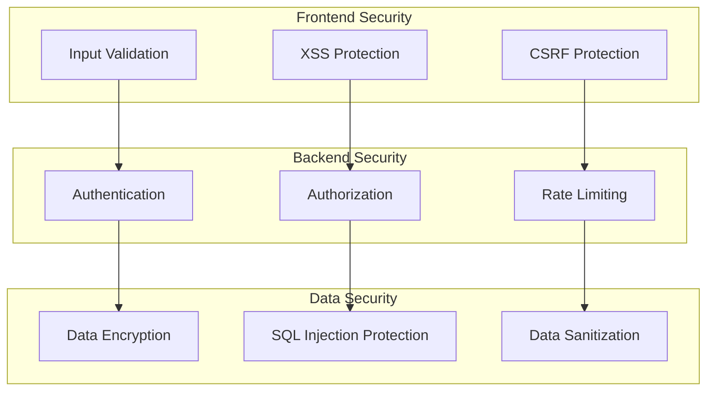
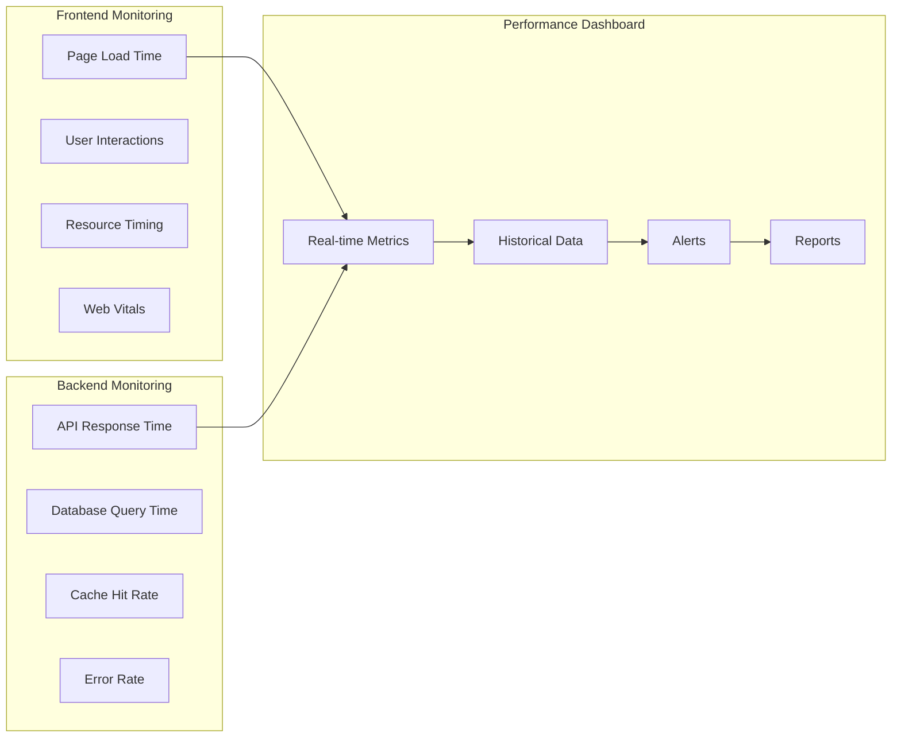
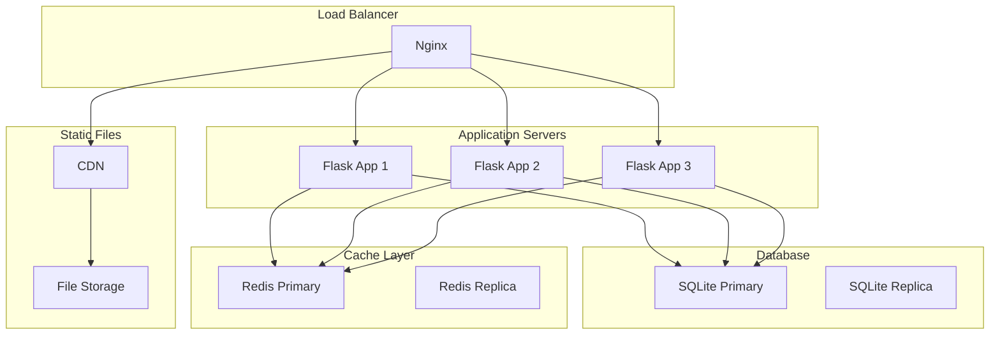

# System Architecture - ארכיטקטורה מלאה

## סקירה

**מטרה:** תיעוד ארכיטקטורה מקיפה של מערכת TikTrack  
**תוצאה:** הבנה מלאה של המערכת לכל המפתחים

---

## ארכיטקטורה כללית

### High-Level Architecture



### Component Architecture



---

## Frontend Architecture

### Module Structure

```
trading-ui/
├── scripts/
│   ├── core/
│   │   ├── cache-manager.js          # Cache system
│   │   ├── logger-service.js         # Logging system
│   │   ├── initialization.js        # App initialization
│   │   └── notification-system.js    # Notifications
│   ├── services/
│   │   ├── trades-service.js        # Trades API
│   │   ├── alerts-service.js        # Alerts API
│   │   ├── accounts-service.js      # Accounts API
│   │   └── external-data-service.js # External data
│   ├── components/
│   │   ├── tt-button.js             # Button component
│   │   ├── tt-modal.js              # Modal component
│   │   ├── tt-table.js              # Table component
│   │   └── tt-form.js               # Form component
│   ├── pages/
│   │   ├── trades.js                # Trades page logic
│   │   ├── alerts.js                # Alerts page logic
│   │   └── preferences.js            # Preferences logic
│   └── utils/
│       ├── ui-utils.js              # UI utilities
│       ├── date-utils.js            # Date utilities
│       └── validation-utils.js      # Validation
├── styles-new/
│   ├── 01-settings/                 # CSS variables
│   ├── 02-tools/                    # Mixins, functions
│   ├── 03-generic/                  # Reset, normalize
│   ├── 04-elements/                 # Base elements
│   ├── 05-objects/                  # Layout objects
│   ├── 06-components/               # UI components
│   └── 07-utilities/                # Utility classes
└── pages/
    ├── trades.html                  # Trades page
    ├── alerts.html                  # Alerts page
    ├── preferences.html             # Preferences page
    └── index.html                   # Dashboard
```

### Data Flow



---

## Backend Architecture

### API Structure

```
Backend/
├── app.py                          # Main Flask app
├── config/
│   ├── database.py                 # Database config
│   ├── cache.py                    # Cache config
│   └── logging.py                  # Logging config
├── models/
│   ├── trade.py                    # Trade model
│   ├── alert.py                    # Alert model
│   ├── account.py                  # Account model
│   └── log.py                      # Log model
├── routes/
│   ├── api/
│   │   ├── trades.py               # Trades API
│   │   ├── alerts.py               # Alerts API
│   │   ├── accounts.py             # Accounts API
│   │   ├── cache_sync.py           # Cache sync API
│   │   └── logs.py                 # Logs API
│   └── web/
│       ├── dashboard.py            # Dashboard routes
│       └── static.py               # Static files
├── services/
│   ├── cache_service.py            # Cache operations
│   ├── logging_service.py          # Logging operations
│   └── external_data_service.py    # External data
└── utils/
    ├── database_utils.py           # Database utilities
    ├── cache_utils.py              # Cache utilities
    └── validation_utils.py         # Validation
```

### Database Schema

```sql
-- Core Tables
CREATE TABLE accounts (
    id INTEGER PRIMARY KEY,
    name VARCHAR(255) NOT NULL,
    type VARCHAR(50) NOT NULL,
    created_at DATETIME DEFAULT CURRENT_TIMESTAMP,
    updated_at DATETIME DEFAULT CURRENT_TIMESTAMP
);

CREATE TABLE trades (
    id INTEGER PRIMARY KEY,
    account_id INTEGER NOT NULL,
    ticker_id INTEGER NOT NULL,
    symbol VARCHAR(20) NOT NULL,
    quantity DECIMAL(15,2) NOT NULL,
    price DECIMAL(15,4) NOT NULL,
    total_value DECIMAL(15,2) NOT NULL,
    trade_date DATETIME NOT NULL,
    created_at DATETIME DEFAULT CURRENT_TIMESTAMP,
    FOREIGN KEY (account_id) REFERENCES accounts(id),
    FOREIGN KEY (ticker_id) REFERENCES tickers(id)
);

CREATE TABLE alerts (
    id INTEGER PRIMARY KEY,
    account_id INTEGER NOT NULL,
    ticker_id INTEGER NOT NULL,
    condition_type VARCHAR(50) NOT NULL,
    condition_value DECIMAL(15,4) NOT NULL,
    is_active BOOLEAN DEFAULT TRUE,
    created_at DATETIME DEFAULT CURRENT_TIMESTAMP,
    FOREIGN KEY (account_id) REFERENCES accounts(id),
    FOREIGN KEY (ticker_id) REFERENCES tickers(id)
);

CREATE TABLE logs (
    id INTEGER PRIMARY KEY,
    timestamp DATETIME NOT NULL,
    level VARCHAR(10) NOT NULL,
    message TEXT NOT NULL,
    context JSON,
    page VARCHAR(255),
    user_agent VARCHAR(500),
    user_id INTEGER,
    created_at DATETIME DEFAULT CURRENT_TIMESTAMP
);

-- Indexes for Performance
CREATE INDEX idx_trades_account_id ON trades(account_id);
CREATE INDEX idx_trades_created_at ON trades(created_at);
CREATE INDEX idx_alerts_account_id ON alerts(account_id);
CREATE INDEX idx_logs_timestamp ON logs(timestamp);
CREATE INDEX idx_logs_level ON logs(level);
```

---

## Cache Architecture

### Multi-Layer Cache System



### Cache Dependencies

```javascript
const CACHE_DEPENDENCIES = {
  // User Level
  'user-preferences': [],
  'user-profile': ['user-preferences'],
  
  // Account Level
  'accounts-data': ['user-preferences'],
  'account-{id}': ['accounts-data'],
  
  // Trading Level
  'trades-data': ['accounts-data'],
  'trade-{id}': ['trades-data'],
  'executions-data': ['accounts-data'],
  'execution-{id}': ['executions-data'],
  
  // Market Level
  'tickers-data': ['accounts-data'],
  'ticker-{id}': ['tickers-data'],
  'market-data': ['tickers-data'],
  'quote-{symbol}': ['market-data'],
  
  // Alerts Level
  'alerts-data': ['accounts-data'],
  'alert-{id}': ['alerts-data'],
  'conditions-data': ['trades-data'],
  
  // Dashboard Level
  'dashboard-data': ['market-data', 'trades-data', 'executions-data'],
  'statistics-data': ['trades-data', 'executions-data']
};
```

---

## Logging Architecture

### Log Flow



### Log Levels

```javascript
const LOG_LEVELS = {
  DEBUG: 0,    // Development debugging
  INFO: 1,     // General information
  WARN: 2,     // Warnings
  ERROR: 3     // Errors
};

const LOG_CATEGORIES = {
  USER_ACTION: 'user-action',
  API_CALL: 'api-call',
  CACHE_OPERATION: 'cache-operation',
  DATABASE_QUERY: 'database-query',
  PERFORMANCE: 'performance',
  ERROR: 'error'
};
```

---

## Security Architecture

### Security Layers



### Security Measures

```python
# Backend/security/security.py
from flask import request, abort
from functools import wraps
import re

def validate_input(data, rules):
    """Validate input data against rules"""
    for field, rule in rules.items():
        if field not in data:
            if rule.get('required', False):
                abort(400, f'{field} is required')
            continue
        
        value = data[field]
        
        # Type validation
        if rule.get('type') == 'string' and not isinstance(value, str):
            abort(400, f'{field} must be a string')
        
        # Pattern validation
        if 'pattern' in rule:
            if not re.match(rule['pattern'], value):
                abort(400, f'{field} format is invalid')
        
        # Length validation
        if 'max_length' in rule:
            if len(value) > rule['max_length']:
                abort(400, f'{field} is too long')
    
    return True

def rate_limit(max_requests=100, window=3600):
    """Rate limiting decorator"""
    def decorator(f):
        @wraps(f)
        def decorated_function(*args, **kwargs):
            # Implement rate limiting logic
            return f(*args, **kwargs)
        return decorated_function
    return decorator

def sanitize_input(data):
    """Sanitize input data"""
    if isinstance(data, dict):
        return {k: sanitize_input(v) for k, v in data.items()}
    elif isinstance(data, list):
        return [sanitize_input(item) for item in data]
    elif isinstance(data, str):
        # Remove potentially dangerous characters
        return re.sub(r'[<>"\']', '', data)
    return data
```

---

## Performance Architecture

### Performance Monitoring



### Performance Metrics

```javascript
const PERFORMANCE_METRICS = {
  // Frontend Metrics
  pageLoad: {
    target: 2000,      // 2 seconds
    critical: 3000     // 3 seconds
  },
  lcp: {
    target: 2500,      // 2.5 seconds
    critical: 4000     // 4 seconds
  },
  fid: {
    target: 100,       // 100ms
    critical: 300      // 300ms
  },
  cls: {
    target: 0.1,       // 0.1
    critical: 0.25     // 0.25
  },
  
  // Backend Metrics
  apiResponse: {
    target: 500,       // 500ms
    critical: 1000     // 1 second
  },
  databaseQuery: {
    target: 100,       // 100ms
    critical: 500      // 500ms
  },
  cacheHitRate: {
    target: 0.8,       // 80%
    critical: 0.6      // 60%
  }
};
```

---

## Deployment Architecture

### Production Environment



### Environment Configuration

```python
# config/environments.py
import os

class Config:
    SECRET_KEY = os.environ.get('SECRET_KEY')
    DATABASE_URL = os.environ.get('DATABASE_URL')
    CACHE_URL = os.environ.get('CACHE_URL')
    LOG_LEVEL = os.environ.get('LOG_LEVEL', 'INFO')

class DevelopmentConfig(Config):
    DEBUG = True
    DATABASE_URL = 'sqlite:///dev.db'
    CACHE_URL = 'memory://'

class ProductionConfig(Config):
    DEBUG = False
    DATABASE_URL = os.environ.get('DATABASE_URL')
    CACHE_URL = os.environ.get('CACHE_URL')

class TestingConfig(Config):
    TESTING = True
    DATABASE_URL = 'sqlite:///:memory:'
    CACHE_URL = 'memory://'

config = {
    'development': DevelopmentConfig,
    'production': ProductionConfig,
    'testing': TestingConfig,
    'default': DevelopmentConfig
}
```

---

## סיכום

### ארכיטקטורה מקיפה

**Frontend:**
- מודולרי ומאורגן
- Cache עם dependencies
- Logging מקיף
- Web Components

**Backend:**
- Flask API מאורגן
- Database עם indexes
- Cache synchronization
- Logging system

**Security:**
- Input validation
- Rate limiting
- Data sanitization
- XSS/CSRF protection

**Performance:**
- Multi-layer caching
- Database optimization
- Bundle optimization
- Monitoring dashboard

### יתרונות

**Scalability:**
- מודולרי וניתן להרחבה
- Cache layers מרובים
- Database optimization

**Maintainability:**
- קוד מאורגן ומתועד
- Separation of concerns
- Clear interfaces

**Performance:**
- Cache strategy מתקדמת
- Database optimization
- Bundle optimization

**Security:**
- Security layers מרובים
- Input validation
- Rate limiting
